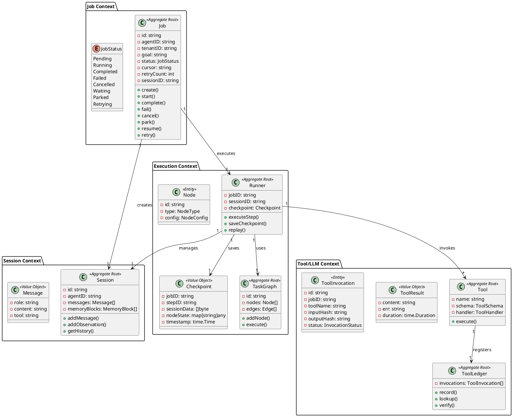
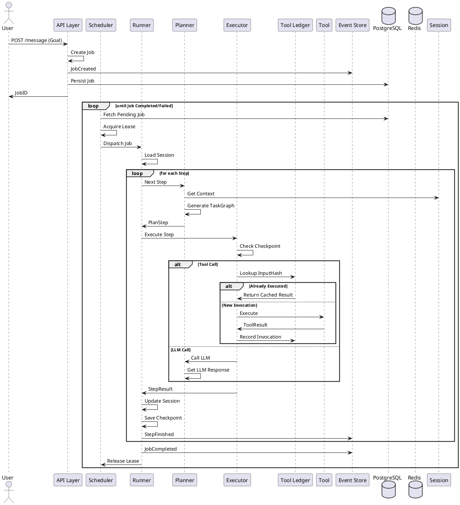
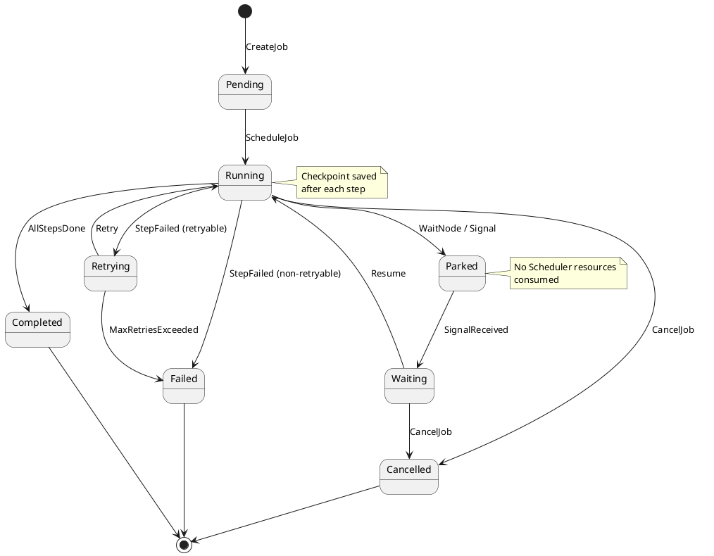

# Aetheris 领域驱动设计文档

> 版本: 1.0  
> 日期: 2026-03-09  
> 项目: ~/Desktop/poc/corag (原名 rag-platform)

---

## 1. 产品愿景

### 1.1 电梯演讲

- **目标客户**: 需要生产级 AI Agent 运行时的企业开发者
- **核心痛点**:
  1. Agent 运行时缺乏持久化和恢复能力，崩溃后无法继续
  2. 工具调用无法保证 At-Most-Once，可能重复执行导致数据问题
  3. 缺乏审计和可追溯性，无法满足合规要求
  4. 缺乏 Human-in-the-Loop 支持，审批流程难以实现
- **产品类型**: Agent 托管运行时 (Agent Hosting Runtime) — Agent 领域的 Temporal
- **解决方案**: 提供持久化、可恢复、可观测的 Agent 执行环境，支持事件溯源、checkpoint 恢复、Tool Ledger 保证幂等性
- **竞争优势**:
  - At-Most-Once 工具调用保证 (基于 Tool Ledger)
  - 确定性 Replay (Confirmation Replay 机制)
  - 完整的审计证据链 (Evidence Graph)
  - 多框架适配 (LangGraph, AutoGen, CrewAI 等)

### 1.2 核心价值主张

> **"Kubernetes 管理容器，Aetheris 管理 Agent"**

Aetheris 聚焦于 **执行可靠性**，为 AI Agent 提供生产级运行时保障。

---

## 2. 领域划分

### 2.1 域分类

| 域类型 | 领域 | 描述 |
|--------|------|------|
| **核心域** | Agent Runtime | 核心运行时：Job 管理、调度、执行、恢复 |
| **核心域** | Event Store | 事件溯源：事件持久化、状态推导 |
| **核心域** | Tool Ledger | 工具调用幂等性保证 |
| **核心域** | Checkpoint | 执行状态快照与恢复 |
| **核心域** | Scheduler | 任务调度、租约管理、重试逻辑 |
| **支撑域** | Planner | 任务规划：将 Goal 转换为 TaskGraph DAG |
| **支撑域** | Executor | 单步执行：LLM Node、Tool Node、Wait Node 等 |
| **支撑域** | Session | 会话管理：记忆存储、消息历史 |
| **支撑域** | Signal | 信号处理：Human-in-the-Loop、Resume 触发 |
| **通用域** | Auth | 认证授权 |
| **通用域** | Audit | 审计日志 |
| **通用域** | Metrics | 指标监控 |
| **通用域** | Tracing | 分布式追踪 |
| **通用域** | Config | 配置管理 |

### 2.2 领域优先级

1. **最高优先级**: Job Runtime、Event Store、Tool Ledger、Scheduler — 核心执行保障
2. **高优先级**: Checkpoint、Executor、Session、Signal — 执行能力
3. **中优先级**: Planner、Audit、Metrics — 可观测性
4. **低优先级**: Auth、Config、Tracing — 基础设施

---

## 3. 限界上下文 (Bounded Context)

### 3.1 上下文地图

```
┌─────────────────────────────────────────────────────────────────────────────────────┐
│                              Aetheris 系统                                           │
├─────────────────┬─────────────────┬─────────────────┬─────────────────────────────┤
│   Job 上下文      │  Execution      │    Session      │      Tool/LLM              │
│   (Job,JobStore, │  上下文         │    上下文        │      上下文                 │
│    Scheduler)    │  (Executor,     │  (Memory,       │  (ToolRegistry,             │
│                 │   Planner,      │   Messages)     │   LLMAdapter)               │
│                 │   Checkpoint)   │                 │                             │
├─────────────────┼─────────────────┼─────────────────┼─────────────────────────────┤
│   核心           │   核心           │   支撑           │   支撑                      │
└─────────────────┴─────────────────┴─────────────────┴─────────────────────────────┘
         │                    │                   │                    │
         │                    │                   │                    │
         ▼                    ▼                   ▼                    ▼
┌─────────────────────────────────────────────────────────────────────────────────────┐
│                         通用基础设施层                                                │
│   (Auth, Audit, Metrics, Tracing, Config, Storage)                                   │
└─────────────────────────────────────────────────────────────────────────────────────┘
```

### 3.2 上下文职责

| 限界上下文 | 核心职责 | 关键实体 |
|-----------|----------|----------|
| **Job Context** | Job 生命周期管理、调度、队列 | Job, JobInbox, Queue, Lease |
| **Execution Context** | 步骤执行、checkpoint、replay | Runner, Step, TaskGraph, Checkpoint |
| **Session Context** | 会话状态、记忆、消息历史 | Session, Message, Memory |
| **Tool/LLM Context** | 工具注册、LLM 调用、效果存储 | Tool, LLM, Effect |
| **Audit Context** | 审计追踪、证据链、合规 | Evidence, AuditLog |
| **Proof Context** | 执行证明、幂等性保证 | ToolLedger, ExecutionProof |

---

## 4. 领域模型

### 4.1 Job 上下文

#### 聚合: Job (Aggregate Root)

```go
// Job Agent 任务实体
type Job struct {
    ID                     string           // 唯一标识
    AgentID                string           // 关联 Agent ID
    TenantID               string           // 租户隔离
    Goal                   string           // 任务目标
    Status                 JobStatus        // 任务状态
    Cursor                 string           // Checkpoint 恢复游标
    RetryCount             int              // 已重试次数
    SessionID              string           // 关联会话
    CancelRequestedAt      time.Time        // 取消请求时间
    IdempotencyKey         string           // 幂等键
    Priority               int              // 调度优先级
    QueueClass             string           // 队列类型 (realtime/default/background/heavy)
    RequiredCapabilities  []string         // 所需能力
    ExecutionVersion       string           // 执行版本
    PlannerVersion         string           // Planner 版本
    CreatedAt              time.Time
    UpdatedAt              time.Time
}
```

#### JobStatus 状态机

```
┌──────────┐     创建      ┌─────────┐     执行      ┌──────────┐
│ Pending  │ ──────────▶  │ Running │ ──────────▶  │Completed│
└──────────┘              └─────────┘              └──────────┘
      ▲                       │                         │
      │                       │ 失败                     │
      │                       ▼                         │
      │                  ┌─────────┐                    │
      │                  │ Failed  │                    │
      │                  └─────────┘                    │
      │                       │                         │
      │              重试     │     取消                  │
      │                  ┌────┴────┐                    │
      │                  ▼         ▼                    │
      │            ┌─────────┐ ┌──────────┐            │
      │            │Retrying │ │ Cancelled│            │
      │            └─────────┘ └──────────┘            │
      │                       │                          │
      │               等待信号/人工                      │
      │                       ▼                          │
      │                  ┌────────┐                      │
      └───────────────── │ Parked │ ◀───────────────────┘
                         └────────┘
                               │
                               │ 信号唤醒
                               ▼
                         ┌──────────┐
              ┌─────────│ Waiting  │──────────┐
              │         └──────────┘          │
              │            │                   │
              │            │ 短暂等待           │
              └────────────┴───────────────────┘
```

#### 领域事件

| 事件 | 描述 |
|------|------|
| JobCreated | Job 已创建 |
| JobStarted | Job 开始执行 |
| JobCompleted | Job 已完成 |
| JobFailed | Job 执行失败 |
| JobCancelled | Job 已取消 |
| JobRetrying | Job 正在重试 |
| JobParked | Job 已暂停等待信号 |
| JobResumed | Job 已恢复执行 |

### 4.2 Execution 上下文

#### 聚合: Runner (Aggregate Root)

```go
// Runner 执行器
type Runner struct {
    JobID      string
    SessionID  string
    Checkpoint *Checkpoint
    Steps      []*Step
}
```

#### 聚合: TaskGraph (Aggregate Root)

```go
// TaskGraph 任务图（DAG）
type TaskGraph struct {
    ID       string
    Nodes    []*Node
    Edges    []*Edge
    RootID   string
}

type Node struct {
    ID       string
    Type     NodeType  // LLM, Tool, Wait, Condition, etc.
    Config   NodeConfig
    Input    map[string]any
    Output   map[string]any
}

type Edge struct {
    From     string
    To       string
    Condition string
}
```

#### Checkpoint 值对象

```go
type Checkpoint struct {
    JobID       string
    StepID      string
    SessionData []byte
    NodeState   map[string]any
    Timestamp   time.Time
}
```

#### 领域事件

| 事件 | 描述 |
|------|------|
| StepStarted | 步骤开始 |
| StepFinished | 步骤完成 |
| StepFailed | 步骤失败 |
| StepRetried | 步骤已重试 |
| CheckpointSaved | Checkpoint 已保存 |
| NodeStarted | Node 开始执行 |
| NodeFinished | Node 执行完成 |

### 4.3 Session 上下文

#### 聚合: Session (Aggregate Root)

```go
type Session struct {
    ID           string
    AgentID      string
    TenantID     string
    Messages     []*Message
    MemoryBlocks []*MemoryBlock
    Metadata     map[string]any
    CreatedAt    time.Time
    UpdatedAt    time.Time
}

type Message struct {
    Role    string  // user, assistant, system
    Content string
    Tool    string
    Input   map[string]any
    Output  string
    Error   string
}

type MemoryBlock struct {
    ID        string
    Type      string  // working, context, archive
    Content   string
    Tokens    int
    UpdatedAt time.Time
}
```

### 4.4 Tool/LLM 上下文

#### 工具执行结果值对象

```go
type ToolResult struct {
    Content   string
    Err       string
    ToolName  string
    Input     map[string]any
    Output    any
    Duration  time.Duration
}
```

#### LLM 调用请求/响应

```go
type LLMRequest struct {
    Model     string
    Messages  []llm.Message
    Tools     []ToolSchema
    Temperature float64
    MaxTokens int
}

type LLMResponse struct {
    Content   string
    ToolCalls []ToolCall
    Usage     Usage
    Model     string
}
```

#### Effect 副作用记录

```go
type Effect struct {
    ID          string
    JobID       string
    StepID      string
    Type        EffectType  // HTTP, Tool, LLM, etc.
    Request     []byte
    Response    []byte
    Timestamp   time.Time
    Verified   bool
}
```

### 4.5 Tool Ledger (幂等性保证)

#### 聚合: ToolInvocation (Aggregate Root)

```go
type ToolInvocation struct {
    ID          string
    JobID       string
    StepID      string
    ToolName    string
    InputHash   string      // 输入哈希
    OutputHash  string      // 输出哈希
    Status      InvocationStatus  // Pending, Completed, Failed
    Result      []byte
    CreatedAt   time.Time
    UpdatedAt   time.Time
}
```

####-Most-Once At 保证机制

```
1. Tool Call 请求 → 计算 InputHash
2. 查询 ToolLedger: 
   - 已存在且 Completed → 返回缓存结果 (跳过执行)
   - 已存在且 Pending → 等待或失败
   - 不存在 → 创建记录，状态 Pending，执行工具
3. 工具执行完成 → 写入结果，更新状态为 Completed
4. Replay 时 → 通过 InputHash 查找，直接恢复结果
```

---

## 5. 领域事件清单

### 5.1 Job 生命周期事件

| 事件名称 | 触发时机 | 携带数据 |
|----------|----------|----------|
| JobCreated | POST /message 创建 Job | JobID, AgentID, Goal, TenantID |
| JobStarted | Scheduler 派发 Job 给 Worker | JobID, WorkerID, LeaseID |
| JobCompleted | 所有 Step 执行完成 | JobID, Result, Duration |
| JobFailed | 执行过程出错且不可重试 | JobID, Error, LastStep |
| JobCancelled | 收到取消请求 | JobID, CancelRequestedAt |
| JobParked | 遇到 WaitNode 或等待信号 | JobID, WaitReason, ExpectedResumeTime |
| JobResumed | 收到 Signal 或信号触发 | JobID, ResumeSource |
| JobRetrying | 失败后进入重试 | JobID, RetryCount, NextRetryAt |

### 5.2 执行过程事件

| 事件名称 | 触发时机 | 携带数据 |
|----------|----------|----------|
| StepStarted | 开始执行单个 Step | JobID, StepID, StepType |
| StepFinished | Step 执行完成 | JobID, StepID, Output, Duration |
| StepFailed | Step 执行失败 | JobID, StepID, Error, Retryable |
| StepRetried | Step 重新执行 | JobID, StepID, RetryCount |
| CheckpointSaved | 保存 Checkpoint | JobID, CheckpointID, Cursor |
| ToolInvoked | 工具调用发起 | JobID, ToolName, InputHash |
| ToolCompleted | 工具调用完成 | JobID, ToolName, ResultHash |
| LLMCalled | LLM 调用发起 | JobID, Model, PromptTokens |
| LLMResponseReceived | LLM 响应返回 | JobID, Model, CompletionTokens |

### 5.3 审计相关事件

| 事件名称 | 触发时机 | 携带数据 |
|----------|----------|----------|
| EvidenceRecorded | 证据已记录 | JobID, EvidenceID, EvidenceType |
| AuditLogCreated | 审计日志创建 | JobID, Action, Actor, Timestamp |
| ReplayExecuted | Replay 执行 | JobID, ReplayID, VerificationResult |

---

## 6. 命令与决策映射

### 6.1 命令列表

| 命令 | 执行者 | 决策/规则 | 产出事件 |
|------|--------|-----------|----------|
| CreateJob | API/CLI | 幂等性检查 | JobCreated |
| ScheduleJob | Scheduler | 队列选择、Worker 分配 | JobStarted |
| ExecuteStep | Runner | Step 验证、Checkpoint | StepStarted → StepFinished/Failed |
| InvokeTool | Executor | ToolLedger 检查、幂等性 | ToolInvoked → ToolCompleted |
| CallLLM | Executor | 模型选择、Token 限制 | LLMCalled → LLMResponseReceived |
| PauseJob | Runner (WaitNode) | 等待条件检查 | JobParked |
| ResumeJob | Signal Handler | 信号验证 | JobResumed |
| CancelJob | API/CLI | 取消权限检查 | JobCancelled |
| RetryJob | Scheduler | 重试策略、Backoff | JobRetrying |

### 6.2 核心决策规则

1. **调度决策**: 按 Priority 降序 + QueueClass 选择，同优先级按 CreatedAt 升序
2. **幂等性决策**: ToolLedger InputHash 匹配 → 跳过执行，返回缓存
3. **重试决策**: Exponential Backoff，RetryCount * 2^n 秒，上限 30 分钟
4. **取消决策**: CancelRequestedAt 非零 → 设置 runCtx cancel，状态置为 Cancelled
5. **Replay 决策**: Confirmation Replay — 验证外部状态匹配后再恢复

---

## 7. 架构建议

### 7.1 分层架构

```
┌─────────────────────────────────────────────────────────────────┐
│                        表示层 (API Layer)                        │
│    HTTP API (Hertz) │ CLI │ SDK                               │
└────────────────────────────┬────────────────────────────────────┘
                             │
                             ▼
┌─────────────────────────────────────────────────────────────────┐
│                       应用层 (Application)                       │
│    JobAppService │ AgentAppService │ SessionAppService         │
│    Command/Query Handlers                                     │
└────────────────────────────┬────────────────────────────────────┘
                             │
                             ▼
┌─────────────────────────────────────────────────────────────────┐
│                         领域层 (Domain)                          │
│  Entities │ Value Objects │ Domain Services │ Domain Events   │
│  Job │ Runner │ Session │ ToolLedger │ Checkpoint             │
└────────────────────────────┬────────────────────────────────────┘
                             │
                             ▼
┌─────────────────────────────────────────────────────────────────┐
│                      基础设施层 (Infrastructure)                 │
│  PostgreSQL │ Redis │ Event Store │ Tool Registry │ LLM       │
└─────────────────────────────────────────────────────────────────┘
```

### 7.2 技术选型建议

| 组件 | 推荐方案 | 说明 |
|------|----------|------|
| 消息队列 | Redis + PostgreSQL | Job 队列用 Redis，有序集合实现优先级 |
| 事件存储 | PostgreSQL | 事件溯源存储 |
| 缓存 | Redis | Session、Checkpoint 缓存 |
| LLM | 可插拔适配器 | OpenAI、Local、Vertex AI、Bedrock |
| Agent 框架 | 适配器模式 | LangGraph、AutoGen、CrewAI |

---

## 8. PlantUML 图

### 8.1 核心领域模型关系图



### 8.2 执行流程图



### 8.3 状态转换图



---

## 9. 最佳实践与演进建议

### 9.1 DDD 实践要点

1. **聚合边界**: Job 作为核心聚合根，内部状态变更通过 Job 统一管理
2. **最终一致性**: 跨聚合通过领域事件 (JobCreated, StepFinished 等) 异步同步
3. **值对象不可变**: Checkpoint、Message、ToolResult 设计为值对象
4. **领域服务**: 复杂业务逻辑 (如 Replay 验证) 封装在领域服务中

### 9.2 演进路线

| 阶段 | 目标 | 关键任务 |
|------|------|----------|
| 1.0 | 核心运行时 | Job/Scheduler/Runner 完善 |
| 1.1 | 幂等性保证 | ToolLedger 完整实现 |
| 1.2 | Replay 能力 | Confirmation Replay |
| 2.0 | 多框架适配 | LangGraph/AutoGen 适配器 |
| 2.1 | 高级调度 | 能力感知调度、优先级队列 |
| 2.2 | 审计增强 | Evidence Graph 完善 |

---

## 附录: 代码模块对照

| DDD 概念 | 代码位置 | 核心文件 |
|----------|----------|----------|
| Job 聚合 | internal/agent/job/ | job.go, pg_store.go |
| Scheduler | internal/agent/job/ | scheduler.go |
| Runner | internal/agent/job/ | job_runner.go |
| Session | internal/runtime/session/ | session.go |
| Planner | internal/agent/planner/ | planner.go |
| Executor | internal/agent/executor/ | executor.go |
| ToolLedger | pkg/effects/ | tool.go |
| Checkpoint | internal/runtime/jobstore/ | checkpoint.go |
| Event Store | internal/runtime/jobstore/ | event.go |

---

*文档生成时间: 2026-03-09*
