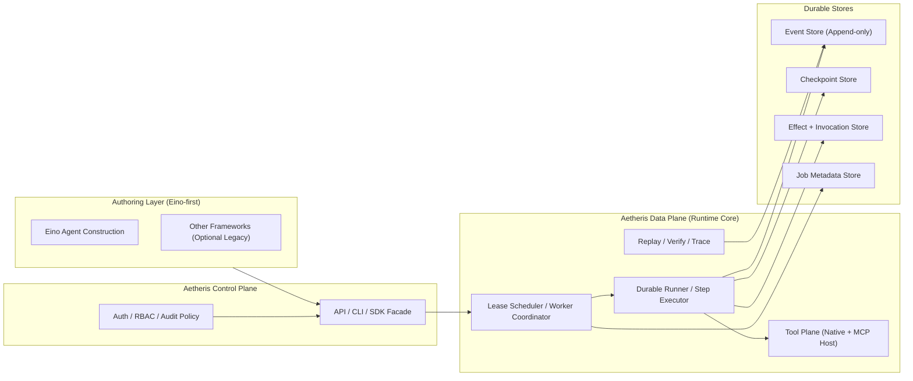

# Aetheris

<p align="center">
  
  
  
  
  
  
  
</p>

<div align="center">

## ⭐ The Missing Layer for Production-Ready AI Agents

**Aetheris** is a durable, replayable execution runtime — the "Temporal for Agents" that your production AI systems desperately need.

[Quick Start](#installation) • [Documentation](docs/guides/get-started.md) • [Examples](examples/) • [Blog](docs/blog/) • [Discord](https://discord.gg/PrrK2Mua)

</div>

---

## 🤔 Why Aetheris?

Your AI agent worked in testing. But production is different.

```
❌ Worker crashed → Restart from beginning
❌ Tool called twice → Duplicate payments
❌ Need to audit AI decisions → No trace
❌ Agent waiting for approval → Wastes resources
❌ Need to replay failed run → Impossible
```

Go agent frameworks (LangChainGo, LangGraphGo, ADK) build agents. **Aetheris runs them in production.**

---

## 🎯 What is Aetheris?

> **Kubernetes for AI Agents**

Aetheris manages agents — providing durability, reliability, and observability for production systems.

**It's not:**
- ❌ Chatbot framework
- ❌ Prompt library
- ❌ RAG system
- ❌ Another way to write agents

**It is:**
- ✅ Agent execution runtime — host LangChainGo/LangGraphGo/ADK agents
- ✅ Durable execution — survive crashes, resume from checkpoints
- ✅ Reliable orchestrator — at-most-once tool execution
- ✅ Auditable system — full decision history

---

## ✨ Key Features

| Feature | What It Means |
| ------- | --------------- |
| **At-Most-Once** | Tool calls never repeat, even after crashes |
| **Crash Recovery** | Resume from checkpoints, not from scratch |
| **Deterministic Replay** | Reproduce any run for debugging |
| **Human-in-the-Loop** | Pause for approval, resume without waste |
| **Full Audit Trail** | Every decision traced |
| **Multi-Framework** | Plug in LangChainGo/LangGraphGo/ADK |

---

## 📊 Use Cases

| Use Case | Description |
| -------- | ------------- |
| **Human-in-the-Loop** | Agents pause for approval, resume with full context |
| **Compliance & Audit** | Event-sourced traceability, replayable evidence |
| **Local-First** | Private cloud, air-gapped environments |

---

## 🚀 Quick Start

```bash
# Install
go install github.com/Colin4k1024/Aetheris/cmd/cli@latest

# Or use Docker
./scripts/local-2.0-stack.sh start

# Initialize
aetheris init my-agent
cd my-agent
aetheris run

# Monitor
aetheris jobs list
aetheris trace <job_id>
```

See [Getting Started Guide](docs/guides/getting-started-agents.md) for details.

---

## 🔗 Authoring Strategy

Build agents in **Eino**, run them on Aetheris for durability, replay, and audit.

---

## 🏗️ Architecture



**The flow:** Eino authoring → Aetheris runtime submission → scheduler/runner execution → durable events/checkpoints/effects → replay/verify/audit.

### Core Components

| Component | Path | Responsibility |
| --------- | ---- | --------------- |
| **API Server** | `cmd/api/` | HTTP server (Hertz), creates and interacts with agents |
| **Worker** | `cmd/worker/` | Background execution worker, schedules and executes jobs |
| **CLI** | `cmd/cli/` | Command-line tool (`init`, `chat`, `jobs`, `trace`, `replay`, etc.) |
| **AgentFactory** | `internal/runtime/eino/agent_factory.go` | Config-driven Eino ADK agent creation (recommended entry point) |
| **Tool Bridge** | `internal/runtime/eino/tool_bridge.go` | Converts Aetheris RuntimeTool → Eino InvokableTool |
| **Eino Engine** | `internal/runtime/eino/engine.go` | Workflow compilation, runner management |
| **Agent Runtime** | `internal/agent/runtime/` | Core execution engine (DAG compiler + runner) |
| **Job Store** | `internal/agent/runtime/job/` | Event-sourced durable execution history (PostgreSQL) |
| **Scheduler** | `internal/agent/runtime/job/scheduler.go` | Leases and retries tasks with lease fencing |
| **Runner** | `internal/agent/runtime/runner/` | Step-level execution with checkpointing |
| **Planner** | `internal/agent/planner/` | Produces TaskGraph from goals |
| **Executor** | `internal/agent/runtime/executor/` | Executes DAG nodes using eino framework |
| **Effects** | `internal/agent/effects/` | At-most-once tool execution guarantee via Ledger |

### Execution Flow

```
User Message → API creates Job (dual-write: event stream + stateful Job)
  → Scheduler picks up pending Job
  → Runner.RunForJob: if Job.Cursor exists, restore from Checkpoint;
     otherwise PlanGoal → TaskGraph → Compiler → DAG
  → Steppable executes nodes one by one
  → Each node writes Checkpoint, updates Session.LastCheckpoint and Job.Cursor
  → Recovery resumes from next node
```

### Key Concepts

| Concept | Description |
| ------- | ------------ |
| **Job** | Durable task unit, survives worker crashes |
| **Step** | Single execution unit within a Job |
| **Checkpoint** | State snapshot after step completion, enables resume |
| **Effect** | External side effect record (API calls, DB writes) |
| **Ledger** | Tool invocation authorization ledger (guarantees at-most-once) |
| **TaskGraph** | Directed acyclic graph of step dependencies |

### StepOutcome Semantics

Each step produces exactly one outcome:

| Outcome | Meaning |
| ------- | -------- |
| **Pure** | No side effects; safe to replay |
| **SideEffectCommitted** | World changed; must not re-execute |
| **Retryable** | Failure, world unchanged; retry allowed |
| **PermanentFailure** | Failure; job cannot continue |
| **Compensated** | Rollback applied; terminal state |

### Execution Guarantees

| Guarantee | Description |
| --------- | ------------ |
| **At-Most-Once** | Tool calls never repeat, even after crashes |
| **Crash Recovery** | Agents resume from checkpoints, not from scratch |
| **Deterministic Replay** | Reproduce any run for debugging or auditing |
| **Event Sourcing** | Full execution history as append-only event stream |

---


## 📈 Why This Matters

```
LLMs made agents possible.
Aetheris makes agents production-ready.
```


| Problem               | Without Aetheris           | With Aetheris           |
| --------------------- | -------------------------- | ----------------------- |
| Worker crash | Restart from beginning     | Resume from checkpoint  |
| Duplicate calls  | Possible ($$$ loss)        | Guaranteed at-most-once |
| Debug     | Guess what happened        | Deterministic replay    |
| Audit    | Impossible                 | Full evidence chain     |
| Human approval  | Wastes resources | StatusParked  |

---

## 🌍 Community

[Discord](https://discord.gg/PrrK2Mua) • [Discussions](https://github.com/Colin4k1024/Aetheris/discussions) • [Docs](https://docs.aetheris.ai)

⭐ Star us on [GitHub](https://github.com/Colin4k1024/Aetheris)!

---

## 📄 License

Apache License 2.0 — free for commercial use.

---

## 🙏 Thanks

Built with [eino](https://github.com/cloudwego/eino), [hertz](https://github.com/cloudwego/hertz), [pgx](https://github.com/jackc/pgx).

---

<div align="center">

**⭐ Star us. Build production agents. Ship with confidence.**

</div>

---

## 📚 Long-tail Keywords & SEO Terms

*This section helps improve searchability for specific use cases and related queries.*

### Core Use Case Keywords
- durable AI agent execution runtime
- AI agent crash recovery and checkpoint
- production AI agent orchestration
- at-most-once tool execution AI
- event-sourced AI agent audit trail
- deterministic AI agent replay

### Technical Keywords
- Go AI agent framework production
- LangChainGo production deployment
- LangGraphGo durability
- AI agent human-in-the-loop approval
- AI agent state management
- AI agent workflow checkpointing
- AI agent idempotency guarantee
- AI agent observability and tracing

### Industry Keywords
- enterprise AI agent compliance
- AI agent local-first deployment
- AI agent private cloud
- AI agent air-gapped environment
- AI agent regulatory audit
- AI agent financial services compliance
- AI agent healthcare data handling

### Feature Keywords
- AI agent checkpoint resume
- AI agent decision replay
- AI agent full stacktrace
- AI agent failure recovery
- AI agent retry with fencing
- AI agent lease management
- AI agent side effect ledger
- AI agent effect store

### Integration Keywords
- Eino framework integration
- MCP server agent hosting
- AI agent MCP tool bridge
- ADK agent hosting runtime
- AI agent API gateway
- AI agent webhook integration
