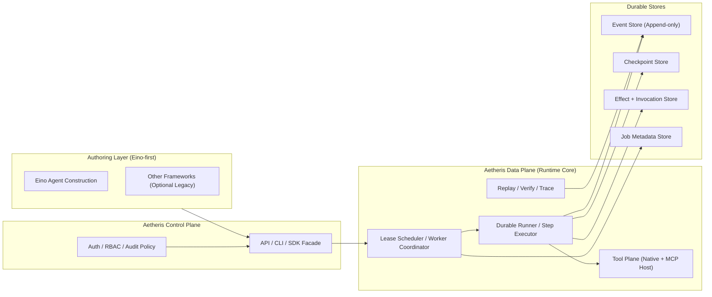

# Aetheris

<p align="center">
  
  
  
  
  
  
  
</p>

<div align="center">

## ⭐ Durable Execution for AI Agents — Build Anywhere, Run Reliably in Production

**Aetheris** is the execution runtime that makes your AI agents survive crashes, avoid duplicate calls, and let you replay any failure like a video recording.

[Quick Start](#-quick-start) • [Documentation](docs/guides/get-started.md) • [Examples](examples/) • [Discord](https://discord.gg/PrrK2Mua)

</div>

---

## 😰 你是否遇到过这些崩溃噩梦？

**场景一：半夜报警，API 被重复调用了 3 次**
> 用户提交订单，Agent 调用支付 API，Worker 刚好在这时崩溃。
> 重启后 Agent 不知道支付到底成功没有——**再调一次**。
> 恭喜，用户被扣了三次钱。

**场景二：跑了 2 小时的报告，最后一步崩了**
> Agent 要处理 10,000 条数据，跑到第 9,800 条时 OOM。
> 重启后从零开始，用户第二天早上才拿到报告，投诉工单已堆积。

**场景三：Agent 执行到一半，需要人工审批**
> Agent 准备给用户退款 $50,000——你想先审批。
> 审批完了让 Agent 继续，但它的上下文已经丢了，状态全乱了。

**场景四：生产出了 bug，不知道 Agent 做了什么**
> Agent 给用户推荐了错误的理财产品。
> 你想回放它的思考过程，但根本没有记录，只能靠猜。

---

## 😮‍💨 Aetheris 之前的无奈

```
你的 AI Agent：
❌ Worker 重启 → 从头开始跑，用户等 10 分钟
❌ 支付完成后崩溃 → 不知道付没付，钱打水漂或重复扣
❌ 出 bug 想回放 → 不可能，只能重跑
❌ 要人工审批 → 只能重新问用户，上下文丢失
❌ 监管审计 → 拿不出证据，解释不清
```

---

## 🚀 Aetheris 之后的体验

```
用 Aetheris 跑你的 Agent：
✅ Worker 重启 → 从上一次成功的步骤继续，毫秒级恢复
✅ 支付完成后崩溃 → 事件溯源，能查到"第几步完成的"
✅ 出 bug 想回放 → 任意时间点重放，像看录像一样定位问题
✅ 要人工审批 → 状态 park，等你 approve，从断点继续
✅ 监管审计 → 完整决策链，step by step 的证据包
```

> **不改变你写 Agent 的方式**，只用 Aetheris 托管你的 Agent，它帮你兜底可靠性。

---

## 🎯 什么感觉？像给 Agent 装了一个"黑匣子 + 时光机"

| 你现在的 Agent | 加上 Aetheris |
| -------------- | -------------- |
| 崩溃 = 丢失所有进度 | 崩溃 = 从上一次 checkpoint 继续 |
| 工具调用没有幂等保证 | 同一工具调用，永远只执行一次 |
| 失败后只能重头跑 | 任意步骤可重放，精准定位 bug |
| 审批 = 状态丢失 | 审批 = 状态 Park，approve 后无缝衔接 |
| 生产问题靠猜 | 完整执行链路，随时回放审计 |

---

## ✨ 核心能力

| 能力 | 听起来像 | 实际上解决了 |
| ---- | -------- | ------------ |
| **At-Most-Once** | "工具调用不重复" | 你的支付 API 再也不会被调用两次 |
| **Crash Recovery** | "崩溃能恢复" | 跑了 2 小时的报告不会被清零 |
| **Deterministic Replay** | "可以回放" | 出 bug 能像看录像一样定位 |
| **Human-in-the-Loop** | "人工审批" | 大额操作等你批准再继续 |
| **Event Sourcing** | "事件溯源" | 监管来查，你有一整条证据链 |

---

## 📊 什么时候用？真实场景举例

| 场景 | 不用 Aetheris | 用了 Aetheris |
| ---- | -------------- | -------------- |
| **支付场景** | 支付完成后 Worker 崩溃，重复扣款 | 事件溯源，幂等保证，崩溃也能确认支付状态 |
| **长任务处理** | 处理 1 万条数据，崩在最后 1 条，全部重跑 | Checkpoint 恢复，从断点继续，API 只调一次 |
| **需要审批** | Agent 执行到一半要等审批，状态丢失 | StatusParked，审批通过后无缝从断点继续 |
| **合规审计** | 监管来查，拿不出 Agent 决策证据 | 完整事件链，step by step 回放 |
| **Bug 调试** | 生产出 bug，只能重跑一遍看日志猜 | 任意时间点重放执行，像看录像一样定位 |
| **多 Agent 协作** | 一个 Agent 挂了，其他不知道状态 | 各 Agent 独立持久化，独立恢复 |

---

## 🚀 Quick Start

```bash
# Install
go install github.com/Colin4k1024/Aetheris/cmd/cli@latest

# Or use Docker
./scripts/local-2.0-stack.sh start

# Initialize
aetheris init my-agent
cd my-agent
aetheris run

# Monitor
aetheris jobs list
aetheris trace <job_id>
```

See [Getting Started Guide](docs/guides/getting-started-agents.md) for details.

---

## 🔗 Authoring Strategy

Build agents in **Eino**, run them on Aetheris for durability, replay, and audit.

---

## 🏗️ Architecture



**The flow:** Eino authoring → Aetheris runtime submission → scheduler/runner execution → durable events/checkpoints/effects → replay/verify/audit.

### Core Components

| Component | Path | Responsibility |
| --------- | ---- | --------------- |
| **API Server** | `cmd/api/` | HTTP server (Hertz), creates and interacts with agents |
| **Worker** | `cmd/worker/` | Background execution worker, schedules and executes jobs |
| **CLI** | `cmd/cli/` | Command-line tool (`init`, `chat`, `jobs`, `trace`, `replay`, etc.) |
| **AgentFactory** | `internal/runtime/eino/agent_factory.go` | Config-driven Eino ADK agent creation (recommended entry point) |
| **Tool Bridge** | `internal/runtime/eino/tool_bridge.go` | Converts Aetheris RuntimeTool → Eino InvokableTool |
| **Eino Engine** | `internal/runtime/eino/engine.go` | Workflow compilation, runner management |
| **Agent Runtime** | `internal/agent/runtime/` | Core execution engine (DAG compiler + runner) |
| **Job Store** | `internal/agent/runtime/job/` | Event-sourced durable execution history (PostgreSQL) |
| **Scheduler** | `internal/agent/runtime/job/scheduler.go` | Leases and retries tasks with lease fencing |
| **Runner** | `internal/agent/runtime/runner/` | Step-level execution with checkpointing |
| **Planner** | `internal/agent/planner/` | Produces TaskGraph from goals |
| **Executor** | `internal/agent/runtime/executor/` | Executes DAG nodes using eino framework |
| **Effects** | `internal/agent/effects/` | At-most-once tool execution guarantee via Ledger |

### Execution Flow

```
User Message → API creates Job (dual-write: event stream + stateful Job)
  → Scheduler picks up pending Job
  → Runner.RunForJob: if Job.Cursor exists, restore from Checkpoint;
     otherwise PlanGoal → TaskGraph → Compiler → DAG
  → Steppable executes nodes one by one
  → Each node writes Checkpoint, updates Session.LastCheckpoint and Job.Cursor
  → Recovery resumes from next node
```

### Key Concepts

| Concept | Description |
| ------- | ------------ |
| **Job** | Durable task unit, survives worker crashes |
| **Step** | Single execution unit within a Job |
| **Checkpoint** | State snapshot after step completion, enables resume |
| **Effect** | External side effect record (API calls, DB writes) |
| **Ledger** | Tool invocation authorization ledger (guarantees at-most-once) |
| **TaskGraph** | Directed acyclic graph of step dependencies |

### StepOutcome Semantics

Each step produces exactly one outcome:

| Outcome | Meaning |
| ------- | -------- |
| **Pure** | No side effects; safe to replay |
| **SideEffectCommitted** | World changed; must not re-execute |
| **Retryable** | Failure, world unchanged; retry allowed |
| **PermanentFailure** | Failure; job cannot continue |
| **Compensated** | Rollback applied; terminal state |

### Execution Guarantees

| Guarantee | Description |
| --------- | ------------ |
| **At-Most-Once** | Tool calls never repeat, even after crashes |
| **Crash Recovery** | Agents resume from checkpoints, not from scratch |
| **Deterministic Replay** | Reproduce any run for debugging or auditing |
| **Event Sourcing** | Full execution history as append-only event stream |

---


## 📈 Why This Matters

```
LLMs made agents possible.
Aetheris makes agents production-ready.
```


| Problem               | Without Aetheris           | With Aetheris           |
| --------------------- | -------------------------- | ----------------------- |
| Worker crash | Restart from beginning     | Resume from checkpoint  |
| Duplicate calls  | Possible ($$$ loss)        | Guaranteed at-most-once |
| Debug     | Guess what happened        | Deterministic replay    |
| Audit    | Impossible                 | Full evidence chain     |
| Human approval  | Wastes resources | StatusParked  |

---

## 🧩 开箱即用的场景模板

不想从零搭？直接跑起来：

| 模板 | 解决什么问题 |
| ---- | ------------ |
| [**客服 Agent**](./templates/customer-service-agent/) | 用户问退货 → 调库存 → 审批退款 → 执行退款，全流程不丢状态 |
| [**RAG 助手**](./templates/rag-assistant/) | 上传 PDF → 自动向量化 → 问答，所有步骤可重放 |
| [**自动研究员**](./templates/autonomous-researcher/) | 丢一个主题，它自己搜、自己读、自己总结，崩了能从断点继续 |
| [**多 Agent 辩论**](./templates/multi-agent-debate/) | 多个 Agent 协作讨论，挂了不影响整体，独立恢复 |

[**MCP Gateway**](./tools/mcp-gateway/) — 预置工具：GitHub、文件系统、网页搜索、数据库

[VSCode Extension](./tools/vscode-extension/) — Code snippets & syntax highlighting

---

## 🌍 Community

[Discord](https://discord.gg/PrrK2Mua) • [Discussions](https://github.com/Colin4k1024/Aetheris/discussions) • [Docs](https://docs.aetheris.ai)

⭐ Star us on [GitHub](https://github.com/Colin4k1024/Aetheris)!

---

## 📄 License

Apache License 2.0 — free for commercial use.

---

## 🙏 Thanks

Built with [eino](https://github.com/cloudwego/eino), [hertz](https://github.com/cloudwego/hertz), [pgx](https://github.com/jackc/pgx).

---

<div align="center">

**⭐ Star us. Build production agents. Ship with confidence.**

</div>
