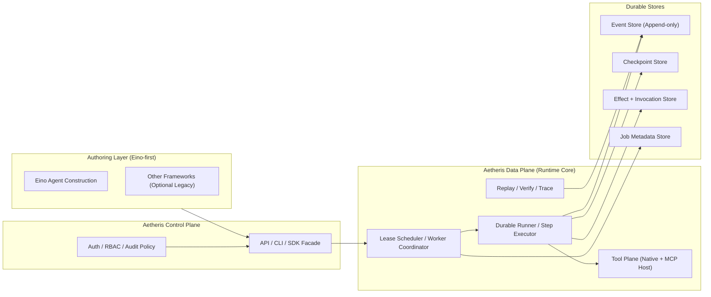

# Aetheris

<p align="center">
  
  
  
  
  
  
  
</p>

<div align="center">

## ⭐ The Missing Layer for Production-Ready AI Agents

**Aetheris** is a durable, replayable execution runtime — the "Temporal for Agents" that your production AI systems desperately need.

[Quick Start](#installation) • [Documentation](docs/guides/get-started.md) • [Examples](examples/) • [Blog](docs/blog/) • [Discord](https://discord.gg/PrrK2Mua)

</div>

---

## 🤔 Why Aetheris?

Your AI agent worked perfectly in testing. Then production happened.

```
❌ Worker crashed mid-task? → Everything starts over
❌ Tool called twice? → Duplicate payments, duplicated emails
❌ Need to audit why AI made a decision? → No trace, no proof
❌ Agent waiting for human approval? → Consumes resources forever
❌ Need to replay a failed run for debugging? → Impossible
```

**This is the reality of most AI agent deployments.** The Go agent frameworks (LangChainGo, LangGraphGo, Google ADK, Genkit) are great for _building_ agents, but they don't handle _running_ agents in production.

**Aetheris fills that gap.**

---

## 🎯 What is Aetheris?

> **Aetheris = Kubernetes for AI Agents**

Just as Kubernetes manages containers, **Aetheris manages agents** — providing the durability, reliability, and observability that production systems require.

It is built as **B2D infrastructure** for enterprise AI systems: developers and architects use Aetheris when durability, compliance evidence, and local-first deployment are non-negotiable.

It's not:

- ❌ A chatbot framework
- ❌ A prompt library
- ❌ A RAG system
- ❌ Another way to _write_ agents (use LangChainGo, LangGraphGo, Google ADK, Genkit for that)

It is:

- ✅ An **agent execution runtime** — host your LangChainGo/LangGraphGo/ADK agents on Aetheris
- ✅ A **durable execution engine** — agents survive crashes and resume from checkpoints
- ✅ A **reliable orchestrator** — at-most-once tool execution guarantees
- ✅ An **auditable system** — full decision history with evidence chain

---

## ✨ Key Features

| Feature                       | What It Means for You                                        |
| ----------------------------- | ------------------------------------------------------------ |
| **🛡️ At-Most-Once Execution** | Tool calls never repeat. Even after crashes. Period.         |
| **💥 Crash Recovery**         | Agents resume from checkpoints, not from scratch             |
| **🔄 Deterministic Replay**   | Reproduce any run for debugging or auditing                  |
| **👤 Human-in-the-Loop**      | Pause for approval, resume later — without wasting resources |
| **📋 Full Audit Trail**       | Every decision traced — who, what, when, why                 |
| **🔌 Multi-Framework**        | Already using LangChainGo/LangGraphGo/ADK? Just plug them in |

---

## 📊 Three Core Use Cases

### 1. Human-in-the-Loop Operations

> _"Our refund agent waits for human approval, then continues automatically."_

Legal contracts, payment approvals, support escalations — agents can pause for days and resume with full context.

### 2. Compliance and Auditable Decisioning

> _"Every API call and model decision is reconstructable for auditors."_

Financial risk checks, legal controls, healthcare approvals — with event-sourced traceability and replayable evidence.

### 3. Local-First and Air-Gapped Deployment

> _"Core context stays on our private network, not a hosted SaaS backend."_

Private cloud, on-prem, and air-gapped environments — with embedded local stores and deterministic recovery.

---

## 🚀 Installation

### Quick Install

```bash
# One-liner install (macOS/Linux)
curl -sSL https://raw.githubusercontent.com/Colin4k1024/Aetheris/main/scripts/install.sh | bash

# Or from source
go install github.com/Colin4k1024/Aetheris/cmd/cli@latest
```

### Docker (Fastest Way)

```bash
# Start a complete local stack in 30 seconds
./scripts/local-2.0-stack.sh start

# Verify it's running
curl http://localhost:8080/api/health
```

---

## ⚡ Quick Start

```bash
# 1. Initialize a new agent project
aetheris init my-agent

# 2. Run it
cd my-agent
aetheris run

# 3. Monitor
aetheris jobs list
aetheris trace <job_id>
```

**That's it.** Your first production-ready agent is running.

For a complete walkthrough: [Getting Started Guide](docs/guides/getting-started-agents.md)

---

## 🔗 Authoring Strategy (Eino-first)

Build agent logic in **Eino** first, then submit runs/jobs to Aetheris for durable execution.

- ✅ Default path: Eino agent/workflow authoring + Aetheris runtime execution
- ✅ Aetheris focus: durability, replay, scheduling, audit, MCP tool plane
- ⚠️ Legacy adapter paths are still available for migration, but no longer the recommended default

---

## 🏗️ Architecture



**The flow:** Eino authoring → Aetheris runtime submission → scheduler/runner execution → durable events/checkpoints/effects → replay/verify/audit.

---

## 🧭 Strategy

Aetheris is explicitly positioned as a **B2D runtime foundation** (not a generic end-user SaaS application).  
See [Strategy and User Stories](docs/strategy-and-user-stories.md) for strategic goals, user stories, and four-phase transformation status.

---

## 📈 Why This Matters

```
LLMs made agents possible.
Aetheris makes agents production-ready.
```

Current AI stacks focus on model intelligence. **Aetheris focuses on execution reliability.**

| Problem               | Without Aetheris           | With Aetheris           |
| --------------------- | -------------------------- | ----------------------- |
| Worker crash mid-task | Restart from beginning     | Resume from checkpoint  |
| Duplicate tool calls  | Possible ($$$ loss)        | Guaranteed at-most-once |
| Debug failed runs     | Guess what happened        | Deterministic replay    |
| Audit AI decisions    | Impossible                 | Full evidence chain     |
| Human approval waits  | Consumes resources forever | StatusParked, no waste  |

---

## 🌍 Community & Support

<div align="center">

| Platform              | Link                                                                 |
| --------------------- | -------------------------------------------------------------------- |
| 💬 Discord            | [Join the community](https://discord.gg/PrrK2Mua)                    |
| 🐦 GitHub Discussions | [Q&A and ideas](https://github.com/Colin4k1024/Aetheris/discussions) |
| 📖 Documentation      | [docs.aetheris.ai](https://docs.aetheris.ai)                         |
| 🐙 Star us on GitHub  | [Colin4k1024/Aetheris](https://github.com/Colin4k1024/Aetheris)      |

**If Aetheris helps you build production agents, please ⭐ star us on GitHub!**

</div>

---

## 📄 License

Apache License 2.0 — free for commercial use.

---

## 🙏 Acknowledgments

Built with [cloudwego/eino](https://github.com/cloudwego/eino), [cloudwego/hertz](https://github.com/cloudwego/hertz), [jackc/pgx](https://github.com/jackc/pgx).

---

<div align="center">

**⭐ Star us. Build production agents. Ship with confidence.**

</div>
