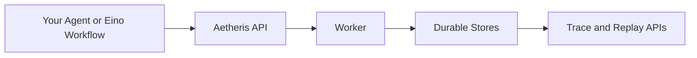

# Aetheris

Aetheris is a durable execution runtime for AI agents.

It lets an agent run as a job, survive worker crashes, keep an event trail, and expose traces for debugging and audit. The fastest path is to keep your existing agent as an HTTP service and let Aetheris manage submission, job state, idempotency keys, and trace visibility around it.

## What It Does

- Runs agent work as durable jobs with status, events, and traces.
- Resumes work from checkpoints instead of restarting everything after a crash.
- Wraps external tool or agent calls with stable job IDs and idempotency keys.
- Provides replay, trace, and verification APIs for debugging and audit.

## When To Use It

Use Aetheris when an agent task is long-running, expensive, stateful, or risky to repeat:

- Refunds, payments, procurement, ticket automation, compliance reports.
- Human approval flows where the job must wait and continue later.
- Existing Python, JavaScript, Go, or Eino agents that need runtime reliability.

For a simple stateless chat bot, Aetheris is probably more runtime than you need.

## Quick Start

Requirements:

- Go 1.26.1+
- Git

Start the local embedded runtime. This mode uses local embedded stores and does not require Docker, PostgreSQL, or Redis.

```bash
git clone https://github.com/Colin4k1024/Aetheris.git
cd Aetheris

go mod download
make run-embedded
```

Check the API:

```bash
curl http://localhost:8080/api/health
```

Stop it when done:

```bash
make stop-embedded
```

Full walkthrough: [docs/guides/quickstart.md](docs/guides/quickstart.md)

## Connect An Existing HTTP Agent

Add an `external_http` agent under the top-level `agents` field in the active runtime config. For embedded API-only development, that config is usually [configs/api.embedded.yaml](configs/api.embedded.yaml):

```yaml
agents:
  agents:
    customer_support_bot:
      type: "external_http"
      description: "Existing customer support agent"
      external:
        url: "http://localhost:9000/invoke"
        timeout: "120s"
        token_env: "CUSTOMER_BOT_TOKEN"
```

Your agent receives:

```json
{
  "message": "user request",
  "session_id": "session id",
  "metadata": {
    "agent_id": "customer_support_bot",
    "job_id": "job id",
    "idempotency_key": "stable key"
  }
}
```

It should return:

```json
{
  "answer": "final response",
  "final": true,
  "metadata": {}
}
```

Submit a job:

```bash
curl -X POST http://localhost:8080/api/agents/customer_support_bot/message \
  -H "Content-Type: application/json" \
  -H "Idempotency-Key: demo-message-1" \
  -d '{"message":"Check order status for order-123"}'
```

Then inspect the job:

```bash
curl http://localhost:8080/api/jobs/<job_id>
curl http://localhost:8080/api/jobs/<job_id>/trace
```

Adapter details: [docs/adapters/external-http-agent.md](docs/adapters/external-http-agent.md)

## Main Paths

| Goal | Start here |
| ---- | ---------- |
| Run locally in minutes | [docs/guides/quickstart.md](docs/guides/quickstart.md) |
| Wrap an existing HTTP agent | [docs/adapters/external-http-agent.md](docs/adapters/external-http-agent.md) |
| Build with Eino | [docs/adapters/eino-examples.md](docs/adapters/eino-examples.md) |
| Understand runtime guarantees | [docs/guides/runtime-guarantees.md](docs/guides/runtime-guarantees.md) |
| Deploy with Docker Compose | [docs/guides/deployment.md](docs/guides/deployment.md) |
| Review API surface | [docs/reference/api.md](docs/reference/api.md) |

## Architecture



The recommended first integration is `external_http`: keep your agent where it is, expose one invoke endpoint, add it to the active runtime config, and let Aetheris own job submission, status, events, and traces.

## Repository Map

| Path | Purpose |
| ---- | ------- |
| [cmd/api](cmd/api) | HTTP API service |
| [cmd/worker](cmd/worker) | Background job worker |
| [cmd/cli](cmd/cli) | CLI helpers |
| [configs](configs) | Local and embedded runtime configs |
| [internal/agent](internal/agent) | Agent runtime, scheduler, job lifecycle |
| [internal/runtime/eino](internal/runtime/eino) | Eino integration and agent factory |
| [docs](docs) | Guides, references, design notes |
| [examples](examples) | Example agents and workflows |

## Reliability Boundary

`external_http` makes the outer call to your existing agent durable and traceable. It does not automatically make every side effect inside that agent exactly-once or at-most-once.

For high-risk operations such as payment, email, order creation, or database writes, migrate those operations into Aetheris Runtime Tools so they can participate in the Invocation Ledger and Effect Store.

## Current Simplification Work

This repository is being simplified around the fastest user path: embedded local run, HTTP agent intake, job status, and trace inspection.

See [docs/SIMPLIFICATION.md](docs/SIMPLIFICATION.md) for the cleanup plan.
