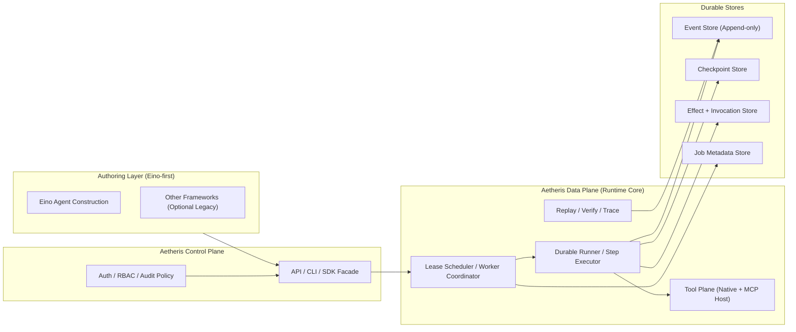

# Aetheris

<p align="center">
  
  
  
  
  
  
  
</p>

<div align="center">

## ⭐ Durable Execution for AI Agents — Build Anywhere, Run Reliably in Production

**Aetheris** is the execution runtime that makes your AI agents survive crashes, avoid duplicate calls, and let you replay any failure like a video recording.

[Quick Start](#-quick-start) • [Documentation](docs/guides/get-started.md) • [Examples](examples/) • [Discord](https://discord.gg/PrrK2Mua)

</div>

---

## 😰 你是否遇到过这些崩溃噩梦？

**场景一：半夜报警，支付 API 被重复调用了 3 次**
> 用户提交订单，Agent 完成风控检查、调起支付 API，Worker 刚好在「写完支付记录」但「还没更新订单状态」时崩溃。
> 重启后 Agent 不知道支付到底成功没有——**再调一次**。再崩——**再调一次**。
>
> 技术根因：Agent 没有「幂等键 + 执行台账」，**重试 = 重复扣款**。
> 实际损失：用户被扣了三次钱，客诉工单 + 对账修复 + 运营介入，一个晚上的事故。

**场景二：跑了 4 小时的合规报告，倒数第二步崩了**
> 合规 Agent 需要抓取 10,000 份合同、调用 LLM 逐份摘要、汇总输出审计报告。
> 跑到 9,800 份时 Worker OOM。重启后——**从第 1 份重新开始**，LLM token 全部重烧。
>
> 技术根因：没有 Checkpoint，**任何一步失败 = 全部重跑**。
> 实际损失：4 小时变 8 小时，LLM 费用翻倍，合规截止日差点 miss。

**场景三：大额退款 Agent 执行到一半，等了 3 天审批，上下文丢了**
> Agent 准备给用户退款 ¥500,000——风控系统触发人工审批。
> 你 3 天后批准了，Agent 重新跑——**原来的对话记忆、风控结果、中间状态全没了**。
> 只能重新查询所有上游数据，有些数据已经变了，结果不一致。
>
> 技术根因：没有「状态 Park + 断点续传」，**审批 = 上下文清零**。
> 实际损失：重复触发风控 API、多次审批流转、数据不一致导致二次核查。

**场景四：生产出了 bug，监管要求还原 Agent 决策过程**
> Agent 给用户推荐了不适合的理财产品，用户亏损投诉，监管介入。
> 你想还原 Agent 当时的完整推理过程，但根本没有记录——LLM 调用了什么、Tool 返回了什么、中间做了什么判断，全靠猜。
>
> 技术根因：没有「事件溯源 + 确定性回放」，**出问题 = 无法解释**。
> 实际损失：监管罚款、合规人员加班、无法证明 AI 决策链路合规。

**场景五：供应链 Agent 调了 30 个供应商 API，不知道哪些已经确认了**
> 采购 Agent 同时向 30 个供应商发送询价并确认库存，中途网络分区，部分请求超时。
> 重启后 Agent 无法判断哪些供应商已经收到了确认——**重发所有请求**，导致双重采购订单。
>
> 技术根因：没有「调用台账（Ledger）」，**网络故障 = 重复下单**。
> 实际损失：超额采购 + 供应商投诉 + 手工核查每笔订单。

**场景六：医疗 AI 助手生成诊断报告，崩溃后重复写入患者记录**
> 医疗 Agent 读取患者检查数据、调用 LLM 生成诊断建议、写入 HIS 系统。
> 步骤 3 写入时超时，Agent 重试——**患者记录出现两条重复诊断，内容略有不同**。
> 医生不知道该信哪条。
>
> 技术根因：数据库写入没有幂等保证，**超时重试 = 脏数据**。
> 实际损失：医疗事故风险 + 手工核查 + 合规风险。

---

## 😮‍💨 Aetheris 之前的无奈

```
你的 AI Agent（每个团队都踩过的坑）：
❌ Worker 重启      → 从头开始跑，LLM token 全部重烧，用户等 N 倍时间
❌ 支付 API 超时    → 不知道付没付，选择重试 → 重复扣款；选择不试 → 丢单
❌ 出 bug 想回放    → 不可能，只能重跑一遍猜逻辑
❌ 等人工审批       → 审批通过，上下文已丢，重新问一遍用户，状态不一致
❌ 监管来审计       → 拿不出 AI 决策证据，只有一堆 print log
❌ 多 Agent 协作    → 某个 Agent 挂了，其他 Agent 不知道状态，整体混乱
❌ 供应商 API 重试  → 没有幂等台账，重试 = 重复下单
❌ 医疗/金融写入    → 超时重试写出脏数据，手工核查成本极高
```

---

## 🚀 Aetheris 之后的体验

```
用 Aetheris 跑你的 Agent：
✅ Worker 重启      → 从上一次成功的步骤继续，毫秒级恢复，LLM 结果从缓存注入不重调
✅ 支付 API 超时    → 幂等台账（Ledger）记录调用状态，重试前先查台账，永不重复扣款
✅ 出 bug 想回放    → 任意时间点确定性重放，像看录像一样定位问题，不触发真实 API
✅ 等人工审批       → Job 状态 Park，保留完整上下文，approve 后无缝从断点继续
✅ 监管来审计       → 完整不可变事件链，step by step 决策证据包，随时导出
✅ 多 Agent 协作    → 各 Agent 独立持久化，独立恢复，互不影响
✅ 供应商 API 重试  → 调用台账 + 幂等键，同一请求永远只执行一次
✅ 医疗/金融写入    → 两步提交（先记录再执行），崩溃恢复走 catch-up，不产生脏数据
```

> **不改变你写 Agent 的方式**，只用 Aetheris 托管你的 Agent，它帮你兜底所有执行可靠性问题。

---

## 🎯 什么感觉？像给 Agent 装了一个"黑匣子 + 时光机"

| 你现在的 Agent | 加上 Aetheris |
| -------------- | -------------- |
| 崩溃 = 丢失所有进度 | 崩溃 = 从上一次 checkpoint 继续 |
| 工具调用没有幂等保证 | 同一工具调用，永远只执行一次 |
| 失败后只能重头跑 | 任意步骤可重放，精准定位 bug |
| 审批 = 状态丢失 | 审批 = 状态 Park，approve 后无缝衔接 |
| 生产问题靠猜 | 完整执行链路，随时回放审计 |

---

## ✨ 核心能力

| 能力 | 听起来像 | 实际上解决了 | 工作机制 |
| ---- | -------- | ------------ | -------- |
| **At-Most-Once** | "工具调用不重复" | 你的支付 API 再也不会被调用两次 | Invocation Ledger + Effect Store 两步提交，幂等键在崩溃前后全程追踪 |
| **Crash Recovery** | "崩溃能恢复" | 跑了 4 小时的报告不会被清零 | 每个 Step 完成后写 Checkpoint；崩溃后下一个 Worker 从 Checkpoint 续跑，已完成 Step 从事件流注入结果 |
| **Deterministic Replay** | "可以回放" | 出 bug 能像看录像一样定位 | Replay 时 Runner 从 Event Store 注入所有已提交结果，**不触发真实 LLM/Tool 调用** |
| **Human-in-the-Loop** | "人工审批" | 大额操作等你批准再继续，上下文不丢 | Job 状态置为 StatusParked，计算资源释放，approve signal 到达后从断点精确恢复 |
| **Event Sourcing** | "事件溯源" | 监管来查，你有一整条不可变证据链 | 所有 Step 状态变更追加写入 Event Store（append-only），永不修改历史，可重建任意时刻状态 |
| **DAG 并发执行** | "并行加速" | 多个独立步骤同时跑，不互相等待 | 拓扑层内步骤并行调度，失败快速中止同层，Replay 按确定顺序重建，幂等保证不变 |

---

## 📊 什么时候用？真实场景举例

| 场景 | 行业 | 不用 Aetheris | 用了 Aetheris |
| ---- | ---- | ------------- | ------------- |
| **支付/退款流程** | 金融/电商 | 支付完成后 Worker 崩溃，重复扣款或丢单 | 幂等台账 + 两步提交，崩溃也能确认支付状态 |
| **大批量数据处理** | 合规/数据 | 处理 1 万条数据，崩在最后 1 条，全部重跑 | Checkpoint 恢复，从断点继续，LLM 不重调 |
| **大额审批流程** | 金融/采购 | Agent 等审批时上下文丢失，重新触发所有上游查询 | StatusParked，审批通过后无缝从断点继续 |
| **合规/监管审计** | 金融/医疗 | 监管来查，拿不出 Agent 决策证据 | 完整不可变事件链，step by step 回放 |
| **生产 Bug 调试** | 所有行业 | 只能重跑一遍猜逻辑，触发真实 API | 确定性重放，不触发 API，精准定位问题 |
| **多 Agent 协作** | 研究/客服 | 某个 Agent 挂了，整体状态混乱 | 各 Agent 独立持久化，独立恢复，互不影响 |
| **供应链询价/订单** | 制造/零售 | 向 30 个供应商重发请求，导致重复下单 | Ledger 幂等键，每个供应商请求只确认一次 |
| **医疗诊断辅助** | 医疗 | 超时重试写出重复诊断记录，产生脏数据 | 两步提交，崩溃走 catch-up，记录唯一 |
| **法律文件生成** | 法律 | 生成合同中途崩溃，片段状态无法恢复 | 逐步 Checkpoint，从断点继续生成 |
| **保险理赔 Agent** | 保险 | 理赔流程跨系统，一个环节失败全部重来 | DAG 并发 + 独立 Checkpoint，精确失败恢复 |
| **内容审核流水线** | 内容平台 | 批量审核中断后无法区分哪些已处理 | Event Store 记录每条处理状态，续跑不重复 |
| **AI 投研报告** | 金融 | 跑了几小时后因 API 限流失败，全部重来 | 已成功 Step 缓存注入，限流重试不重调 LLM |

---

## 🚀 Quick Start

```bash
# Install
go install github.com/Colin4k1024/Aetheris/cmd/cli@latest

# Or use Docker
./scripts/local-2.0-stack.sh start

# Initialize
aetheris init my-agent
cd my-agent
aetheris run

# Monitor
aetheris jobs list
aetheris trace <job_id>
```

See [Getting Started Guide](docs/guides/getting-started-agents.md) for details.

---

## 🔗 Authoring Strategy

Build agents in **Eino**, run them on Aetheris for durability, replay, and audit.

---

## 🏗️ Architecture



**The flow:** Eino authoring → Aetheris runtime submission → scheduler/runner execution → durable events/checkpoints/effects → replay/verify/audit.

### Core Components

| Component | Path | Responsibility |
| --------- | ---- | --------------- |
| **API Server** | `cmd/api/` | HTTP server (Hertz), creates and interacts with agents |
| **Worker** | `cmd/worker/` | Background execution worker, schedules and executes jobs |
| **CLI** | `cmd/cli/` | Command-line tool (`init`, `chat`, `jobs`, `trace`, `replay`, etc.) |
| **AgentFactory** | `internal/runtime/eino/agent_factory.go` | Config-driven Eino ADK agent creation (recommended entry point) |
| **Tool Bridge** | `internal/runtime/eino/tool_bridge.go` | Converts Aetheris RuntimeTool → Eino InvokableTool |
| **Eino Engine** | `internal/runtime/eino/engine.go` | Workflow compilation, runner management |
| **Agent Runtime** | `internal/agent/runtime/` | Core execution engine (DAG compiler + runner) |
| **Job Store** | `internal/agent/runtime/job/` | Event-sourced durable execution history (PostgreSQL) |
| **Scheduler** | `internal/agent/runtime/job/scheduler.go` | Leases and retries tasks with lease fencing |
| **Runner** | `internal/agent/runtime/runner/` | Step-level execution with checkpointing |
| **Planner** | `internal/agent/planner/` | Produces TaskGraph from goals |
| **Executor** | `internal/agent/runtime/executor/` | Executes DAG nodes using eino framework |
| **Effects** | `internal/agent/effects/` | At-most-once tool execution guarantee via Ledger |

### Execution Flow

```
User Message → API creates Job (dual-write: event stream + stateful Job)
  → Scheduler picks up pending Job
  → Runner.RunForJob: if Job.Cursor exists, restore from Checkpoint;
     otherwise PlanGoal → TaskGraph → Compiler → DAG
  → Steppable executes nodes one by one
  → Each node writes Checkpoint, updates Session.LastCheckpoint and Job.Cursor
  → Recovery resumes from next node
```

### Key Concepts

| Concept | Description |
| ------- | ------------ |
| **Job** | Durable task unit, survives worker crashes |
| **Step** | Single execution unit within a Job |
| **Checkpoint** | State snapshot after step completion, enables resume |
| **Effect** | External side effect record (API calls, DB writes) |
| **Ledger** | Tool invocation authorization ledger (guarantees at-most-once) |
| **TaskGraph** | Directed acyclic graph of step dependencies |

### StepOutcome Semantics

Each step produces exactly one outcome:

| Outcome | Meaning |
| ------- | -------- |
| **Pure** | No side effects; safe to replay |
| **SideEffectCommitted** | World changed; must not re-execute |
| **Retryable** | Failure, world unchanged; retry allowed |
| **PermanentFailure** | Failure; job cannot continue |
| **Compensated** | Rollback applied; terminal state |

### Execution Guarantees

| Guarantee | Description |
| --------- | ------------ |
| **At-Most-Once** | Tool calls never repeat, even after crashes |
| **Crash Recovery** | Agents resume from checkpoints, not from scratch |
| **Deterministic Replay** | Reproduce any run for debugging or auditing |
| **Event Sourcing** | Full execution history as append-only event stream |

---

## 🔍 At-Most-Once 到底怎么保证的？

这是 Aetheris 最核心也最难做对的一个能力。

**问题：为什么普通 Agent 做不到 At-Most-Once？**

```
// ❌ 普通重试逻辑的陷阱
func processRefund(orderID string) error {
    result, err := paymentAPI.Charge(orderID)  // 调了
    if err != nil {
        return retry(processRefund, orderID)    // 再调！ → 重复扣款
    }
    saveResult(result)
    return nil
}
// 崩溃发生在 Charge 成功但 saveResult 之前 → 重启后重试 → 再次扣款
```

**Aetheris 的解法：Invocation Ledger + Effect Store 两步提交**

```
Step 执行前：  Ledger.Authorize(idempotency_key) → 只允许第一次通过
                                                 → 后续调用返回"已存在"
Step 执行中：  Tool.Execute() → 成功后 Effect.Put(result)  ← 先持久化结果
Step 执行后：  EventStore.Append(command_committed)         ← 再写事件

崩溃恢复时：   检查 Ledger → 已授权 → 检查 Effect Store → 有结果
              → catch-up: 直接注入结果，不重新执行 Tool
              → 永远只扣一次款
```

**三个关键不变量：**
1. `Ledger.Authorize` 成功 = 这个幂等键已被「预占」，后续重试直接返回已有结果
2. `Effect.Put` 先于 `EventStore.Append` = 崩溃在两者之间时，恢复靠 catch-up 而非重执行
3. Replay 路径绝不调用真实 Tool/LLM = 历史结果从 Event Store 注入，行为 100% 确定

---

## 📈 Why This Matters

```
LLMs made agents possible.
Aetheris makes agents production-ready.

Before Aetheris: your agent is a script.
After Aetheris:  your agent is a durable process.
```

| Problem               | Without Aetheris           | With Aetheris           |
| --------------------- | -------------------------- | ----------------------- |
| Worker crash | Restart from beginning     | Resume from checkpoint  |
| Duplicate API calls  | Possible ($$$ loss)        | Guaranteed at-most-once via Ledger |
| Debug production bug  | Guess what happened        | Deterministic replay, zero real API calls |
| Regulatory audit    | Impossible to reconstruct  | Full immutable evidence chain |
| Human approval  | Context lost, restart needed | StatusParked, resume from exact breakpoint |
| Multi-step long tasks | Any failure = full restart | Per-step checkpoint, granular recovery |
| Compliance-grade tracing | No structured audit trail | Event-sourced, append-only execution history |

---

## 🧩 开箱即用的场景模板

不想从零搭？直接跑起来：

| 模板 | 解决什么问题 |
| ---- | ------------ |
| [**退款审批 Agent**](./examples/human_approval_agent/) | 用户申请退款 → 调风控 → 等审批 → 执行退款，全流程不丢状态，幂等保证不重复扣款 |
| [**客服处理 Agent**](./examples/simple_chat_agent/) | 用户问题分类 → 调工单系统 → 通知，崩溃后从断点继续，消息不重复发送 |
| [**RAG 研究助手**](./examples/eino_agent_with_tools/) | 上传文档 → 向量化 → 检索问答，所有步骤可重放，LLM 结果缓存 |
| [**多 Agent 协作**](./examples/multi_agent_collaboration/) | 多个 Agent 分工协作，各自独立 Checkpoint，某 Agent 挂了不影响整体 |
| [**计划执行 Agent**](./examples/plan_execute_agent/) | 分解目标 → DAG 执行 → 汇总结果，并行步骤加速，失败精确恢复 |
| [**技能路由 Agent**](./examples/skill_agent/) | 根据任务类型分发给不同 Agent，全链路事件溯源，随时审计 |

[**MCP Gateway**](./docs/mcp/) — 预置工具：GitHub、文件系统、网页搜索、数据库

[CLI 工具文档](./docs/guides/cli.md) — `aetheris jobs list / trace / replay` 查看、追踪、重放任务

---

## 🌍 Community

[Discord](https://discord.gg/PrrK2Mua) • [Discussions](https://github.com/Colin4k1024/Aetheris/discussions) • [Docs](https://docs.aetheris.ai)

⭐ Star us on [GitHub](https://github.com/Colin4k1024/Aetheris)!

---

## 📄 License

Apache License 2.0 — free for commercial use.

---

## 🙏 Thanks

Built with [eino](https://github.com/cloudwego/eino), [hertz](https://github.com/cloudwego/hertz), [pgx](https://github.com/jackc/pgx).

---

<div align="center">

**⭐ Star us. Build production agents. Ship with confidence.**

</div>
