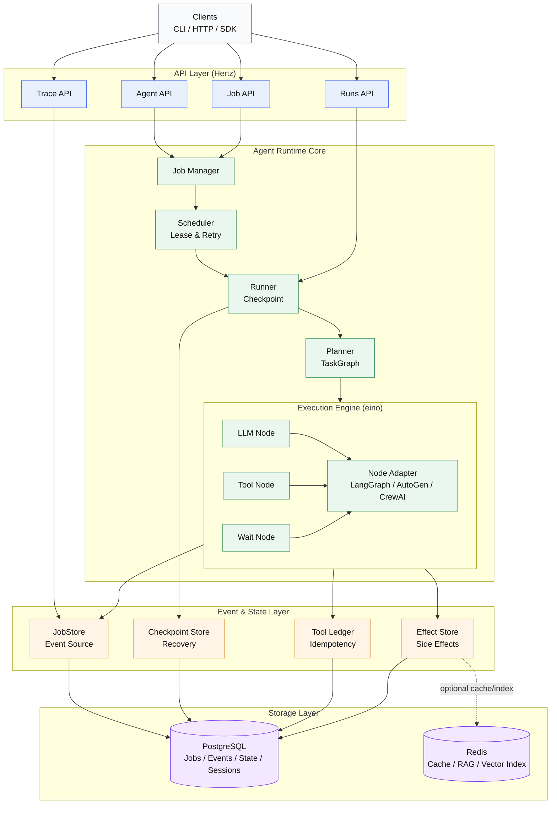

# Aetheris

<p align="center">
  
  
  
  
  
</p>

**Aetheris is an execution runtime for intelligent agents.**

It provides a durable, replayable, and observable environment where AI agents can plan, execute, pause, resume, and recover long-running tasks. Execution is event-sourced and recoverable, so agents can resume after crashes and be replayed for debugging.

Instead of treating LLM calls as stateless requests, Aetheris treats an agent as a **stateful process** — similar to how an operating system manages programs.

## Key Features

- **Durable Execution** — Agents survive crashes and can resume from checkpoints
- **At-Most-Once** — Tool executions are guaranteed not to repeat (Ledger-based)
- **Deterministic Replay** — Reproduce any agent run for debugging
- **Human-in-the-Loop** — Pause for approval, signals, or external events
- **Audit Trail** — Full decision history with evidence graph
- **Multi-Framework Support** — LangGraph, AutoGen, CrewAI adapters

---

## What Aetheris Actually Is

**Aetheris is an Agent Hosting Runtime — Temporal for Agents.** You don’t use it to _write_ agents; you use it to _run_ them. Durable, recoverable, and auditable.

Aetheris is closer to **Temporal / workflow engine / distributed runtime** than to a traditional AI framework.

It is _not_:

- a chatbot framework
- a prompt wrapper
- a RAG library
- a tool for _authoring_ agent logic (use LangGraph, AutoGen, CrewAI, etc. for that)

It _is_:

- an **agent execution runtime** — you host long-running, recoverable agent jobs on it
- a long-running task orchestrator
- a recoverable planning & execution engine
- a durable memory of agent actions

Aetheris turns agent behavior into a deterministic execution history.

### Where Aetheris sits in the stack

| Layer               | Role                                                     | Examples                   |
| ------------------- | -------------------------------------------------------- | -------------------------- |
| **Agent authoring** | Define plans, tools, prompts                             | LangGraph, AutoGen, CrewAI |
| **Agent runtime**   | Run agents: durability, lease, replay, signal, forensics | **Aetheris**               |
| **Capabilities**    | RAG, search, APIs                                        | Vector DBs, RAG pipelines  |
| **Compute**         | LLM, embedding, inference                                | OpenAI, local models       |

You build agents with your favorite framework; you **host** them on Aetheris for production-grade execution.

---

## The Problem

Modern agent frameworks assume that:

- requests are short
- failures are rare
- memory is ephemeral
- execution is synchronous

Real agent workloads break all of these assumptions.

Agents need to:

- run for minutes or hours
- call tools and external systems
- survive crashes and restarts
- be inspectable and debuggable
- resume from the middle of a task

Without a runtime, an agent is just a fragile script.

---

## The Core Idea

Aetheris introduces a different execution model:

> An agent interaction is a **Job**.
> A Job produces an **event stream**.
> The system can replay the stream to reconstruct execution.

Every action becomes an event:

- planning
- tool calls
- intermediate reasoning steps
- retries
- failures
- recovery

Because execution is event-sourced, Aetheris can:

- resume after crash
- run across multiple workers
- audit every decision
- deterministically replay an agent run

**Important**: These guarantees require developers to follow the [Step Contract](design/step-contract.md) — steps must be deterministic and side effects must go through Tools. See the contract for how to write correct steps.

---

## When to Use Aetheris

Aetheris is designed for **three core scenarios**:

### 1. Human-in-the-Loop Operations

Approval flows, customer service tickets, operational decisions — agents wait for human input (possibly for days) and resume from the checkpoint.

**Why Aetheris**:

- **StatusParked**: Long waits do not consume Scheduler resources
- **Continuation**: On resume, full state is bound (reasoning continuity)
- **Signal**: External trigger to resume (at-least-once delivery)

**Examples**: Legal contract approval, payment approval, escalated support tickets, HR hiring approval

---

### 2. Long-Running API Orchestration

SaaS operation agents, data pipelines, batch processing — agents call multiple external APIs (possibly for an hour).

**Why Aetheris**:

- **At-most-once**: Tool calls are not repeated (Ledger + Effect Store)
- **Crash recovery**: After worker crash, execution continues from Checkpoint
- **Step timeout**: Timeout triggers automatic retry or failure

**Examples**: Salesforce batch sync, Stripe order processing, data cleansing pipelines, API orchestration

---

### 3. Auditable Decision Agents

Financial transactions, medical prescriptions, government systems — must record who did what, when, and why.

**Why Aetheris**:

- **Evidence Graph**: Records RAG doc IDs, tool invocations, LLM model/version
- **Execution Proof Chain**: Tamper-evident decision history
- **Replay deterministic**: Proven “decision is reproducible”

**Examples**: Automated loan approval, prescription recommendations, subsidy disbursement, compliance decisions

---

**Don't use Aetheris** for:

- Stateless chatbots (single request/response, no persistence needed)
- Prototype/demo agents (crashes acceptable, no audit requirements)
- Pure in-memory tasks (<1 min, no side effects)

If your agent is becoming a "critical system" (customers depend on it, data loss is unacceptable, failures cost money), you need Aetheris.

Hands-on walkthroughs for these three scenarios are in [docs/guides/getting-started-agents.md](docs/guides/getting-started-agents.md).

---

## Installation

### Quick Install (macOS/Linux)

```bash
# Install CLI via Homebrew (coming soon)
# brew install aetheris

# Or use curl installer
curl -sSL https://raw.githubusercontent.com/Colin4k1024/Aetheris/main/scripts/install.sh | bash

# Or install from source
go install github.com/Colin4k1024/Aetheris/cmd/cli@latest
```

### Build from Source

```bash
# Clone the repository
git clone https://github.com/Colin4k1024/Aetheris.git
cd Aetheris

# Build all binaries
make build

# Or build individual components
go build -o bin/api ./cmd/api
go build -o bin/worker ./cmd/worker
go build -o bin/aetheris ./cmd/cli
```

### Docker Quick Start

```bash
# Start a local stack with Docker Compose
./scripts/local-2.0-stack.sh start

# Check health
curl http://localhost:8080/api/health
```

---

## Quick Start

**Scaffold a minimal agent project**: From an empty directory, run `aetheris init` (or `aetheris init <dir>`) to copy a minimal template with config and a sample agent. Then see [Getting Started with Agents](docs/guides/getting-started-agents.md) to build your first production agent in 15 minutes.

See a real business scenario (refund approval agent with human-in-the-loop) running on Aetheris, including:

- Tool definition (at-most-once side effects)
- Wait node (StatusParked for long waits)
- Signal (human approval)
- Crash recovery (Worker crash → resume without duplicate)
- Trace & Replay (audit & debug)

## Ecosystem & Adapters

Aetheris integrates with popular agent frameworks:

| Framework                                | Status    | Description                           |
| ---------------------------------------- | --------- | ------------------------------------- |
| [LangGraph](examples/langgraph-agent/)   | ✅ Stable | Run LangGraph flows on Aetheris       |
| [AutoGen](examples/autogen_agent/)       | ✅ Stable | Microsoft AutoGen multi-agent support |
| [CrewAI](examples/crewai_agent/)         | ✅ Stable | CrewAI crew orchestration             |
| [LlamaIndex](examples/llamaindex_agent/) | ✅ Stable | LlamaIndex agent integration          |
| [Vertex AI](examples/vertex_agent/)      | ✅ Stable | Google Vertex AI Agent Engine         |
| [AWS Bedrock](examples/bedrock_agent/)   | ✅ Stable | AWS Bedrock Agents                    |
| [AgentScope](examples/agentscope_agent/) | ✅ Stable | AgentScope multi-agent framework      |

Already have agents? Migrate them to Aetheris:

- [Adapter Index](docs/adapters/README.md) — Choose adapter by migration path and granularity
- [Custom Agent Adapter](docs/adapters/custom-agent.md) — Wrap your existing agents (imperative → TaskGraph)
- [LangGraph Adapter](docs/adapters/langgraph.md) — Run LangGraph flows on Aetheris runtime

## Examples

- [Human Approval](examples/human_approval_agent/) — Approval workflows with human-in-the-loop
- [Multi-Agent Collaboration](examples/multi_agent_collaboration/) — Complex multi-agent systems
- [LangGraph Complete](examples/langgraph-complete/) — Full LangGraph workflow example

---

## Architecture Overview

**Aetheris treats agents as virtual processes, not tasks.** Workers schedule and host processes; processes can pause, wait for signals, receive messages, and resume across different workers.



### Key Components

| Component                   | Description                         |
| --------------------------- | ----------------------------------- |
| **Agent API**               | HTTP endpoints for agent management |
| **Job Manager**             | Creates and tracks agent jobs       |
| **Scheduler**               | Lease management & retry logic      |
| **Runner**                  | Step execution with checkpointing   |
| **Planner**                 | Converts goals to TaskGraph DAG     |
| **Execution Engine (eino)** | DAG execution with node adapters    |
| **JobStore**                | Event-sourced durable history       |
| **Tool Ledger**             | Ensures at-most-once execution      |
| **Effect Store**            | Records side effects for replay     |
| **Checkpoint Store**        | Enables crash recovery              |

### Execution Flow

User Request → API Layer → Job Created → Scheduler (Lease)
→ Runner (Checkpoint) → Planner (TaskGraph)
→ Execution Engine (LLM / Tool / Wait Nodes)
→ Events Written → Job Complete

### Notes

- **Aetheris treats agents as virtual processes, not one-shot tasks**
- **Execution is event-sourced and recoverable**
- **Tool Ledger ensures at-most-once tool execution**
- **Checkpoint Store enables crash recovery**
- **Framework adapters map LangGraph / AutoGen / CrewAI flows into the runtime**

### Framework Adapters

Aetheris integrates with popular agent frameworks:

```
┌─────────────┐   ┌─────────────┐   ┌─────────────┐
│  LangGraph  │   │   AutoGen   │   │   CrewAI    │
│  Adapter    │   │   Adapter   │   │   Adapter   │
└──────┬──────┘   └──────┬──────┘   └──────┬──────┘
       │                  │                  │
       └──────────────────┼──────────────────┘
                          ▼
              ┌─────────────────────┐
              │   Aetheris Runtime  │
              │ (Durable, Recover, │
              │  Audit, Observable) │
              └─────────────────────┘
```

Scheduler correctness (lease fencing, step timeout) is implemented and documented in [design/scheduler-correctness.md](design/scheduler-correctness.md).

RAG is one capability that agents can use via pipelines or tools; it is **pluggable**, not the only built-in scenario. Aetheris is an **Agent Hosting Runtime** (Temporal for agents): retrieval, generation, and knowledge pipelines are integrated as optional components, not the core product.

**Names**: The product name is **Aetheris**. The Go module name (and import path) is **rag-platform**. The CLI command is **aetheris**. See [docs/README.md](docs/README.md) for naming details.

Detailed documentation (configuration, CLI, deployment) is in [docs/](docs/).

Common CLI operations:

- `aetheris replay <job_id>` inspect event stream and trace URL
- `aetheris monitor --watch --interval 5` watch queue/stuck-job observability snapshot
- `aetheris migrate m1-sql` print incremental M1 schema SQL
- `aetheris migrate backfill-hashes --input events.ndjson --output events.backfilled.ndjson` backfill hash chain for exported events

---

## Makefile — Build and run

The project provides a Makefile for one-command build and startup of all services.

| Command                 | Description                                                          |
| ----------------------- | -------------------------------------------------------------------- |
| `make` / `make help`    | Show help                                                            |
| `make build`            | Build api, worker, and cli into `bin/`                               |
| `make run`              | **Build and start API + Worker in background** (one-command startup) |
| `make run-api`          | Build and start only API in background                               |
| `make run-worker`       | Build and start only Worker in background                            |
| `make run-all`          | Alias of `make run`                                                  |
| `make stop`             | Stop API and Worker started by `make run`                            |
| `make clean`            | Remove `bin/`                                                        |
| `make test`             | Run tests                                                            |
| `make test-integration` | Run key integration suites (runtime + http)                          |
| `make docker-build`     | Build runtime container image (`aetheris/runtime:local`)             |
| `make docker-run`       | Start local 2.0 stack via Compose script                             |
| `make docker-stop`      | Stop local 2.0 stack via Compose script                              |
| `make release-2.0`      | Run 2.0 release preflight checks                                     |
| `make vet`              | go vet                                                               |
| `make fmt`              | gofmt -w                                                             |
| `make tidy`             | go mod tidy                                                          |

**One-command run**: From the repo root, run `make run` to build and then start the API (default :8080) and Worker in the background; PIDs and logs are under `bin/`. Use `make stop` to stop. If using Postgres as jobstore, start Postgres first (see [docs/guides/deployment.md](docs/guides/deployment.md)). For a full walkthrough of core features (quick trial vs full runtime), see [docs/guides/get-started.md](docs/guides/get-started.md).

**Local 2.0 stack (Compose)**: run `./scripts/local-2.0-stack.sh start` to launch `postgres + api + worker1 + worker2`, and `./scripts/local-2.0-stack.sh stop` to shut it down.

---

## Why This Matters

Current AI stacks focus on model intelligence.

Aetheris focuses on **execution reliability**.

LLMs made agents possible.
Reliable runtimes will make agents usable in production.

Aetheris is an attempt to provide the missing layer:

> Kubernetes manages containers.
> Aetheris manages agents.

That claim holds only when the runtime can **prove** that agent steps do not repeat external side effects. Aetheris 1.0 provides:

- **At-most-once tool execution** — Every tool invocation is a persistent fact (Tool Invocation Ledger). On replay, the runner looks up the ledger and restores results instead of calling the tool again.
- **World-consistent replay** — Replay is not “run the step again”; it is “verify the external world still matches the event stream, then restore memory and skip execution” (Confirmation Replay). If verification fails, the job fails rather than silently re-executing.

So: **external side effects are executed at most once**. 1.0 proof: the four fatal tests (worker crash before tool, crash after tool before commit, two workers same step, replay restore output) pass — no step repeats external side effects under crash, restart, or duplicate worker. High-level runtime flow and StepOutcome semantics: [design/runtime-core-diagrams.md](design/runtime-core-diagrams.md). See [design/1.0-runtime-semantics.md](design/1.0-runtime-semantics.md) for the three mechanisms and the Execution Proof Chain; [design/execution-proof-sequence.md](design/execution-proof-sequence.md) for the detailed Runner–Ledger–JobStore sequence diagram. For 2.0 feature modules and roadmap: [design/aetheris-2.0-overview.md](design/aetheris-2.0-overview.md).

---

## Auditability & Forensics

Aetheris is built not only to **trace** execution but to **audit** and **attribute** it. You can answer: _"Who had the AI send that email, at which step, and based on which LLM output or tool result?"_

- **Decision timeline** — The event stream is the source of truth; every step has node*started/node_finished, command_emitted/command_committed, and tool_invocation*\* events.
- **Reasoning snapshot** — Per-step context (goal, state_before, state_after, and optionally llm_request/llm_response for LLM nodes) is written as `reasoning_snapshot` events for causal debugging.
- **Step causality** — The execution tree (plan → node → tool) and Trace API let you see which step’s input/output led to the next.
- **Tool provenance** — Every tool call’s input and output is recorded; you can trace side effects back to the exact step and command.

See [design/execution-forensics.md](design/execution-forensics.md) and [design/causal-debugging.md](design/causal-debugging.md).

**Runtime guarantees and failure behavior** are documented in [docs/guides/runtime-guarantees.md](docs/guides/runtime-guarantees.md). See what happens when workers crash, steps timeout, or signals are lost. Formal guarantees table: [design/execution-guarantees.md](design/execution-guarantees.md).

---

## Powered by Aetheris

Projects and companies using Aetheris in production.

### Featured Case Studies

| Company                                          | Industry   | Use Case                 | Results           |
| ------------------------------------------------ | ---------- | ------------------------ | ----------------- |
| [AutoFinance](./docs/showcase/01-autofinance.md) | Fintech    | AI Portfolio Rebalancing | 99.9% reliability |
| [HealthAI](./docs/showcase/02-healthai.md)       | Healthcare | Patient Triage           | 40% faster        |
| [LogiShip](./docs/showcase/03-logiship.md)       | Logistics  | Inventory Optimization   | $2M savings       |

[View all case studies →](./docs/showcase/README.md)

### Add Your Project

To add your project, please open a PR or start a [Discussion](https://github.com/Colin4k1024/Aetheris/discussions/category/show-and-tell).

---

## Security

Aetheris includes production-ready security features:

- **Authentication** — JWT-based authentication (configurable)
- **CORS Control** — Configurable allowed origins
- **Production Mode** — Strict validation for production deployments:
  - Requires PostgreSQL for durable storage
  - Requires authentication enabled
  - Requires JWT secret key
  - Requires SSL for database connections
  - Requires specific CORS origins (not wildcard)
  - Validates default credentials are changed

See [Security Guide](docs/guides/security.md) for security settings.

## Troubleshooting

Having issues? Check the [Troubleshooting Guide](docs/guides/troubleshooting.md) for common problems and solutions.

---

## License

Aetheris is licensed under the Apache License 2.0. See [LICENSE](LICENSE) for details.

## Contributing

Contributions are welcome! Please see [CONTRIBUTING.md](CONTRIBUTING.md) for guidelines on how to get started.

## Community

Join our growing community:

| Platform                                                                  | Description                       |
| ------------------------------------------------------------------------- | --------------------------------- |
| [Discord](https://discord.gg/PrrK2Mua)                                    | Real-time chat, help, discussions |
| [GitHub Discussions](https://github.com/Colin4k1024/Aetheris/discussions) | Q&A, feature ideas                |
| [Community Docs](docs/community.md)                                       | Full community guide              |

---

## Code of Conduct

Please note that this project is governed by a [Code of Conduct](CODE_OF_CONDUCT.md).
By participating, you are expected to uphold this code.
