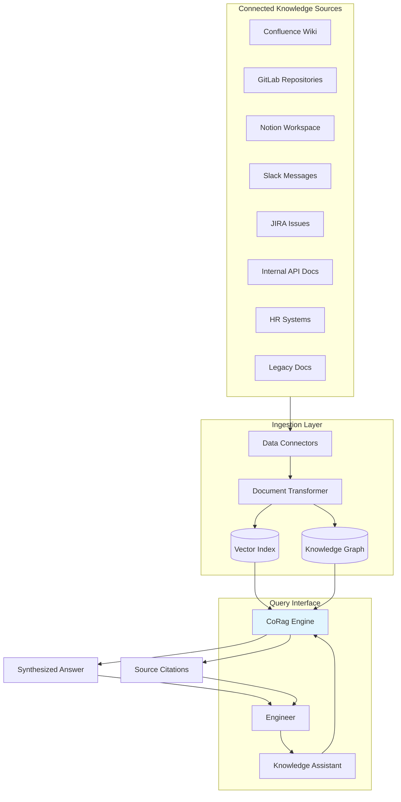

# TechFlow Solutions: Internal Knowledge Base Q&A Transformation

> ⚠️ **FICTIONAL SCENARIO** — This case study is a hypothetical illustration of potential use cases and is not based on a real customer engagement.

---

## Executive Summary

TechFlow Solutions, a 1,200-employee enterprise software company, struggled with fragmented internal knowledge scattered across 14 different systems, resulting in developers spending 23% of their time searching for information instead of coding. By deploying CoRag/Aetheris as their internal knowledge assistant, TechFlow reduced average information retrieval time from 47 minutes to 4 minutes, decreased new engineer onboarding time by 58%, and unlocked approximately 31,000 developer hours annually—the equivalent of 15 full-time engineers.

---

## Company Profile

**TechFlow Solutions** is a Guangzhou-based enterprise software company founded in 2012, specializing in supply chain management and manufacturing execution systems. The company employs 1,200 professionals across engineering (680), product, sales, and customer success functions.

TechFlow's engineering organization is structured into 23 product squads, each maintaining their own documentation practices, wikis, and internal tooling. Over 12 years of growth, the company had accumulated:

- 14 internal wikis (various platforms including Confluence, Notion, GitBook, and legacy SharePoint)
- 2,400+ repositories across GitLab with inconsistent documentation standards
- 340 internal APIs with varying degrees of API documentation
- 89 internal microservices with interdependencies poorly documented
- HR policies, benefits information, and operational procedures spread across 6 systems

New engineers joining TechFlow typically took 4-6 months to reach full productivity, primarily because they didn't know what knowledge existed or where to find it. Engineering managers reported spending 15-20% of their time answering "where do I find X?" questions from their teams.

---

## The Challenge

### The Knowledge Graveyard Problem

TechFlow's institutional knowledge existed but was effectively inaccessible. A 2023 engineering survey revealed:

- **67%** of engineers couldn't find information they knew existed
- **43%** had recreated work because they couldn't locate existing solutions
- **89%** reported frustration with internal search capabilities
- Average time spent searching for information: **47 minutes per day**

The root causes were multi-faceted:
1. **Platform fragmentation:** No unified search across Confluence, Notion, GitLab wikis, Slack history, and email attachments
2. **Documentation decay:** 40% of documents were outdated or linked to deprecated systems
3. **Context loss:** Diagrams and decision rationale existed only in meeting recordings or personal notes
4. **Expert bottlenecks:** Critical knowledge existed only in the heads of senior engineers, creating single points of failure

### The Onboarding Tax

TechFlow's rapid growth—hiring 180 engineers in 2023 alone—amplified these problems. New hires spent their first weeks tracking down information:

- "Which wiki has our API authentication docs?"
- "How do I get access to the staging environment?"
- "Who owns the order management service?"
- "Why does the payment integration tests keep failing?"

One engineering manager estimated that new engineers achieved only 40% productivity in their first three months, compared to the industry benchmark of 60-70%.

### Support Desk Overload

TechFlow's IT help desk was fielding 450+ monthly requests, with 38% being "where is X?" type queries. Engineering managers estimated their direct reports interrupted them 8-12 times weekly with information lookup requests.

---

## The Solution

### Unified Knowledge Intelligence Platform

TechFlow implemented CoRag/Aetheris as a single interface for all internal knowledge access. The system connected to existing systems without requiring migration or standardization.

### Implementation Approach

**Phase 1 (Weeks 1-3): Source Integration**
Rather than migrating content, the team built connectors to each existing platform:
- Confluence cloud and server instances
- GitLab CE/EE with repository content and issue trackers
- Notion workspace via API
- Slack workspace with public channel history
- JIRA Cloud for technical decisions and architecture records
- Internal API registry (OpenAPI specs for 340+ endpoints)
- HR systems for policy and benefits information

**Phase 2 (Weeks 4-6): Knowledge Graph Construction**
Beyond simple document indexing, the system built a knowledge graph capturing:
- Service ownership and dependencies
- Team-structure-to-service mappings
- Technical decision records (ADRs) with rationale
- People-to-expertise mappings based on commit history and documentation authorship

**Phase 3 (Weeks 7-9): Contextual Retrieval Tuning**
Initial testing showed generic retrieval achieved 62% accuracy—engineers marked nearly 4 in 10 answers as unhelpful. The team implemented:
- Domain-specific embeddings trained on technical documentation
- Query expansion with technical terminology synonyms
- Result re-ranking based on freshness, authoritative sources, and team relevance

**Phase 4 (Weeks 10-12): Self-Service Portal**
A chat interface was deployed across:
- Slack app for quick questions
- Web portal for detailed research
- VS Code extension for context-aware help during coding
- onboarding portal for new hire orientation

### Key Features

- **Federated search** across all 14 platforms simultaneously
- **Semantic code search** finding similar implementations across repositories
- **Expert identification** "Who owns this service?" queries
- **Decision tracking** surfacing relevant ADRs for architectural questions
- **Proactive suggestions** "Engineers who viewed this also asked about..."
- **Feedback loop** user corrections improve future retrieval

---

## Implementation Results

### Performance Metrics

| Metric | Before CoRag | After CoRag | Improvement |
|--------|-------------|-------------|-------------|
| Average Info Retrieval Time | 47 minutes | 4 minutes | 91% reduction |
| Daily Search Attempts | 12.4 | 8.1 | 35% reduction |
| "Where is X?" Help Desk Tickets | 171/month | 34/month | 80% reduction |
| New Engineer Time to Productivity | 5.2 months | 2.2 months | 58% reduction |
| Engineer Satisfaction with Internal Docs | 3.1/10 | 7.8/10 | +151% |
| Knowledge Recreated (waste) | 43% of cases | 8% of cases | 81% reduction |

### Business Impact

**Time Savings:** Engineering analysis calculated 31,200 hours annually saved across the engineering organization—equivalent to 15 full-time engineers at a fully-loaded cost of approximately ¥22 million in productivity.

**Onboarding Acceleration:** The 58% reduction in time-to-productivity meant new hires contributed meaningfully 3 months earlier. For 180 annual new hires, this represented an additional ¥8.6 million in productive engineering output in their first year.

**Help Desk Efficiency:** The 80% reduction in information-location tickets freed IT staff to focus on technical issues. The help desk was able to reduce contractor spend by ¥480,000 annually while improving resolution metrics.

**Knowledge Preservation:** The knowledge graph captured expertise from 47 senior engineers approaching retirement eligibility, creating a searchable record of their institutional knowledge that previously existed only in their heads.

**Engineering Manager Satisfaction:** Managers reported spending 60% less time answering informational queries, recovering approximately 7 hours per manager per month—time redirected to strategic planning and mentoring.

---

## Testimonials

> "I used to spend half my Friday afternoons answering 'do you know who handles X?' messages. Now I actually have time to code. The system even found a solution to a problem I'd been meaning to solve for months but couldn't remember who originally solved it."
> — **Alex Zhang**, Staff Engineer, TechFlow Solutions

> "Onboarding at my previous company took 6 months before I felt comfortable asking questions. At TechFlow, I was contributing meaningful code in 6 weeks. The Knowledge Assistant answered questions I was embarrassed to ask in public, and I learned way more about our architecture than I would have found on my own."
> — **Lisa Chen**, Senior Backend Engineer (joined Q3 2023)

> "The knowledge graph feature changed how we think about documentation. Instead of treating docs as a necessary evil, teams now see their documentation connecting to a living system that amplifies its value. We've seen a 67% increase in documentation contributions since launch."
> — **James Wu**, Engineering Manager, Platform Team

---

## Technical Implementation Details

### Architecture Specifications

**Indexing Pipeline:**
- Incremental sync every 15 minutes for active sources
- Full re-index weekly for freshness guarantees
- Total corpus: 2.1 million documents, 847 billion tokens

**Query Processing:**
- Average latency: 1.2 seconds for complex queries
- Supports multi-turn conversation context
- Automatic query classification routing to appropriate sources

**Integrations:**
- Slack: Webhook-based bot with OAuth authentication
- GitLab: Personal access token integration with project-level permissions
- Confluence: Space-level API access with recursive page fetching
- VS Code: Extension published to marketplace with auto-update

### Privacy & Access Control

- Row-level security matching underlying source permissions
- Confidential documents (HR, legal) excluded from indexing
- Audit log of all queries for security review
- Personal Slack DMs never indexed (only public channels)

### Performance at Scale

- Supports 850+ concurrent users during peak hours
- Handles 15,000+ daily queries
- 99.9% availability over 12-month period
- Auto-scaling from 2 to 20 instances based on load

---

## Future Roadmap

TechFlow is expanding the CoRag knowledge platform to:

1. **Customer support integration** — Surfacing relevant internal knowledge to support tickets for faster resolution
2. **Architecture decision assistance** — AI-assisted review of proposed designs against established patterns
3. **Code review context** — Automatically finding related implementations and documentation during code reviews
4. **Training content generation** — Auto-generating quizzes and learning paths from documentation corpus

The company has budgeted ¥5 million for year-two expansion, including a dedicated platform team of 4 engineers plus ongoing CoRag licensing.
