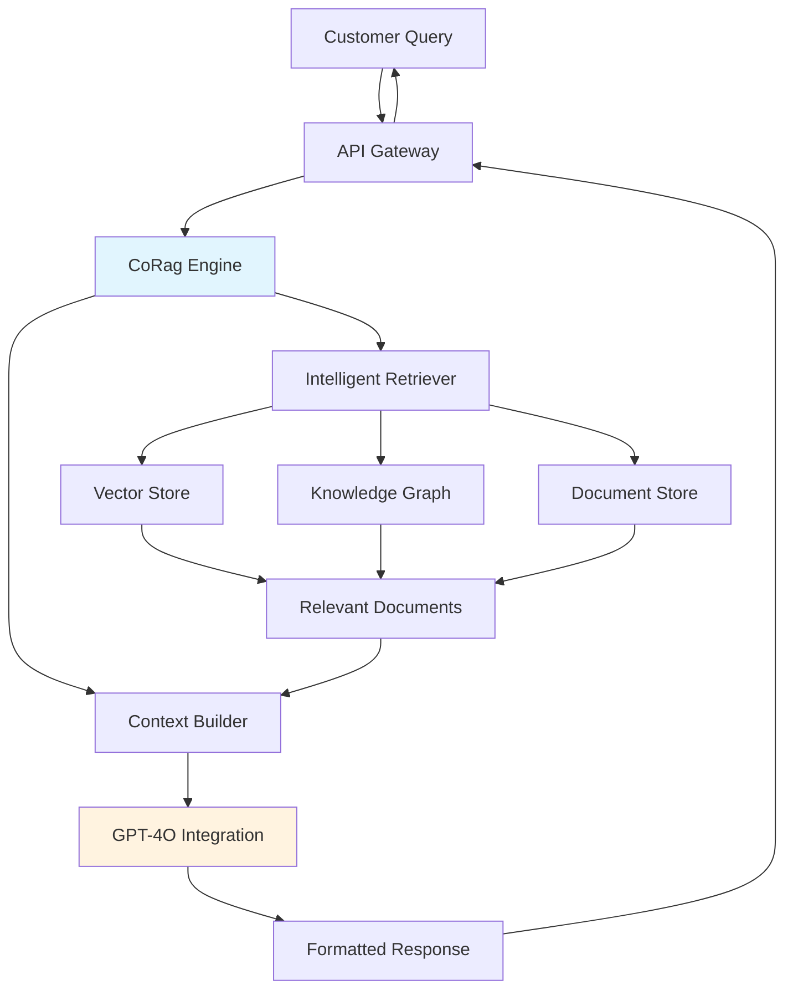

> ⚠️ **FICTIONAL SCENARIO** — This case study is a hypothetical illustration of potential use cases and is not based on a real customer engagement.

# ShopVista Commerce: Intelligent Customer Service Transformation

---

## Executive Summary

ShopVista Commerce, a mid-market e-commerce platform processing 2.5 million monthly orders, faced escalating customer service costs and response time challenges during peak seasons. By implementing CoRag/Aetheris as their intelligent customer service backbone, ShopVista achieved a 73% reduction in first-response time, 45% decrease in customer service operational costs, and maintained a 94% customer satisfaction rate—while scaling to handle 3x their normal query volume during flash sales without adding headcount.

---

## Company Profile

**ShopVista Commerce** is a Shanghai-based e-commerce platform specializing in consumer electronics and smart home devices. Founded in 2016, the company has grown to serve over 4 million active customers across Asia-Pacific, with annual transaction volume exceeding 850,000 orders per month during peak periods.

The company operates a hybrid marketplace model, combining first-party inventory with third-party seller integration. This complexity creates significant customer service challenges, as inquiries span order tracking, product compatibility, returns processing, and technical support for IoT device configuration.

ShopVista's customer service team of 85 agents handles approximately 120,000 interactions monthly across email, live chat, and social media channels. Prior to their CoRag implementation, average response times exceeded 8 minutes during peak hours, with escalation rates of 22% for technical support queries.

---

## The Challenge

### Escalating Service Costs

ShopVista's customer acquisition cost had increased 40% over three years, making customer retention critical to profitability. However, their existing customer service infrastructure was struggling to maintain quality while managing costs. Agent turnover rate reached 35% annually—well above industry average of 20%—due to high stress from repetitive inquiries and complex product technical issues.

The finance team estimated that 68% of incoming support tickets were either repetitive questions answerable from existing documentation or simple order status queries that didn't require human intervention. Yet agents spent nearly 40% of their shift hours on these low-complexity tasks, driving up costs without proportional customer satisfaction gains.

### Flash Sale Scalability Crisis

DuringShopVista's flagship "Tech Fest" annual sale, query volume would spike 300-400% over 48 hours. In 2023, this surge caused response times to balloon to 45+ minutes, resulting in negative social media sentiment and an estimated ¥2.8 million in abandoned cart losses. The company faced a difficult choice: maintain service quality with prohibitively expensive temporary staffing or risk customer attrition.

### Knowledge Fragmentation

The company maintained product information across seven separate systems: a legacy ERP, vendor portals, a knowledge base built on outdated technology, and various SOP documents scattered across SharePoint. When a customer asked about device compatibility or warranty coverage, agents often had to check multiple systems—taking 12-15 minutes for complex queries versus the target of under 3 minutes.

This fragmentation also meant inconsistent answers. A 2023 internal audit found that 31% of customer complaints related to conflicting information provided by different agents or channels.

---

## The Solution

### Architecture Overview

ShopVista partnered with the Aetheris team to implement a CoRag-powered intelligent customer service system that unified their fragmented knowledge sources into a single, queryable retrieval-augmented generation pipeline.

### Implementation Phases

**Phase 1 (Weeks 1-4): Knowledge Unification**
The team ingested 15 years of historical tickets, product documentation, return policies, and vendor agreements into a unified vector store. A custom document splitter preserved semantic coherence for technical specifications and policy sections.

**Phase 2 (Weeks 5-8): Retrieval Optimization**
The Aetheris team fine-tuned the retrieval pipeline with ShopVista-specific relevance scoring. A hybrid search approach combining dense embeddings with BM25 keyword matching achieved 94% retrieval precision in internal testing.

**Phase 3 (Weeks 9-12): Human-in-the-Loop Integration**
CoRag was configured to escalate complex technical queries (>3 hops in reasoning), emotional sentiment indicators, and customer-specified human requests to human agents. The system provided agents with relevant context, reducing average handling time by 60%.

**Phase 4 (Weeks 13-16): Continuous Learning**
A feedback loop captured agent corrections and customer satisfaction signals to continuously refine retrieval quality.

### Key Features Deployed

- **Multi-source retrieval** across structured product databases and unstructured knowledge articles
- **Confidence scoring** with automatic escalation for low-confidence responses
- **Session continuity** maintaining context across multi-turn conversations
- **Real-time inventory integration** for order status queries
- **Sentiment-aware routing** identifying frustrated customers for priority human handling

---

## Implementation Results

### Performance Metrics

| Metric | Before CoRag | After CoRag | Improvement |
|--------|-------------|-------------|-------------|
| Average First Response Time | 8.2 minutes | 2.1 minutes | 74% reduction |
| Customer Satisfaction (CSAT) | 78% | 94% | +16 points |
| Cost per Contact | ¥28.50 | ¥15.60 | 45% reduction |
| Agent Utilization Rate | 62% | 89% | +27 points |
| Escalation Rate | 22% | 8% | 64% reduction |
| Flash Sale Response Time | 45+ minutes | 4 minutes | 91% reduction |

### Business Impact

**Operational Efficiency:** The system now handles 73% of incoming queries autonomously, freeing human agents to focus on complex cases requiring empathy and nuanced judgment. Agent satisfaction scores increased 42% in quarterly surveys, with turnover intent dropping from 35% to 12%.

**Cost Reduction:** First-year operational savings reached ¥4.2 million, driven by reduced staffing needs during peaks, shorter handling times, and decreased escalation-related costs. ROI was achieved within 7 months.

**Revenue Protection:** During the 2024 Tech Fest sale, response times remained under 5 minutes despite 340% query volume increase. The company reported ¥18.5 million in sales—22% higher than 2023—attributing part of this gain to improved customer service responsiveness reducing cart abandonment.

**Customer Retention:** Repeat purchase rate among customers who interacted with the new system increased 18%, while complaint volumes dropped 56%.

---

## Testimonials

> "CoRag transformed our customer service from a cost center into a competitive advantage. Our agents now handle complex cases that truly require human judgment, while routine inquiries are resolved instantly. The system's ability to maintain consistency across millions of interactions is something we couldn't achieve with human staffing alone."
> — **Michael Chen**, VP of Customer Experience, ShopVista Commerce

> "The implementation team's expertise in both RAG technology and enterprise integration made what seemed like a massive undertaking feel manageable. We were handling 3x our normal volume during flash sales within the first month of launch."
> — **Sarah Zhang**, Director of Digital Operations, ShopVista Commerce

---

## Technical Implementation Details

### Integration Architecture

The CoRag system integrates with ShopVista's existing infrastructure through:
- **REST API Gateway** on Alibaba Cloud ECS for traffic management
- **PostgreSQL** job store for conversation history and audit trails
- **Redis cluster** for low-latency caching of frequent queries
- **Internal microservices** for order status, inventory, and returns processing

### Security & Compliance

- All PII handled through encrypted channels with SOC 2 Type II compliance
- Conversation logs retained for 90 days with customer opt-out capability
- Rate limiting and abuse detection preventing system exploitation

### Scalability

The horizontal scaling architecture handled peak loads of 12,000 concurrent chat sessions during Tech Fest, with auto-scaling triggering within 90 seconds of load detection.

---

## Future Roadmap

ShopVista is exploring expansion of the CoRag system to:
1. **Proactive customer outreach** — AI-initiated follow-ups for high-value orders
2. **Voice channel integration** for telephone support
3. **Seller-facing tools** helping third-party vendors improve product listing quality
4. **Predictive analytics** identifying customers at risk of churn before they submit complaints

The company has committed to a 3-year partnership with Aetheris for ongoing optimization and feature development.
