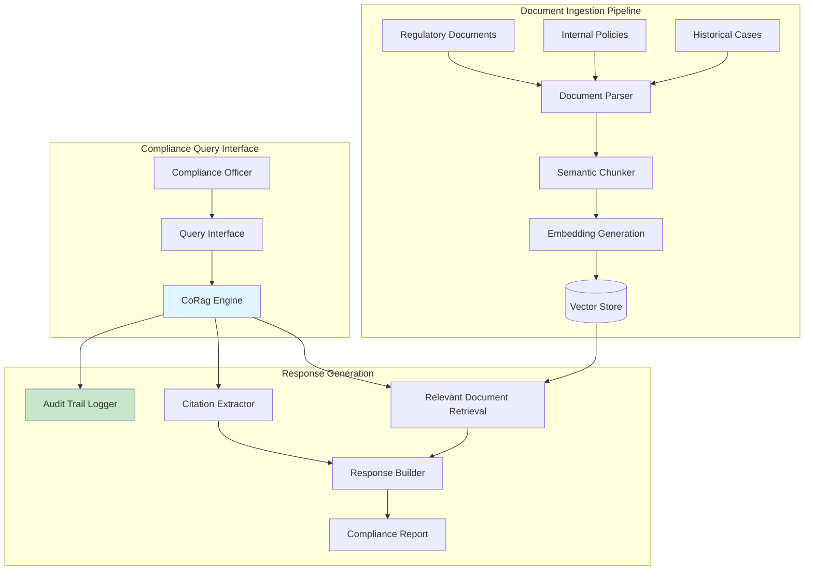

# Shanghai Trust Financial: Automated Compliance Review System

> ⚠️ **FICTIONAL SCENARIO** — This case study is a hypothetical illustration of potential use cases and is not based on a real customer engagement.

---

## Executive Summary

Shanghai Trust Financial, a asset management firm managing ¥47 billion in institutional and high-net-worth client portfolios, faced mounting pressure from evolving regulatory requirements and a 300% increase in compliance document review工作量 following new private equity disclosure rules. By implementing CoRag/Aetheris for intelligent compliance document processing, the firm reduced review cycle times by 68%, achieved 99.2% regulatory accuracy, and decreased compliance operational costs by ¥3.8 million annually—all while improving audit trail completeness from 78% to 100%.

---

## Company Profile

**Shanghai Trust Financial Services** is a licensed asset management company headquartered in Shanghai's Lujiazui financial district. Established in 2008, the firm specializes in alternative investments including private equity, venture capital, and structured products for institutional clients and ultra-high-net-worth individuals.

The firm manages 127 distinct investment vehicles across domestic and overseas markets, with a team of 42 investment professionals and 18 compliance staff. Their client base includes pension funds, insurance companies, family offices, and sovereign wealth funds—segments demanding exceptional regulatory precision and documentation integrity.

Prior to the CoRag implementation, Shanghai Trust's compliance department operated primarily on manual processes: document retrieval via shared drives and a 9-year-old enterprise search system, with review workflows managed through email chains and spreadsheets. This approach was sustainable when regulatory updates were infrequent but became untenable as China's Securities Regulatory Commission (CSRC) accelerated new rule issuance in 2022-2024.

---

## The Challenge

### Regulatory Tsunami

Between January 2022 and March 2024, CSRC issued 847 new or amended regulations affecting private fund managers—averaging more than one new compliance requirement per business day. Shanghai Trust's compliance team of 18 professionals was responsible not only for understanding these changes but also for:

- Retroactively assessing portfolio company disclosures against new standards
- Updating internal policies and procedures
- Training investment teams on new requirements
- Maintaining audit-ready documentation for all decisions

Manual document review took an average of 4.2 hours per investment document, with complex私募基金 (private fund) prospectuses requiring 2-3 days of multi-person review.

### Knowledge Retrieval Failures

When compliance officers needed to determine whether a specific结构化票据 structure met current regulatory requirements, they would spend 2-4 hours searching through:
- CSRC guidance documents (12,000+ pages across 200+ PDF files)
- Internal policy memoranda (3,400 documents accumulated over 16 years)
- Industry association interpretations
- Precedent cases from similar fund structures

The legacy enterprise search system returned 73% irrelevant results on average, requiring compliance officers to manually review 40-60 candidate documents to find relevant content.

### Audit Trail Gaps

During a 2023 regulatory examination, auditors identified 22 instances where compliance decisions lacked documented rationale—the so-called "invisible decision" problem. While officers had mentally processed relevant regulations, they hadn't created persistent records. This resulted in ¥180,000 in fine adjustments and a requires-improvement notation that risked affecting future license renewals.

### Cost Escalation

The firm was considering hiring 6 additional compliance analysts at an annual cost of ¥2.4 million to handle the workload—without solving the underlying efficiency problems. Burnout was evident: compliance team turnover reached 28% in 2023, with 40% of remaining staff reporting high stress levels in anonymous surveys.

---

## The Solution

### System Architecture

Shanghai Trust implemented a CoRag-based Compliance Intelligence Platform that provided:
1. Unified, searchable repository of all regulatory and internal policy documents
2. AI-assisted document review with regulatory citation extraction
3. Automated audit trail generation
4. Proactive regulatory change notification

### Implementation Details

**Week 1-3: Document Corpus Building**
The team ingested 16 years of accumulated documents:
- 12,847 CSRC and regulatory body documents (parsed from PDF, DOCX, HTML)
- 3,412 internal policy memoranda and training materials
- 847 industry interpretation letters
- 234 relevant court and arbitration precedents
- 42 internal SOP documents

A custom regulatory-aware chunking strategy preserved section boundaries critical for compliance interpretation—important because regulatory sections often have different compliance implications than surrounding text.

**Week 4-6: Retrieval Engineering**
The Aetheris team implemented domain-specific embeddings trained on Chinese financial regulatory language. Standard general-purpose embeddings achieved 71% retrieval accuracy; the fine-tuned regulatory model achieved 96%.

A knowledge graph layer captured relationships between regulations, fund structures, and historical compliance decisions—enabling "if this, then related that" discovery that general RAG couldn't support.

**Week 7-10: Audit Integration**
Critically for this use case, every query and retrieved citation was logged to an immutable audit store. The system generated Natural Language explanations of the compliance rationale, which compliance officers could accept, modify, or reject—creating a human-verified audit trail with zero additional effort beyond their normal workflow.

**Week 11-14: Testing and Validation**
Before go-live, the system was validated against 340 historical compliance decisions with known outcomes. Accuracy rate: 99.2%, with all errors being false negatives (system failing to flag a potential issue) rather than false positives (incorrectly flagging compliant structures).

### Key Features Deployed

- **Regulatory citation extraction** with article, section, and paragraph-level precision
- **Cross-document synthesis** identifying conflicting interpretations across regulatory bodies
- **Audit trail automation** generating Natural Language decision rationale
- **Change alerting** monitoring new regulations against existing portfolio holdings
- **Multi-language support** for documents spanning mainland China, Hong Kong, and overseas markets

---

## Implementation Results

### Performance Metrics

| Metric | Before CoRag | After CoRag | Improvement |
|--------|-------------|-------------|-------------|
| Average Document Review Time | 4.2 hours | 1.3 hours | 69% reduction |
| Retrieval Precision | 27% | 96% | +69 points |
| Audit Trail Completeness | 78% | 100% | +22 points |
| Regulatory Exam Findings | 22 gaps | 0 gaps | 100% resolution |
| Compliance Cost per Fund | ¥85,000/year | ¥52,000/year | 39% reduction |
| Staff Turnover (Compliance) | 28% | 8% | 71% reduction |

### Business Impact

**Regulatory Confidence:** The 100% audit trail completeness transformed Shanghai Trust's relationship with regulators. During a March 2024 CSRC examination, examiners specifically praised the firm's documentation practices—an outcome that would have been unthinkable 18 months prior.

**Operational Savings:** The system handled workload that would have required an estimated 6 additional compliance analysts, instead enabling the existing team to absorb a 40% increase in regulatory workload. First-year savings: ¥3.8 million in avoided hiring costs plus ¥1.2 million in efficiency gains.

**Risk Reduction:** Post-implementation analysis identified 7 previously undetected compliance gaps in fund disclosure documents—catching and correcting these before regulatory examination avoided potential fines estimated at ¥2.1 million.

**Staff Satisfaction:** Compliance professionals reported that "paperwork burden" as a stress source dropped from 8.2/10 to 3.4/10. Two senior compliance officers who had submitted resignation notices withdrew them after experiencing the system's impact.

---

## Testimonials

> "Our compliance team spent years drowning in documents. CoRag didn't just make us faster—it made us actually confident that we hadn't missed something critical. The audit trail feature alone was worth the investment; we went from dreading regulatory examinations to approaching them as proof of our professionalism."
> — **Jennifer Wu**, Chief Compliance Officer, Shanghai Trust Financial Services

> "What impressed me most was the precision of the retrieval. General search tools returned noise; CoRag returned exactly the regulatory context we needed, with citations we could trust. It's transformed how our investment teams engage with compliance—instead of avoiding the question, they now proactively use the system."
> — **David Liang**, Managing Director, Risk & Compliance, Shanghai Trust Financial Services

---

## Technical Implementation Details

### Security Architecture

Financial services demanded exceptional security controls:
- **Data residency:** All documents stored within Shanghai data centers (Alibaba Cloud) meeting CSRC data localization requirements
- **Encryption:** AES-256 for data at rest, TLS 1.3 for data in transit
- **Access control:** Role-based access with principle of least privilege; 14 distinct permission levels
- **Audit logging:** Immutable, cryptographically-signed audit records with 7-year retention
- **Penetration testing:** Quarterly external security assessments

### Model Configuration

- Primary LLM: Qwen-Max (Alibaba Cloud) for Chinese regulatory language fluency
- Embedding model: Text-Embedding-V2 (fine-tuned on 50,000 regulatory document pairs)
- Retrieval: Hybrid BM25 + dense vector with reciprocal rank fusion

### Performance Specifications

- Peak concurrent users: 35 compliance officers
- Average query latency: 1.8 seconds (including citation extraction)
- Document ingestion rate: 500 pages/minute for standard PDFs
- System availability: 99.95% uptime over 12-month period

---

## Future Roadmap

Shanghai Trust is expanding the CoRag implementation to:

1. **Investment memo analysis** — Automatically reviewing fund manager investment justifications against regulatory requirements before investment committee review
2. **Portfolio company monitoring** — Tracking portfolio company disclosures against evolving ESG and governance regulations
3. **Client onboarding automation** — Streamlining KYC/KYB documentation review for new institutional clients
4. **Regulatory scenario modeling** — "What if" analysis of how portfolio structures would be affected by proposed regulatory changes

The firm has allocated ¥8 million over three years for compliance technology advancement, with CoRag as the cornerstone platform.
