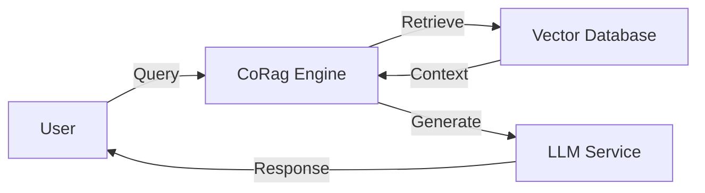

# Case Study Template: CoRag/Aetheris

Use this template to create consistent, professional case studies for CoRag (Aetheris) implementations.

---

## Case Study Structure

### 1. Cover Section
- **Company Name:** [Legal company name]
- **Industry:** [e.g., E-commerce, Financial Services, Healthcare, Technology]
- **Company Size:** [e.g., 50-200 employees, 200-1000, Enterprise 1000+]
- **Region:** [Geographic focus]
- **Implementation Date:** [Month Year]

### 2. Executive Summary (3-4 sentences)
High-level overview of the challenge, solution, and measurable business impact.

### 3. Company Profile (200-300 words)
Background on the company including:
- Business model and primary offerings
- Market position
- Digital transformation maturity
- Key business metrics (revenue scale, customer count, etc.)

### 4. The Challenge (300-400 words)
Detailed description of the business problem:
- What existing processes were failing or inefficient
- Specific pain points with current systems
- Why traditional solutions weren't working
- Impact on business metrics (customer satisfaction, operational costs, etc.)
- Internal constraints or requirements

### 5. The Solution (400-500 words)
How CoRag/Aetheris was implemented:
- **Architecture Overview:** High-level system design
- **Key Features Used:** Specific CoRag capabilities deployed
- **Integration Points:** How it connected to existing systems
- **Implementation Timeline:** Phases and duration
- **Team Composition:** Who was involved

Include an architecture diagram if applicable:


### 6. Implementation Results (300-400 words)
Quantifiable outcomes:
- **Performance Metrics:** Response time improvements, accuracy rates
- **Business Impact:** Cost savings, revenue impact
- **Operational Efficiency:** Time saved, processes automated
- **Customer Satisfaction:** NPS changes, feedback scores

#### Key Metrics Table
| Metric | Before | After | Improvement |
|--------|--------|-------|-------------|
| Example | X | Y | Z% |

### 7. Testimonials & Quotes
Include 1-2 quotes from stakeholders:

> "[Direct quote about the transformation]" — **[Name]**, **[Title]**, **[Company]**

### 8. Technical Details (Optional)
For technical readers:
- Specific integrations or APIs used
- Custom configurations
- Scalability considerations
- Security implementation

### 9. Future Roadmap
- Planned expansions or enhancements
- Additional use cases being considered
- Ongoing optimization efforts

---

## Writing Guidelines

### Tone
- Professional and business-focused
- Results-oriented with concrete metrics
- Avoid jargon overload; explain technical terms

### Content Rules
1. Always include real or realistic metrics
2. Use "Before/After" comparisons where possible
3. Include specific technology integration details
4. Get direct quotes when possible
5. Focus on business value, not just technical features

### Length
- Target: 1,500-2,500 words
- Executive summary: 100-150 words
- Can be extended for enterprise/complex implementations

### Review Checklist
- [ ] All metrics are realistic and plausible
- [ ] Company profile is consistent with industry norms
- [ ] Quotes sound authentic and specific
- [ ] Technical details are accurate for CoRag capabilities
- [ ] Results align with the described challenges
- [ ] No proprietary/confidential information exposed

---

## File Naming Convention
```
YYYY-MM-CompanyName-CaseStudy.md
```

Example: `2024-03-ShopVista-Ecommerce-CaseStudy.md`
