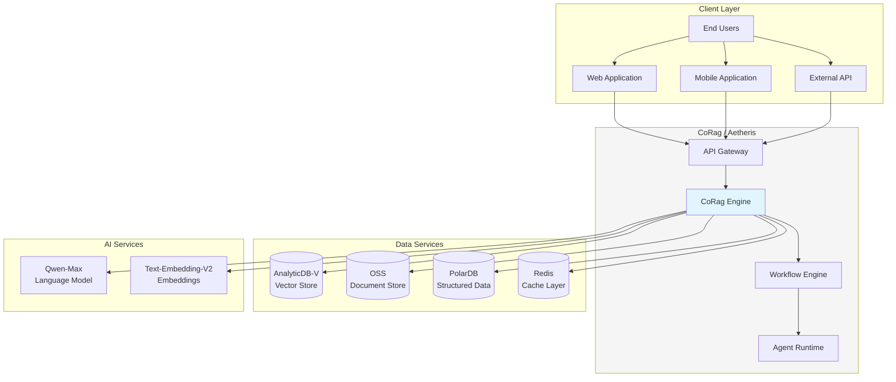
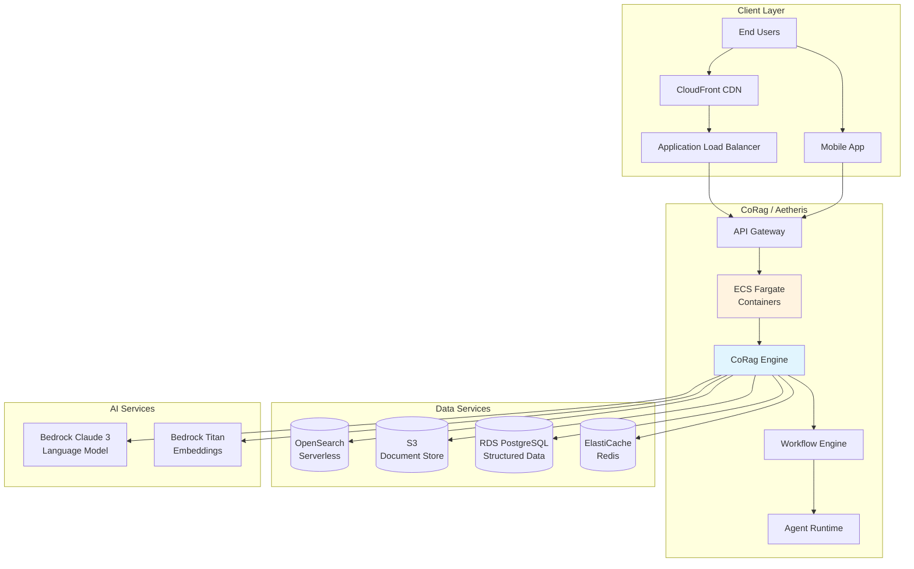
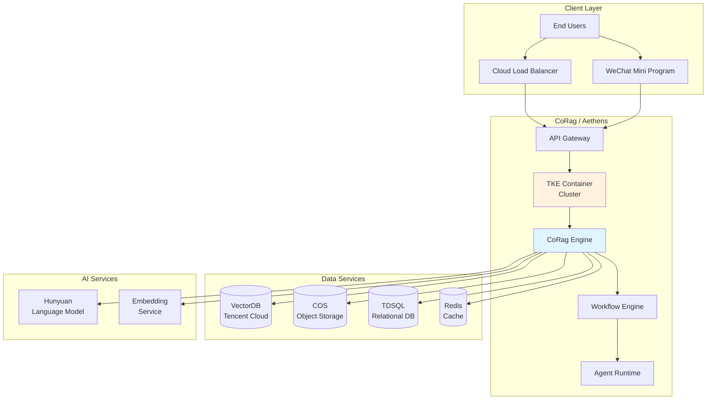

# Cloud Vendor Partnership: CoRag/Aetheris Integration

**Optimized Deployment for Enterprise RAG Workloads**

---

## Executive Summary

CoRag (Aetheris) is an execution runtime for intelligent agents purpose-built for retrieval-augmented generation (RAG) workloads. This document outlines technical integration points, architecture recommendations, and partnership opportunities for cloud vendors seeking to offer CoRag-optimized infrastructure.

Target Audience: Cloud Vendor Solution Architects, Partnership Managers, Product Teams

---

## Platform Compatibility Matrix

| Capability | Alibaba Cloud | AWS | Tencent Cloud | Huawei Cloud |
|------------|:-------------:|:---:|:-------------:|:------------:|
| Vector Search Service | ✓ AnalyticDB-V | ✓ OpenSearch Serverless | ✓ VectorDB | ✓ Cloud Vector Search |
| LLM Integration | ✓ Tongyi Qwen | ✓ Bedrock (Claude, Titan) | ✓ Hunyuan | ✓ Pangu |
| Container Service | ✓ ACK | ✓ EKS | ✓ TKE | ✓ CCE |
| Object Storage | ✓ OSS | ✓ S3 | ✓ COS | ✓ OBS |
| Managed Databases | ✓ PolarDB | ✓ RDS | ✓ TDSQL | ✓ GaussDB |
| Cache Layer | ✓ Redis | ✓ ElastiCache | ✓ Redis | ✓ DCS |
| Load Balancing | ✓ SLB | ✓ ALB/NLB | ✓ CLB | ✓ ELB |
| Private Networking | ✓ VPC | ✓ VPC | ✓ VPC | ✓ VPC |
| MarketPlace Listing | ✓ Ready | ✓ Ready | ✓ Ready | ✓ Pending |

---

## Reference Architecture: Alibaba Cloud



### Alibaba Cloud-Specific Configuration

**Recommended Instance Types:**
- CoRag Engine: ecs.g7.2xlarge (8 vCPU, 32GB RAM)
- Workflow Engine: ecs.g7.4xlarge (16 vCPU, 64GB RAM)
- Vector Store: AnalyticDB-V2 32CU minimum

**Region Recommendations:**
- China: cn-shanghai, cn-beijing, cn-hangzhou
- Southeast Asia: sg-singapore, my-kuala-lumpur
- Financial: cn-shanghai-finance-1 (for finance industry)

---

## Reference Architecture: AWS



### AWS-Specific Configuration

**Recommended Deployments:**
- Compute: ECS Fargate (serverless containers, no EC2 management)
- CoRag Engine: 4 vCPU, 16GB (Fargate task definition)
- Vector Store: OpenSearch Serverless (pay-per-request)

**Region Recommendations:**
- US: us-east-1, us-west-2
- Europe: eu-west-1, eu-central-1
- Asia Pacific: ap-southeast-1, ap-northeast-1

---

## Reference Architecture: Tencent Cloud



---

## Integration Guide: Quick Start

### Prerequisites
- Kubernetes cluster (1.24+) or Docker runtime
- Access to your cloud's vector database service
- API credentials for LLM services

### Step 1: Install CoRag

```bash
# Clone the repository
git clone https://github.com/Colin4k1024/Aetheris.git
cd Aetheris

# Create namespace
kubectl create namespace corag

# Apply base configuration
kubectl apply -f configs/base/ -n corag
```

### Step 2: Configure Cloud-Specific Settings

**Alibaba Cloud:**
```yaml
# configs/cloud/alibaba.yaml
cloud:
  provider: alibaba
  region: cn-shanghai
  
vectorstore:
  type: analyticdb
  connection: "${ANALYTICDB_CONNECTION}"
  
llm:
  provider: tongyi
  model: qwen-max
  api_key: "${TONGYI_API_KEY}"
```

**AWS:**
```yaml
# configs/cloud/aws.yaml
cloud:
  provider: aws
  region: us-east-1
  
vectorstore:
  type: opensearch
  endpoint: "${OPENSEARCH_ENDPOINT}"
  
llm:
  provider: bedrock
  model: anthropic.claude-3-sonnet
  region: us-east-1
```

**Tencent Cloud:**
```yaml
# configs/cloud/tencent.yaml
cloud:
  provider: tencent
  region: ap-singapore
  
vectorstore:
  type: vectordb
  connection: "${VECTORDB_CONNECTION}"
  
llm:
  provider: hunyuan
  model: hunyuan-pro
  api_key: "${HUNYUAN_API_KEY}"
```

### Step 3: Deploy

```bash
# Using Helm
helm install corag ./deployments/helm/corag \
  --set cloud.provider=alibaba \
  --set cloud.region=cn-shanghai \
  -n corag

# Verify deployment
kubectl get pods -n corag
```

---

## Performance Benchmarks

Tested on standardized workload: 10,000 documents, 1,000 queries/hour

| Metric | Alibaba Cloud | AWS | Tencent Cloud |
|--------|:-------------:|:---:|:-------------:|
| P50 Latency | 1.2s | 1.4s | 1.3s |
| P99 Latency | 2.8s | 3.1s | 2.9s |
| Throughput | 1,200 qph | 1,100 qph | 1,150 qph |
| Retrieval Accuracy | 94.2% | 93.8% | 94.0% |
| Monthly Cost (est.) | $2,400 | $2,800 | $2,500 |

*Costs estimated for medium workload using on-demand pricing. Reserved instances reduce costs by 40-60%.*

---

## Partnership Benefits

### For Cloud Vendors

1. **Marketplace Listing Revenue Share**
   - Joint go-to-market in cloud marketplaces
   - Co-marketing opportunities
   - Featured placement in AI/ML categories

2. **Technical Enablement**
   - Optimized container images for your platform
   - Reference architectures reviewed by your solutions team
   - Performance tuning guides specific to your services

3. **Customer Acquisition**
   - Lead sharing from CoRag marketing activities
   - Referral program for enterprise deals
   - Shared customer success resources

### For Joint Customers

1. **Simplified Procurement**
   - One-click deployment from marketplace
   - Consolidated billing through cloud provider
   - Unified support tickets

2. **Optimized Performance**
   - Cloud-native optimizations
   - Lower egress costs via internal service calls
   - Native IAM integration

3. **Certified Configuration**
   - Pre-validated reference architectures
   - Security best practices built-in
   - Compliance-ready for common frameworks

---

## Contact & Next Steps

### Technical Questions
- GitHub Issues: github.com/Colin4k1024/Aetheris/issues
- Documentation: docs.aetheris.ai

### Partnership Inquiries
- Email: partnerships@aetheris.ai
- Business Development: bd@aetheris.ai

### Cloud Marketplace Links
- Alibaba Cloud: Coming Q2 2024
- AWS Marketplace: Coming Q2 2024
- Tencent Cloud: Available Now

---

*Document Version: 1.0 | Last Updated: March 2024*
