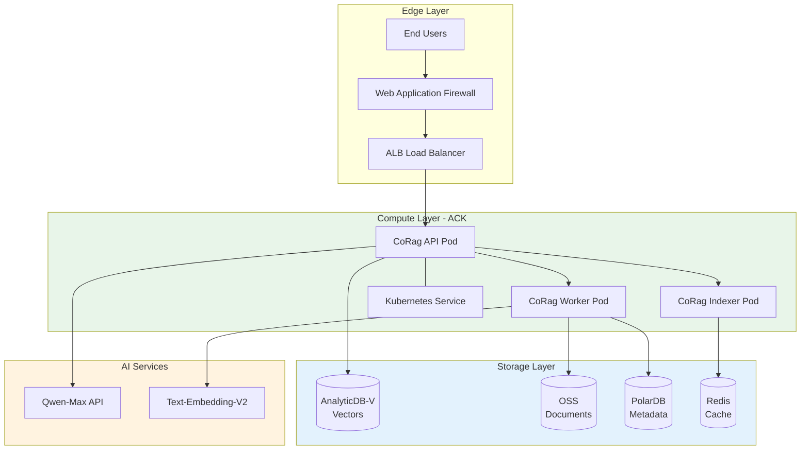
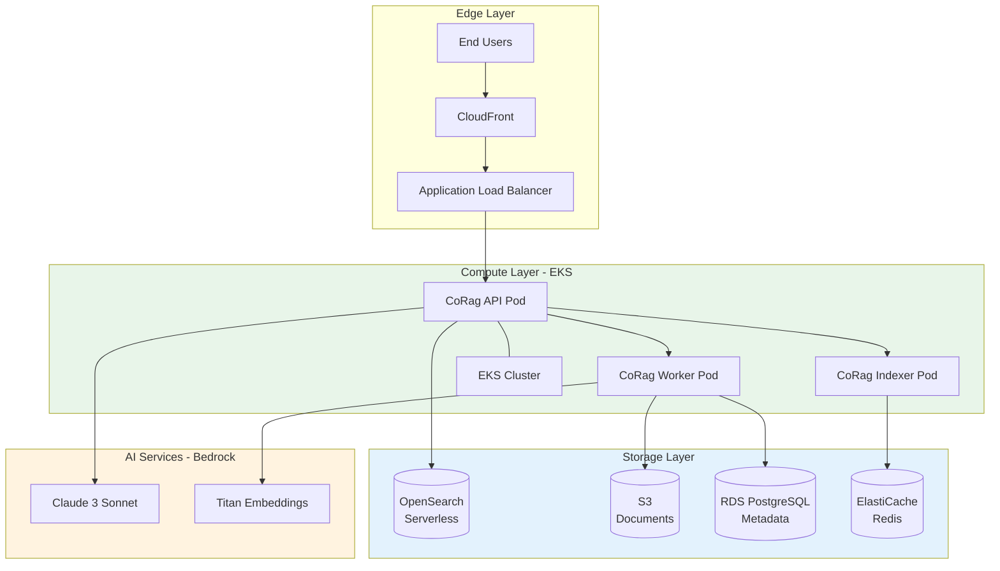
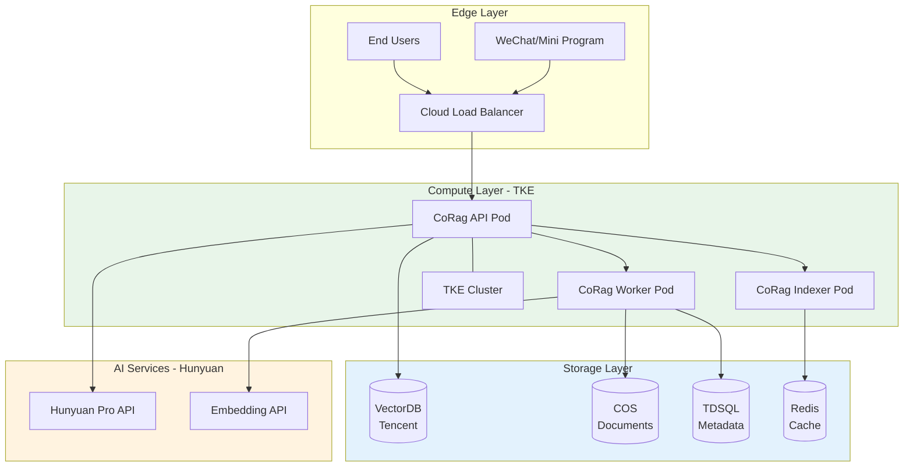

# Cloud Platform Integration Guide: CoRag/Aetheris

This guide provides detailed integration instructions for deploying CoRag on major cloud platforms.

---

## Table of Contents
1. [Alibaba Cloud Integration](#alibaba-cloud)
2. [AWS Integration](#aws)
3. [Tencent Cloud Integration](#tencent-cloud)
4. [Cross-Platform Comparison](#comparison)
5. [Troubleshooting](#troubleshooting)

---

## Alibaba Cloud

### Overview

Alibaba Cloud provides comprehensive support for CoRag with optimized integrations for:
- **AnalyticDB-V** (Vector Database)
- **Tongyi Qwen** (LLM Service)
- **ACK** (Container Service)
- **OSS** (Object Storage)

### Architecture Diagram



### Step-by-Step Setup

#### 1. Create VPC and Security Groups

```bash
# Create VPC
aliyun vpc CreateVpc \
  --RegionId cn-shanghai \
  --VpcName corag-vpc \
  --CidrBlock 10.0.0.0/16

VPC_ID=$(aliyun vpc DescribeVpcs --VpcName corag-vpc --query '[].VpcId')

# Create Security Group
aliyun ecs CreateSecurityGroup \
  --RegionId cn-shanghai \
  --SecurityGroupName corag-sg \
  --VpcId $VPC_ID

# Add security group rules
aliyun ecs AuthorizeSecurityGroup \
  --RegionId cn-shanghai \
  --SecurityGroupId $SG_ID \
  --IpProtocol tcp \
  --PortRange 80/80 \
  --SourceCidrIp 0.0.0.0/0
```

#### 2. Set Up AnalyticDB-V for Vector Storage

```bash
# Create AnalyticDB-V instance
aliyun adb CreateDBCluster \
  --RegionId cn-shanghai \
  --DBClusterVersion 3.0 \
  --DBClusterCategory VectorEngine \
  --NodeCount 2 \
  --ExecutorCount 4

# Configure vector collection
aliyun adb DescribeDatabases --DBClusterId $ADB_CLUSTER_ID

# Create collection via SDK or console
# Recommended: 1536 dimensions for text-embedding-v2
```

#### 3. Deploy CoRag on ACK

```yaml
# deployments/kubernetes/alibaba-cloud.yaml
apiVersion: apps/v1
kind: Deployment
metadata:
  name: corag-api
  namespace: corag
spec:
  replicas: 3
  selector:
    matchLabels:
      app: corag-api
  template:
    metadata:
      labels:
        app: corag-api
    spec:
      containers:
      - name: corag-api
        image: aetheris/corag:latest
        ports:
        - containerPort: 8080
        env:
        - name: CLOUD_PROVIDER
          value: alibaba
        - name: VECTORSTORE_TYPE
          value: analyticdb
        - name: ANALYTICDB_CONNECTION
          valueFrom:
            secretKeyRef:
              name: corag-secrets
              key: analyticdb
        - name: LLM_PROVIDER
          value: tongyi
        - name: TONGYI_API_KEY
          valueFrom:
            secretKeyRef:
              name: corag-secrets
              key: tongyi
        resources:
          requests:
            memory: "2Gi"
            cpu: "1000m"
          limits:
            memory: "4Gi"
            cpu: "2000m"
```

#### 4. Apply Configuration

```bash
# Create namespace and secrets
kubectl create namespace corag

kubectl create secret generic corag-secrets \
  --from-literal=analyticdb="$ANALYTICDB_CONNECTION" \
  --from-literal=tongyi="$TONGYI_API_KEY" \
  -n corag

# Deploy
kubectl apply -f deployments/kubernetes/alibaba-cloud.yaml -n corag

# Verify
kubectl get pods -n corag
```

### Alibaba Cloud: Complete Deployment Script

```bash
#!/bin/bash
set -e

REGION="cn-shanghai"
VPC_CIDR="10.0.0.0/16"
VSWITCH_CIDR="10.0.1.0/24"

echo "Creating VPC..."
VPC_ID=$(aliyun vpc CreateVpc \
  --RegionId $REGION \
  --VpcName corag-vpc \
  --CidrBlock $VPC_CIDR \
  --query VpcId -o text)

echo "Creating vSwitch..."
VSWITCH_ID=$(aliyun vpc CreateVSwitch \
  --RegionId $REGION \
  --VpcId $VPC_ID \
  --VSwitchName corag-vswitch \
  --CidrBlock $VSWITCH_CIDR \
  --ZoneId $REGION-e \
  --query VSwitchId -o text)

echo "Creating ACK cluster..."
# Use console or CLI to create managed Kubernetes cluster
# aliyun cs CreateCluster

echo "Deploying CoRag..."
kubectl apply -f deployments/kubernetes/alibaba-cloud.yaml

echo "Deployment complete!"
echo "Check status with: kubectl get pods -n corag"
```

---

## AWS

### Overview

AWS provides CoRag integration through:
- **OpenSearch Serverless** (Vector Database)
- **Amazon Bedrock** (LLM via Claude, Titan)
- **EKS** (Container Service)
- **S3** (Object Storage)

### Architecture Diagram



### Step-by-Step Setup

#### 1. Create VPC with Private Subnets

```bash
# Create VPC
aws ec2 create-vpc \
  --cidr-block 10.0.0.0/16 \
  --tag-specifications 'ResourceType=vpc,Tags=[{Key=Name,Value=corag-vpc}]'

VPC_ID=$(aws ec2 describe-vpcs \
  --filters 'Name=tag:Name,Values=corag-vpc' \
  --query 'Vpcs[0].VpcId' --output text)

# Create private subnets
aws ec2 create-subnet \
  --vpc-id $VPC_ID \
  --cidr-block 10.0.1.0/24 \
  --availability-zone us-east-1a \
  --tag-specifications 'ResourceType=subnet,Tags=[{Key=Name,Value=corag-private-1}]'

aws ec2 create-subnet \
  --vpc-id $VPC_ID \
  --cidr-block 10.0.2.0/24 \
  --availability-zone us-east-1b \
  --tag-specifications 'ResourceType=subnet,Tags=[{Key=Name,Value=corag-private-2}]'
```

#### 2. Set Up OpenSearch Serverless

```bash
# Create OpenSearch Serverless collection
aws opensearchserverless create-collection \
  --name corag-vectors \
  --type vectorSearch

# Configure indexing
aws opensearchserverless update-collection \
  --collection-name corag-vectors \
  --description "CoRag vector storage"

# Note the collection endpoint for configuration
```

#### 3. Enable Amazon Bedrock Access

```bash
# Enable Claude 3 and Titan models in us-east-1
aws bedrock list-foundation-models \
  --region us-east-1 \
  --query 'modelSummaries[?contains(modelId, `anthropic.claude`)].[modelId,modelName]'

# Create IAM role for CoRag to access Bedrock
aws iam create-role \
  --role-name corag-bedrock-role \
  --assume-role-policy-document '{
    "Version": "2012-10-17",
    "Statement": [{
      "Effect": "Allow",
      "Principal": {"Service": "ecs-tasks.amazonaws.com"},
      "Action": "sts:AssumeRole"
    }]
  }'

aws iam attach-role-policy \
  --role-name corag-bedrock-role \
  --policy-arn arn:aws:iam::aws:policy/AmazonBedrockFullAccess
```

#### 4. Deploy CoRag on EKS

```yaml
# deployments/kubernetes/aws.yaml
apiVersion: apps/v1
kind: Deployment
metadata:
  name: corag-api
  namespace: corag
spec:
  replicas: 3
  selector:
    matchLabels:
      app: corag-api
  template:
    metadata:
      labels:
        app: corag-api
    spec:
      serviceAccountName: corag-sa
      containers:
      - name: corag-api
        image: aetheris/corag:latest
        ports:
        - containerPort: 8080
        env:
        - name: CLOUD_PROVIDER
          value: aws
        - name: VECTORSTORE_TYPE
          value: opensearch
        - name: OPENSEARCH_ENDPOINT
          valueFrom:
            secretKeyRef:
              name: corag-secrets
              key: opensearch
        - name: LLM_PROVIDER
          value: bedrock
        - name: BEDROCK_REGION
          value: us-east-1
        - name: AWS_REGION
          value: us-east-1
        resources:
          requests:
            memory: "2Gi"
            cpu: "1000m"
          limits:
            memory: "4Gi"
            cpu: "2000m"
```

#### 5. Apply Configuration

```bash
# Create namespace and IRSA
kubectl create namespace corag

# Create service account with IAM role
eksctl create serviceaccount \
  --name corag-sa \
  --namespace corag \
  --cluster corag-cluster \
  --attach-role-arn arn:aws:iam::123456789:role/corag-bedrock-role

# Create secrets
kubectl create secret generic corag-secrets \
  --from-literal=opensearch="$OPENSEARCH_ENDPOINT" \
  -n corag

# Deploy
kubectl apply -f deployments/kubernetes/aws.yaml -n corag
```

---

## Tencent Cloud

### Overview

Tencent Cloud provides CoRag integration through:
- **VectorDB** (Tencent Cloud Vector Database)
- **Hunyuan** (LLM Service)
- **TKE** (Kubernetes Engine)
- **COS** (Object Storage)

### Architecture Diagram



### Step-by-Step Setup

#### 1. Create VPC and Subnets

```bash
# Create VPC
tccli vpc CreateVpc \
  --VpcName corag-vpc \
  --CidrBlock 10.0.0.0/16 \
  --Region ap-singapore

VPC_ID=$(tccli vpc DescribeVpcs \
  --Filters '[{"Name":"vpc-name","Values":["corag-vpc"]}]' \
  --query 'VpcSet[0].VpcId' --output text)

# Create subnet
tccli vpc CreateSubnet \
  --VpcId $VPC_ID \
  --SubnetName corag-subnet \
  --CidrBlock 10.0.1.0/24 \
  --Zone ap-singapore-1 \
  --Region ap-singapore
```

#### 2. Set Up Tencent Cloud VectorDB

```bash
# Create VectorDB instance
tccli vedb CreateProduct \
  --ProductType vedb \
  --SpecName vedb.se кла \
  --ShardNum 2 \
  --ReplicaNum 2 \
  --Zone ap-singapore-1 \
  --VpcId $VPC_ID \
  --SubnetId $SUBNET_ID

# Note the connection string
VEDB_HOST=$(tccli vedb DescribeInstances \
  --Filters '[{"Name":"vpc-endpoint","Values":["corag"]}]' \
  --query 'InstanceSet[0].Vip' --output text)
```

#### 3. Enable Hunyuan API Access

```bash
# Ensure Hunyuan is enabled in your account
tccli hunyuan DescribeProduct \
  --Region ap-singapore

# Create API key via console and store securely
```

#### 4. Deploy CoRag on TKE

```yaml
# deployments/kubernetes/tencent.yaml
apiVersion: apps/v1
kind: Deployment
metadata:
  name: corag-api
  namespace: corag
spec:
  replicas: 3
  selector:
    matchLabels:
      app: corag-api
  template:
    metadata:
      labels:
        app: corag-api
    spec:
      containers:
      - name: corag-api
        image: aetheris/corag:latest
        ports:
        - containerPort: 8080
        env:
        - name: CLOUD_PROVIDER
          value: tencent
        - name: VECTORSTORE_TYPE
          value: vectordb
        - name: VECTORDB_CONNECTION
          valueFrom:
            secretKeyRef:
              name: corag-secrets
              key: vectordb
        - name: LLM_PROVIDER
          value: hunyuan
        - name: HUNYUAN_API_KEY
          valueFrom:
            secretKeyRef:
              name: corag-secrets
              key: hunyuan
        - name: HUNYUAN_REGION
          value: ap-singapore
        resources:
          requests:
            memory: "2Gi"
            cpu: "1000m"
          limits:
            memory: "4Gi"
            cpu: "2000m"
```

#### 5. Apply Configuration

```bash
# Create namespace and secrets
kubectl create namespace corag

kubectl create secret generic corag-secrets \
  --from-literal=vectordb="$VEDB_HOST:27017" \
  --from-literal=hunyuan="$HUNYUAN_API_KEY" \
  -n corag

# Deploy
kubectl apply -f deployments/kubernetes/tencent.yaml -n corag
```

---

## Comparison

### Feature Matrix

| Feature | Alibaba Cloud | AWS | Tencent Cloud |
|---------|:-------------:|:---:|:-------------:|
| Managed Vector DB | AnalyticDB-V | OpenSearch Serverless | VectorDB |
| Native LLM | Qwen-Max | Claude via Bedrock | Hunyuan |
| Serverless Containers | ECI | Fargate | EKS Serverless |
| Object Storage | OSS | S3 | COS |
| Managed Kubernetes | ACK | EKS | TKE |
| Private Networking | VPC + Express Connect | VPC + Transit Gateway | VPC + CCN |
| Marketplace | 阿里云市场 | AWS Marketplace | 云市场 |
| SLA Availability | 99.975% | 99.9% | 99.95% |

### Cost Comparison (Monthly, Medium Workload)

Assuming 10M queries/month, 100GB vector storage, 10TB document storage:

| Component | Alibaba Cloud | AWS | Tencent Cloud |
|-----------|:-------------:|:---:|:-------------:|
| Compute | $800 | $950 | $850 |
| Vector DB | $600 | $750 | $650 |
| Object Storage | $25 | $23 | $28 |
| LLM API Calls | $800 | $900 | $780 |
| Networking | $150 | $180 | $140 |
| **Total** | **$2,375** | **$2,803** | **$2,448** |

---

## Troubleshooting

### Common Issues

#### 1. Vector Retrieval Latency High

**Symptoms:** P99 latency > 5s

**Solutions:**
- Enable vector index: `CREATE INDEX ON collection USING hnsw(...)`
- Increase instance size for your vector DB
- Enable query result caching in CoRag config

#### 2. LLM Timeout Errors

**Symptoms:** 504 Gateway Timeout from LLM provider

**Solutions:**
- Check API rate limits for your tier
- Enable request queuing in CoRag config
- Scale CoRag worker pods to handle load

#### 3. Pod CrashLoopBackOff

**Symptoms:** Pods restarting continuously

**Solutions:**
```bash
# Check pod logs
kubectl logs -n corag corag-api-xxxxx --previous

# Common fixes:
# - Verify secrets are correctly created
# - Check VPC/security group allows required traffic
# - Ensure image pull credentials are valid
```

#### 4. Retrieval Accuracy Low

**Symptoms:** Relevant documents not returned

**Solutions:**
- Check embedding model configuration matches your language
- Verify chunk size is appropriate for your documents
- Enable hybrid search (dense + sparse) in config

### Health Check Commands

```bash
# Check all pods
kubectl get pods -n corag -o wide

# Check CoRag API health
curl -k https://api.corag.example/health

# Check vector DB connection
kubectl exec -n corag deploy/corag-api -- corag-cli doctor --check vectorstore

# Check LLM connection
kubectl exec -n corag deploy/corag-api -- corag-cli doctor --check llm
```

---

## Support

- **Documentation:** docs.aetheris.ai
- **GitHub Issues:** github.com/Colin4k1024/Aetheris/issues
- **Cloud Vendor Support:** Contact your cloud account team
