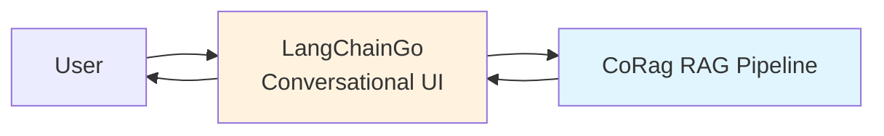

# Cross-Framework Integration Guide: CoRag with LangChainGo

## Overview

This guide shows how to use CoRag alongside LangChainGo for scenarios where combining both frameworks provides additional value.

## When to Combine

You might want to use both when:
1. Prototyping with LangChainGo, then moving RAG pipelines to CoRag for production
2. Using LangChainGo for conversational UI while CoRag handles batch processing
3. Leveraging LangChainGo's broad LLM provider support with CoRag's retrieval optimization

---

## Integration Patterns

### Pattern 1: LangChainGo Frontend → CoRag Backend

Use LangChainGo for the conversational interface while CoRag handles the heavy retrieval work.



**Implementation:**

```go
// LangChainGo handles conversation
type ConversationHandler struct {
    ragBackend *corag.Client
    memory     *Memory
}

func (h *ConversationHandler) Handle(ctx context.Context, userMsg string) (string, error) {
    // Load conversation history
    history := h.memory.Load(ctx)
    
    // Call CoRag for RAG processing
    response, err := h.ragBackend.Query(ctx, &corag.QueryRequest{
        Text:     userMsg,
        Session:  sessionID,
        TopK:     10,
    })
    if err != nil {
        return "", err
    }
    
    // Update memory
    h.memory.Save(ctx, history, userMsg, response.Answer)
    
    return response.Answer, nil
}
```

### Pattern 2: CoRag Retrieval → LangChainGo Generation

Use CoRag's superior retrieval and then LangChainGo for flexible prompt templating and generation.

```go
// Get better retrieval from CoRag
ragResult, err := coragClient.Query(ctx, &corag.QueryRequest{
    Text: userQuery,
})

// Build prompt with LangChainGo
prompt := prompts.NewPromptTemplate(
    `Context: {context}
    
    Question: {question}
    
    Answer in a helpful manner.`,
    []string{"context", "question"},
)

llm := llms.NewChatGPT()
chain := chains.NewLLMChain(llm, prompt)

result, err := chain.Invoke(ctx, map[string]any{
    "context":  strings.Join(ragResult.Documents, "\n"),
    "question": userQuery,
})
```

### Pattern 3: Hybrid Search with Both

Combine vector stores supported by both frameworks:

```go
// CoRag handles dense embedding retrieval
denseRetriever := corag.NewEmbeddingRetriever(
    openai.NewEmbeddingModel(openai.ModelTextEmbedding3Large),
    vectorstore,
)

// LangChainGo handles sparse/bm25 retrieval  
sparseRetriever := langchaingo.NewBM25Retriever(docs)

// Fuse results
fusedResults := corag.FuseRetrievers(denseRetriever, sparseRetriever, 
    corag.RRFConfig{K: 60})
```

---

## Example: Complete Application Stack

```go
package main

import (
    "context"
    
    "github.com/langchain-go/langchaingo/llms"
    "github.com/langchain-go/langchaingo/llms/openai"
    "github.com/langchain-go/langchaingo/prompts"
    "github.com/langchain-go/langchaingo/chains"
    
    "rag-platform/pkg/corag"
)

func main() {
    // Initialize CoRag retrieval engine
    coragClient, err := corag.NewClient(corag.Config{
        VectorStore:  "analyticdb",
        VectorConfig: dbConfig,
        LLM:          "tongyi",
        LLMConfig:    llmConfig,
    })
    if err != nil {
        panic(err)
    }
    defer coragClient.Close()
    
    // Use LangChainGo for structured output parsing
    llm, err := openai.New()
    if err != nil {
        panic(err)
    }
    
    prompt := prompts.NewPromptTemplate(
        `Based on the following context, answer the user's question.
        
        Context: {context}
        Question: {question}
        
        Format your answer as JSON with "answer" and "confidence" fields.`,
        []string{"context", "question"},
    )
    
    chain := chains.NewLLMChain(llm, prompt)
    
    // Query CoRag for retrieval
    result, err := coragClient.Query(context.Background(), &corag.QueryRequest{
        Text: userQuestion,
        TopK: 5,
    })
    if err != nil {
        panic(err)
    }
    
    // Use LangChainGo for generation with structured output
    output, err := chains.Run(
        context.Background(),
        chain,
        map[string]any{
            "context":  result.FormattedContext(),
            "question": userQuestion,
        },
    )
    if err != nil {
        panic(err)
    }
    
    // Parse with LangChainGo output parsers
    parsed, err := jsonparser.ParseJSON(output)
    println(parsed.Answer)
}
```

---

## Deployment Considerations

### Network Latency
When splitting across frameworks, be mindful of network hops. For lowest latency, keep both services in the same region/VPC.

### Consistency
If using separate deployments, ensure:
- Same embedding models
- Compatible vector store (or sync between stores)
- Consistent chunking strategies

### Monitoring
Use OpenTelemetry traces that span both frameworks:

```go
// CoRag already emits OTLP traces
// LangChainGo supports callbacks for tracing

exporter, err := otlptracehttp.New(context.Background())
layer := traces.NewOpenTelemetryLayer(corag.Tracer(), langchaingo.Tracer())
```

---

## Resources

- CoRag Docs: docs.aetheris.ai
- LangChainGo Docs: python.langchain.com/docs/get_started/introduction
- Example integrations: github.com/Colin4k1024/Aetheris/examples

---

*This guide is community-contributed. If you've found other integration patterns useful, please share them!*
