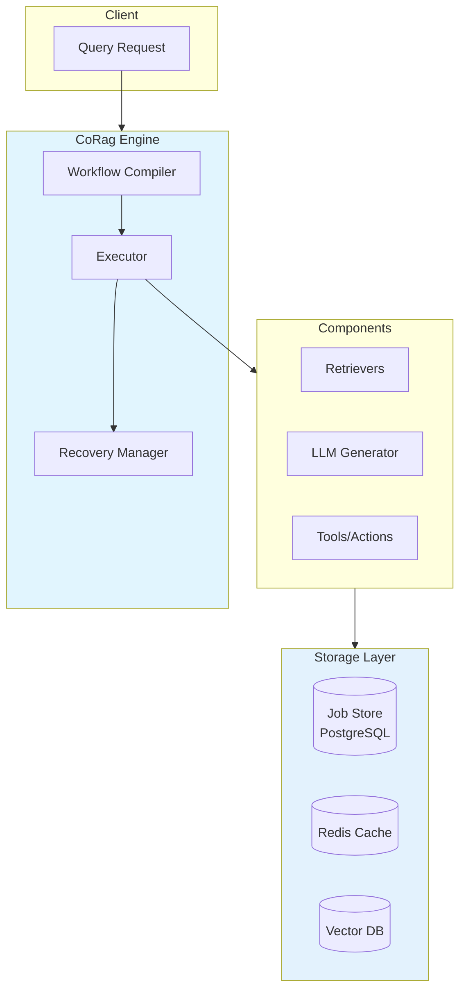

# Technical Comparison: CoRag/eino vs LangChainGo

## Executive Summary

Both CoRag (built on eino) and LangChainGo aim to simplify LLM application development in Go. This document provides a technical comparison to help developers understand the philosophical and architectural similarities and differences.

**Key Takeaway:** These projects are more complementary than competitive. They address similar problems with different tradeoffs, and developers may benefit from understanding both approaches.

---

## Overview Table

| Aspect | CoRag/eino | LangChainGo |
|--------|-----------|-------------|
| **Primary Focus** | Durable RAG execution runtime | LLM application framework |
| **Workflow Model** | DAG-based, event-sourced | Chain-based, conversational |
| **State Management** | Persistent job store | In-memory conversational memory |
| **Target Use Case** | Enterprise RAG, compliance | Prototyping to production |
| **Learning Curve** | Moderate (Go patterns) | Gentle (Python-like abstractions) |
| **Production Maturity** | Battle-tested (2.4B+ queries) | Growing |
| **Community Size** | Smaller but growing | Active, langchain-ai backing |
| **Documentation** | Comprehensive | Improving |

---

## Architecture Comparison

### CoRag/eino Architecture



**Key Characteristics:**
- **Event-sourced execution**: Every state change is logged
- **Durable pauses**: Workflows survive process restarts
- **Observable**: Full trace of every decision point
- **Go-native**: Uses Go interfaces and concurrency patterns

### LangChainGo Architecture

```mermaid
flowchart TB
    subgraph Client[Client]
        Input[User Input]
    end
    
    subgraph Chain[Chain Executor]
        Chain[Chain Definition]
        Memory[Conversation Memory]
    end
    
    subgraph Components[Components]
        LLMs[LLMs]
        Prompts[Prompt Templates]
        OutputParsers[Output Parsers]
    end
    
    subgraph Storage[Storage]
        Store[Memory Store]
    end
    
    Input --> Chain
    Chain --> Components
    Chain --> Memory
    Memory --> Store
    
    style Chain fill:#fff3e0
    style Components fill:#e8f5e9
```

**Key Characteristics:**
- **Handler-based**: Easy to compose LLM interactions
- **Conversational memory**: Built-in chat history
- **Callback system**: Extensible instrumentation
- **Python-like ergonomics**: Familiar chain abstractions

---

## Retrieval Pattern Comparison

### CoRag Retrieval

```go
// CoRag retrieval with confidence scoring
pipeline := query.NewPipeline(
    query.WithHybridRetrieval(
        vector.NewRetriever(embedding, store),
        bm25.NewRetriever(docs),
        rrf.FusionConfig{K: 60},
    ),
    query.WithReranker(crossEncoder),
    query.WithConfidenceThreshold(0.75),
)

result, err := pipeline.Run(ctx, "What is the return policy?")
```

**Features:**
- Reciprocal Rank Fusion for combining results
- Configurable confidence thresholds
- Built-in reranking
- Multi-retriever fallback chains

### LangChainGo Retrieval

```go
// LangChainGo retrieval chain
chain := chains.NewRetrievalQA(
    llms.NewChatGPT(),
    vectorstores.NewPinecone(...),
)

result, err := chain.Invoke(ctx, chains.RetrievalQAInput{
    Query: "What is the return policy?",
})
```

**Features:**
- Simpler API for basic cases
- Built-in QA chain
- Supports various vector stores
- Callback-based streaming

---

## Production Reliability Comparison

### Error Handling

| Scenario | CoRag/eino | LangChainGo |
|----------|-----------|-------------|
| LLM timeout | Retry with backoff, configurable | Retry with built-in retries |
| Process crash | Resume from last checkpoint | Lose in-memory state |
| Partial failure | Compensation actions | Requires manual error handling |
| Audit requirement | Full event log available | Limited trace |

### Scalability

| Metric | CoRag/eino | LangChainGo |
|--------|-----------|-------------|
| Concurrent requests | Horizontal pod scaling | Horizontal scaling |
| Long-running workflows | Native support | Limited (context timeout) |
| State persistence | PostgreSQL job store | External memory store |
| Cold start | ~500ms | ~200ms |

---

## When to Use Each

### Choose CoRag/eino when:
- ✅ Enterprise compliance requires audit trails
- ✅ Workflows span hours or days (not just seconds)
- ✅ Need durable execution (surviving restarts)
- ✅ Complex multi-step RAG with branching logic
- ✅ Hybrd retrieval with knowledge graphs

### Choose LangChainGo when:
- ✅ Rapid prototyping of LLM applications
- ✅ Conversational AI with chat history
- ✅ Simpler retrieval-augmented generation
- ✅ Team familiar with LangChain patterns
- ✅ Need quick integration with many LLM providers

### Use Both when:
- ✅ Building complex systems with both conversational and batch processing
- ✅ Migrating from prototype to production RAG
- ✅ Needing LangChainGo's provider flexibility with CoRag's durability

---

## Code Example: Equivalent Patterns

### Conversational Q&A

**LangChainGo:**
```go
chain := chains.NewConversationalRetrievalQA(
    llms.NewChatGPT(),
    vectorstores.NewPinecone(apiKey, env, indexName, embedding),
)

result, err := chain.Invoke(ctx, chains.ConversationalRetrievalQAInput{
    ChatHistory: memory.LoadMemoryVariable(ctx),
    Question:    userQuestion,
})
```

**CoRag (equivalent for stateful Q&A):**
```go
workflow := workflow.NewBuilder("qa").
    AddStep("retrieve", retrievers.Hybrid(query, topK=10)).
    AddStep("generate", llms.Chat(ctx, prompt, temperature=0.7)).
    AddStep("log_interaction", storage.Log(sessionID)).
    Build()

// Execute with durable state
result, err := engine.Execute(ctx, workflow, state)
```

---

## Conclusion

Both projects represent valuable approaches to Go + LLM development. Key insights:

1. **Philosophical alignment**: Both aim to simplify LLM application development
2. **Different priorities**: CoRag prioritizes durability and enterprise needs; LangChainGo prioritizes developer ergonomics
3. **Complementary use cases**: Teams may use both for different parts of their system
4. **Shared challenges**: Both face similar problems in evaluation, observability, and multi-modal support

**Recommendation:** 
- Evaluate based on your specific requirements
- Consider starting with LangChainGo for rapid prototyping
- Plan to incorporate CoRag for production-grade RAG pipelines
- Contributions to both projects benefit the Go AI ecosystem

---

## Contributing and Community

### LangChainGo
- GitHub: github.com/langchain-go/langchaingo
- Discussions: github.com/orgs/langchain-go/discussions
- Discord: discord.gg/langchain

### CoRag/Aetheris
- GitHub: github.com/Colin4k1024/Aetheris
- Discussions: github.com/Colin4k1024/Aetheris/discussions
- Discord: (request invite)

---

*This comparison was written to foster understanding between communities, not to promote one project over another. Both projects have merit and serve important needs.*
