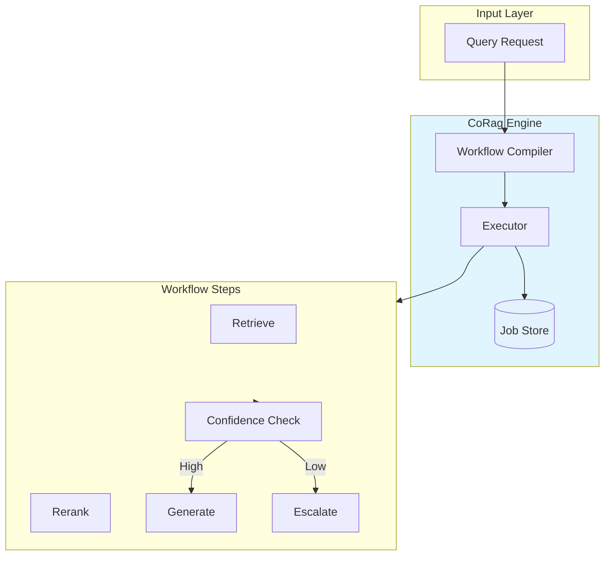
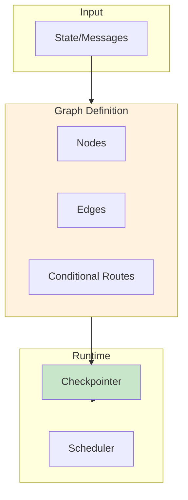

# Technical Comparison: CoRag vs LangGraph

## Overview

This document compares CoRag/Aetheris with LangGraph to help developers understand both approaches to agentic workflow construction.

**Core Philosophy:** Both systems enable complex, multi-step AI workflows. CoRag focuses on RAG-specific durability; LangGraph provides a general-purpose graph-based execution model.

---

## Architecture Comparison

### CoRag Architecture



### LangGraph Architecture



---

## Feature Comparison Matrix

| Feature | CoRag | LangGraph |
|---------|-------|-----------|
| **Execution Model** | Event-sourced DAG | Graph-based with checkpointing |
| **State Persistence** | PostgreSQL event log | Disk/S3 checkpoints |
| **Human-in-the-Loop** | Native pause/resume | interrupt_before/after |
| **Recovery** | Event replay | Checkpoint restore |
| **Scalability** | Horizontal (K8s) | Horizontal (with distributed checkpointer) |
| **RAG Focus** | Built-in retrieval | General purpose |
| **Tracing** | OpenTelemetry (50+ spans) | LangSmith / OpenTelemetry |
| **Learning Curve** | Moderate | Moderate |

---

## Key Conceptual Differences

### State Management

**CoRag (Event Sourcing):**
```go
// Every state change is an event
jobStore.Record(ctx, Event{
    JobID:   job.ID,
    Type:    "RETRIEVAL_COMPLETED",
    Data:    retrievalResults,
    TraceID: traceID,
})

// Recover by replaying events
events, _ := jobStore.GetEvents(ctx, job.ID)
state := ReplayEvents(events)
```

**LangGraph (Checkpointing):**
```python
# State saved as checkpoint
checkpoint = {
    "messages": [...],
    "current_node": "generate",
    "checkpoint_ns": "default"
}

# Restore from checkpoint
graph.restore_checkpoint(checkpoint)
```

### Workflow Definition

**CoRag (Go Builder):**
```go
workflow := workflow.NewBuilder("rag-pipeline").
    AddStep("retrieve", retrievers.Hybrid(query, topK=20)).
    AddStep("rerank", reranker.ReRank(results, topK=5)).
    AddStep("check", confidenceChecker.Check(threshold=0.7)).
    AddConditionalStep("escalate", humanReview, 
        when=lambda s: s.confidence < 0.7).
    AddStep("generate", llms.Generate(prompt)).
    Build()
```

**LangGraph (Python):**
```python
workflow = StateGraph(State)
workflow.add_node("retrieve", retrieve)
workflow.add_node("generate", generate)

workflow.add_edge("retrieve", "generate")
workflow.add_conditional_edges(
    "retrieve",
    should_escalate,
    {"escalate": "human_review", "continue": "generate"}
)
```

---

## RAG-Specific Optimizations

### CoRag Built-ins

```go
// Hybrid retrieval with automatic fusion
pipeline := query.NewPipeline(
    query.WithHybridRetrieval(
        vector.NewRetriever(embedding, store),
        bm25.NewRetriever(documents),
        knowledgeGraph.NewRetriever(kg),
        rrf.FusionConfig{K: 60},
    ),
    query.WithReranker(crossEncoder),
    query.WithConfidenceThreshold(0.75),
    query.WithFallback(func(ctx context.Context, q string) (*Result, error) {
        // Human review fallback
        return humanReview.Submit(ctx, q)
    }),
)
```

### LangGraph Equivalent

```python
# More general-purpose, RAG patterns need more setup
workflow = StateGraph(RAGState)
workflow.add_node("retrieve", retrieve_and_rerank)
workflow.add_node("generate", generate)

def check_confidence(state) -> str:
    if state["confidence"] < 0.75:
        return "escalate"
    return "generate"

workflow.add_conditional_edges(
    "retrieve",
    check_confidence,
    {"escalate": "human_review", "generate": "generate"}
)
```

---

## Production Readiness

### Observability

Both systems support OpenTelemetry:

**CoRag trace spans:**
```
query_abc123
├── parse_query (12ms)
├── retrieve_dense (89ms)
├── retrieve_sparse (45ms)
├── fuse_results (8ms)
├── rerank (23ms)
├── confidence_check (5ms)
├── generate (1247ms)
└── format_response (3ms)
```

**LangGraph + LangSmith:**
- Visual execution graph
- Token usage tracking
- Latency breakdowns

### Failure Recovery

| Scenario | CoRag | LangGraph |
|----------|-------|-----------|
| Crash at step 47/50 | Replay from event log | Restore from checkpoint |
| Network failure mid-request | Retry with idempotency | Checkpoint + retry |
| Human review required | Native interrupt | interrupt_before |
| Rollback partial actions | Compensation events | Not built-in |

---

## When to Use Each

### Choose CoRag when:
- ✅ RAG is your primary use case
- ✅ Enterprise compliance requires full audit trails
- ✅ Workflows may run for hours/days
- ✅ Event sourcing benefits your use case
- ✅ You're in the Go/Eino ecosystem

### Choose LangGraph when:
- ✅ Multi-agent coordination is complex
- ✅ Conversational AI with complex branching
- ✅ Python ecosystem integration needed
- ✅ Visual workflow debugging helps your team
- ✅ LangSmith observability is valuable

### Both together:
```python
# LangGraph for orchestration
orchestrator = LangGraphOrchestrator()

# CoRag as a node in the graph
@orchestrator.node
def rag_query(state):
    result = corag_client.query(state["question"])
    return {"context": result.docs, "answer": result.answer}
```

---

## Conclusion

Both represent excellent approaches to agentic workflow construction. The choice depends largely on:

1. **Language preference** (Go vs Python)
2. **Primary use case** (RAG-specific vs general agents)
3. **Enterprise requirements** (audit trails, event sourcing)
4. **Ecosystem integration** (existing LangChain tools vs Go infrastructure)

*This comparison is meant to inform, not to claim superiority for either project.*
