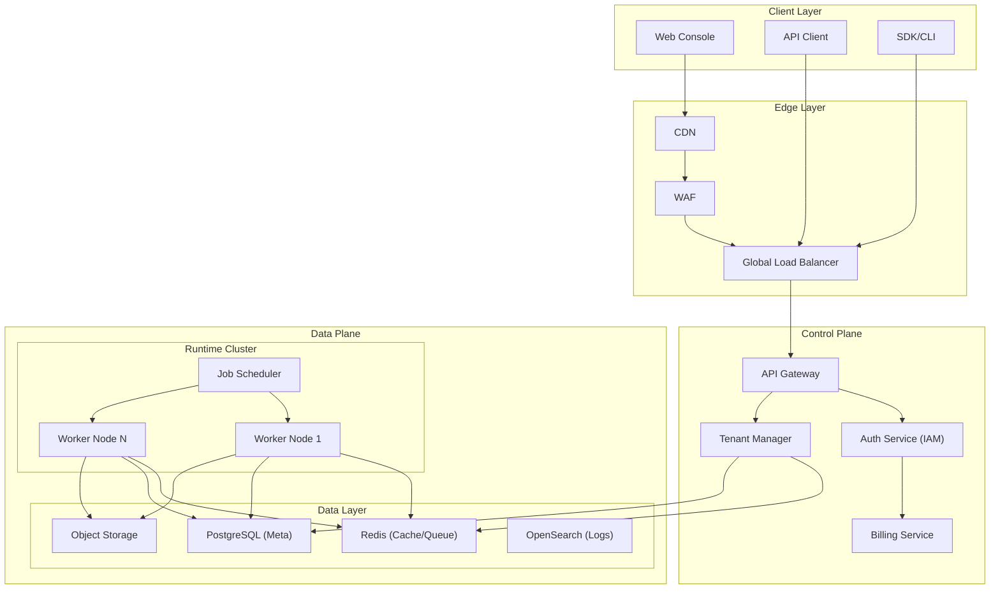

# Aetheris Cloud 架构设计

本文档描述 Aetheris Cloud 托管服务的架构设计方案。

## 概述

Aetheris Cloud 是 Aetheris 的托管 SaaS 服务，提供：
- **零运维部署**：即开即用的 Agent 运行时
- **弹性伸缩**：按需自动扩缩容
- **统一监控**：集中式日志、指标、追踪
- **托管安全**：企业级 IAM、RBAC、审计

## 架构总览



## 核心组件

### 1. 租户管理 (Tenant Manager)

```go
type Tenant struct {
    ID           string      `json:"id"`
    Name         string      `json:"name"`
    Plan         Plan        `json:"plan"`          // free, team, enterprise
    Status       TenantStatus `json:"status"`       // active, suspended, deleted
    
    // 资源配额
    Quota        Quota       `json:"quota"`
    
    // 区域
    Region       string      `json:"region"`
    
    // 功能开关
    Features     map[string]bool `json:"features"`
    
    CreatedAt    time.Time   `json:"created_at"`
    UpdatedAt    time.Time   `json:"updated_at"`
}

type Quota struct {
    MaxUsers           int     `json:"max_users"`
    MaxAgents          int     `json:"max_agents"`
    MaxJobsPerDay      int     `json:"max_jobs_per_day"`
    MaxStorageGB       int     `json:"max_storage_gb"`
    MaxExecutionMinutes int   `json:"max_execution_minutes"`
    MaxAPICallsPerDay  int     `json:"max_api_calls_per_day"`
}

type Plan string

const (
    PlanFree      Plan = "free"
    PlanTeam      Plan = "team"
    PlanEnterprise Plan = "enterprise"
)
```

### 2. 多租户隔离

| 隔离层级 | 实现方式 | 说明 |
|----------|----------|------|
| **网络** | VPC + Security Group | 每个租户独立网络 |
| **存储** | Database Schema 隔离 | PostgreSQL schema per tenant |
| **缓存** | Redis Tenant ID Key | 租户前缀隔离 |
| **计算** | K8s Namespace | Worker 资源隔离 |

### 3. 运行时集群

```yaml
# Kubernetes 部署配置
apiVersion: v1
kind: Namespace
metadata:
  name: tenant-{tenant-id}
---
apiVersion: v1
kind: ResourceQuota
metadata:
  name: tenant-quota
  namespace: tenant-{tenant-id}
spec:
  hard:
    requests.cpu: "32"
    requests.memory: 64Gi
    limits.cpu: "64"
    limits.memory: 128Gi
    pods: "50"
    jobs.aetheris.io: "100"
---
apiVersion: v1
kind: LimitRange
metadata:
  name: tenant-limits
  namespace: tenant-{tenant-id}
spec:
  limits:
    - type: Pod
      max:
        cpu: "16"
        memory: 32Gi
```

### 4. 计费系统

```go
type UsageRecord struct {
    ID          string    `json:"id"`
    TenantID    string    `json:"tenant_id"`
    Metric      string    `json:"metric"`      // api_calls, execution_time, storage
    Value       float64   `json:"value"`
    Unit        string    `json:"unit"`        // calls, minutes, GB
    Timestamp   time.Time `json:"timestamp"`
    Period      string    `json:"period"`      // 2027-01
}

type BillingCycle struct {
    TenantID    string    `json:"tenant_id"`
    StartDate   time.Time `json:"start_date"`
    EndDate     time.Time `json:"end_date"`
    TotalAmount float64   `json:"total_amount"`
    Usage       []UsageSummary
    Status      string    `json:"status"`       // pending, paid, overdue
}

type UsageSummary struct {
    Metric     string  `json:"metric"`
    Used       float64 `json:"used"`
    Quota      float64 `json:"quota"`
    Overage    float64 `json:"overage"`
    UnitPrice  float64 `json:"unit_price"`
    Amount     float64 `json:"amount"`
}
```

## 部署架构

### 全球 Region 分布

```
┌─────────────────────────────────────────────────────────────────────┐
│                         Global Traffic                               │
│                         (Anycast + GeoDNS)                          │
└───────────────────────────────┬─────────────────────────────────────┘
                                │
        ┌───────────────────────┼───────────────────────┐
        │                       │                       │
        ▼                       ▼                       ▼
┌───────────────┐     ┌───────────────┐     ┌───────────────┐
│  US East      │     │  EU West     │     │  APAC East   │
│  (Virginia)   │     │  (Frankfurt) │     │  (Tokyo)      │
├───────────────┤     ├───────────────┤     ├───────────────┤
│ - Control     │     │ - Control     │     │ - Control     │
│ - Runtime     │     │ - Runtime     │     │ - Runtime     │
│ - Data        │     │ - Data        │     │ - Data        │
└───────────────┘     └───────────────┘     └───────────────┘
        │                       │                       │
        └───────────────────────┼───────────────────────┘
                                │
                                ▼
                    ┌───────────────────────┐
                    │   Data Replication     │
                    │   (Cross-Region)       │
                    └───────────────────────┘
```

### Region 内高可用

```
┌──────────────────────────────────────────────────────────────┐
│                    Single Region Architecture                 │
├──────────────────────────────────────────────────────────────┤
│                                                               │
│   ┌─────────┐          ┌─────────┐          ┌─────────┐     │
│   │  AZ 1   │          │  AZ 2   │          │  AZ 3   │     │
│   ├─────────┤          ├─────────┤          ├─────────┤     │
│   │ Master  │◀────────▶│ Master  │◀────────▶│ Master  │     │
│   │  DB     │  Sync   │  DB     │  Sync   │  DB     │     │
│   ├─────────┤          ├─────────┤          ├─────────┤     │
│   │ K8s     │          │ K8s     │          │ K8s     │     │
│   │ Node    │          │ Node    │          │ Node    │     │
│   └─────────┘          └─────────┘          └─────────┘     │
│         │                    │                    │          │
│         └────────────────────┼────────────────────┘          │
│                              │                               │
│                      ┌───────┴───────┐                       │
│                      │   Load        │                       │
│                      │   Balancer    │                       │
│                      └───────────────┘                       │
└──────────────────────────────────────────────────────────────┘
```

## 安全架构

### 多层防护

| 层级 | 组件 | 功能 |
|------|------|------|
| **边缘** | CDN + WAF | DDoS 防护、SQL 注入、XSS 防护 |
| **网络** | VPC + SG | 租户网络隔离、端口控制 |
| **应用** | API Gateway | Rate Limiting、认证、授权 |
| **数据** | KMS | 静态加密、TLS 传输加密 |

### 数据加密

```go
// 静态加密
- 数据库: AES-256-GCM
- 对象存储: S3 Server-Side Encryption (SSE-KMS)
- 备份: 单独加密的备份存储

// 传输加密
- 所有外部通信: TLS 1.3
- 内部服务通信: mTLS

// 密钥管理
- AWS KMS / Azure Key Vault
- 密钥轮换: 90 天周期
```

## 监控与运维

### 可观测性栈

```
┌─────────────────────────────────────────────────────────────────┐
│                    Observability Platform                        │
├─────────────────────────────────────────────────────────────────┤
│                                                                  │
│  ┌─────────────┐  ┌─────────────┐  ┌─────────────┐             │
│  │   Metrics   │  │    Logs     │  │   Traces    │             │
│  │  Prometheus │  │   Loki      │  │   Jaeger    │             │
│  │  + Grafana  │  │  + Grafana  │  │  + Grafana  │             │
│  └──────┬──────┘  └──────┬──────┘  └──────┬──────┘             │
│         │                │                │                      │
│         └────────────────┼────────────────┘                      │
│                          ▼                                       │
│                 ┌─────────────────┐                               │
│                 │   AlertManager │                               │
│                 │   (PagerDuty)   │                               │
│                 └─────────────────┘                               │
└─────────────────────────────────────────────────────────────────┘
```

### SLA 承诺

| 指标 | Free | Team | Enterprise |
|------|------|------|------------|
| **可用性** | 99.5% | 99.9% | 99.95% |
| **响应时间** | < 3s | < 1s | < 500ms |
| **支持** | Community | Email | 24/7 Dedicated |
| **数据保留** | 7 天 | 30 天 | 1 年 |
| **RTO** | 24h | 4h | 1h |
| **RPO** | 24h | 1h | 15min |

## 定价模型

### 按量计费

| 资源 | 计费单位 | 价格 (USD) |
|------|----------|-------------|
| API 调用 | 1,000 次 | $0.10 |
| Job 执行 | 1 分钟 | $0.05 |
| 存储 | 1 GB/月 | $0.10 |
| Agent 托管 | 1 个/天 | $1.00 |

### 订阅计划

| 计划 | 月费 | 包含额度 | 超额费率 |
|------|------|----------|----------|
| **Free** | $0 | 1,000 API / 100 min / 1 GB | 暂停 |
| **Team** | $299 | 50,000 API / 5,000 min / 50 GB | 标准 |
| **Enterprise** | 定制 | 定制 | 折扣 |

## 实施路线图

| 阶段 | 时间 | 目标 |
|------|------|------|
| **MVP** | 2028 Q1 | 单区域、基础功能、邀请制 |
| **Beta** | 2028 Q2 | 多区域、完整 IAM、计费 |
| **GA** | 2028 Q3 | 全球部署、SLA 承诺 |
| **v2** | 2029 H1 | 高级分析、Marketplace 集成 |

## 相关文档

- [商业化路线图](../docs/business/roadmap-2027-2030.md)
- [Enterprise IAM 设计](../enterprise/iam.md)
- [Enterprise RBAC 设计](../enterprise/rbac.md)
- [Enterprise 审计日志设计](../enterprise/audit.md)
