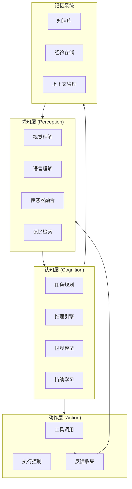
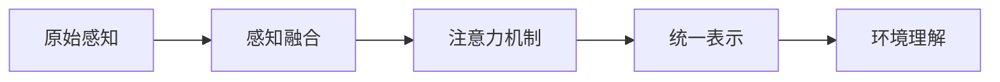
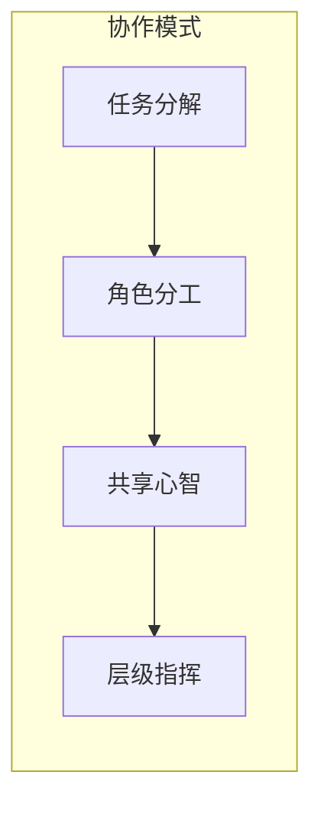

# Embodied AI - 具身智能架构设计

## 概述

Embodied AI（具身智能）是 CoRag 2030 愿景的核心方向之一，旨在构建能够感知环境、执行物理/数字任务的智能体系统。该架构设计智能体如何与现实世界或虚拟环境交互，通过感知-决策-执行闭环实现复杂任务。

---

## 1. 设计目标

- **环境感知**：多模态感知能力（视觉、语言、传感器）
- **自主决策**：基于上下文的任务规划和执行
- **工具使用**：灵活调用各类工具（API、函数、物理设备）
- **持续学习**：从交互经验中学习和适应
- **安全约束**：确保智能体行为在安全边界内

---

## 2. 整体架构



---

## 3. 感知模块

### 3.1 多模态感知

```go
// 感知输入类型
type PerceptionInput struct {
    // 视觉输入
    Visual *VisualInput `json:"visual,omitempty"`
    
    // 语言输入
    Language *LanguageInput `json:"language,omitempty"`
    
    // 传感器数据
    Sensors *SensorData `json:"sensors,omitempty"`
    
    // 环境状态
    Environment *EnvironmentState `json:"environment,omitempty"`
}

type VisualInput struct {
    Image   []byte  // 原始图像
    Depth   []float32  // 深度信息
    PointCloud []Point // 3D 点云
    Annotations []Object  // 目标检测结果
}

type SensorData struct {
    GPS      *GPSData
    IMU      *IMUData    // 惯性测量
    LiDAR    []Point
    Touch    []float32   // 触觉
}
```

### 3.2 感知融合



---

## 4. 认知模块

### 4.1 任务规划

```go
// 任务规划器接口
type TaskPlanner interface {
    // 分解任务为子任务
    Decompose(ctx context.Context, task *Task) ([]*SubTask, error)
    
    // 规划执行顺序
    PlanExecution(ctx context.Context, subtasks []*SubTask) (*ExecutionPlan, error)
    
    // 动态重规划
    Replan(ctx context.Context, plan *ExecutionPlan, feedback *ExecutionFeedback) (*ExecutionPlan, error)
}

// 执行计划
type ExecutionPlan struct {
    Steps       []ExecutionStep
    Dependencies map[string][]string
    EstimatedCost float64
    SuccessProb  float64
}

type ExecutionStep struct {
    StepID      string
    Action      Action
    Preconditions []Condition
    Effects     []Effect
    Timeout     time.Duration
}
```

### 4.2 世界模型

```go
// 世界模型：维护智能体对环境的理解
type WorldModel struct {
    // 实体关系图
    Entities EntityGraph
    
    // 环境状态
    State EnvironmentState
    
    // 物理规则
    Physics PhysicsRules
    
    // 概率预测
    Predictions PredictionModel
}

// 实体关系图
type EntityGraph struct {
    Nodes map[string]*Entity
    Edges []*Relation
}

type Entity struct {
    ID       string
    Type     string  // "object", "agent", "location"
    Props    map[string]interface{}
    Position Vector3
    State    string
}

type Relation struct {
    From    string
    To      string
    Type    string  // "near", "on", "in", "above"
    Weight  float64
}
```

### 4.3 推理引擎

```go
// 推理链
type ReasoningChain struct {
    Context  *Context
    Steps    []ReasoningStep
    Result   *ReasoningResult
    Confidence float64
}

type ReasoningStep struct {
    Type      ReasoningType  // "deduction", "induction", "abduction"
    Input    interface{}
    Logic    string
    Output   interface{}
}

// 推理类型
type ReasoningType int
const (
    Deductive ReasoningType = iota  // 演绎推理
    Inductive                      // 归纳推理
    Abductive                      // 溯因推理
    Analogical                     // 类比推理
    Causal                         // 因果推理
)
```

---

## 5. 动作模块

### 5.1 工具系统

```go
// 工具定义
type Tool struct {
    ID          string
    Name        string
    Description string
    Parameters  []Parameter
    Returns     []ReturnValue
    
    // 执行配置
    Timeout     time.Duration
    RetryPolicy *RetryPolicy
    
    // 安全约束
    Constraints []Constraint
}

// 工具注册
type ToolRegistry struct {
    tools map[string]*Tool
    mu    sync.RWMutex
}

func (r *ToolRegistry) Register(tool *Tool) error {
    r.mu.Lock()
    defer r.mu.Unlock()
    
    // 验证工具定义
    if err := validateTool(tool); err != nil {
        return err
    }
    
    r.tools[tool.ID] = tool
    return nil
}
```

### 5.2 工具类型

| 类型 | 示例 | 用途 |
|------|------|------|
| API 工具 | HTTP/GraphQL 调用 | 外部服务集成 |
| 函数工具 | Lambda/Cloud Function | 计算任务 |
| 数据库工具 | SQL/NoSQL 查询 | 数据访问 |
| 文件工具 | 读写/处理文件 | 文档操作 |
| 物理工具 | 机器人控制 | 物理世界交互 |
| 虚拟工具 | 游戏/模拟器 | 虚拟环境交互 |

### 5.3 执行控制

```go
// 执行器
type Executor struct {
    planner *TaskPlanner
    tools   *ToolRegistry
    monitor *ExecutionMonitor
}

func (e *Executor) Execute(ctx context.Context, plan *ExecutionPlan) (*ExecutionResult, error) {
    results := make([]*StepResult, 0)
    
    for _, step := range plan.Steps {
        // 检查前置条件
        if !e.checkPreconditions(step) {
            return nil, fmt.Errorf("precondition failed for step %s", step.StepID)
        }
        
        // 执行步骤
        result, err := e.executeStep(ctx, step)
        results = append(results, result)
        
        // 检查执行结果
        if err != nil || result.Status == Failed {
            // 触发重规划
            plan = e.planner.Replan(ctx, plan, &ExecutionFeedback{
                CompletedSteps: results,
                FailureReason:  err,
            })
        }
    }
    
    return &ExecutionResult{Steps: results}, nil
}
```

---

## 6. 记忆系统

### 6.1 记忆层次

```mermaid
flowchart TB
    subgraph types["记忆类型"]
        wc[工作记忆<br/>Working Memory<br/>秒级]
        ep[情景记忆<br/>Episodic Memory<br/>分钟-小时]
        sm[语义记忆<br/>Semantic Memory<br/>长期]
    end
    
    wc --> ep
    ep --> sm
    
    wc : "当前上下文"
    ep : "经验积累"
    sm : "知识沉淀"
```

### 6.2 记忆实现

```go
// 记忆接口
type Memory interface {
    // 写入记忆
    Remember(ctx context.Context, memory *MemoryItem) error
    
    // 检索记忆
    Recall(ctx context.Context, query *MemoryQuery) ([]*MemoryItem, error)
    
    // 遗忘（释放空间）
    Forget(ctx context.Context, criteria *ForgetCriteria) error
}

// 记忆项
type MemoryItem struct {
    ID        string
    Type      MemoryType
    Content   interface{}
    Timestamp time.Time
    Importance float64    // 重要性评分
    Tags      []string
    AccessCount int
}

type MemoryType int
const (
    WorkingMemory MemoryType = iota
    EpisodicMemory
    SemanticMemory
)
```

---

## 7. 持续学习

### 7.1 学习策略

```go
// 学习配置
type LearningConfig struct {
    // 在线学习
    OnlineLearning bool
    
    // 少样本学习
    FewShotLearning bool
    
    // 强化学习
    ReinforcementLearning bool
    
    // 人类反馈学习
    HumanFeedbackLearning bool
}

// 学习器接口
type Learner interface {
    // 从经验学习
    Learn(ctx context.Context, experience *Experience) error
    
    // 少样本适应
    Adapt(ctx context.Context, examples []*Example) error
    
    // 评估性能
    Evaluate(ctx context.Context, testSet *TestSet) (*EvaluationResult, error)
}
```

### 7.2 反馈机制

| 反馈类型 | 来源 | 学习方式 |
|----------|------|----------|
| 执行结果 | 动作执行器 | 成功率统计 |
| 环境反馈 | 传感器/状态 | 奖励函数 |
| 用户反馈 | 人工评价 | RLHF |
| 同伴反馈 | 其他智能体 | 知识蒸馏 |

---

## 8. 多智能体协作

### 8.1 协作模式



### 8.2 协作协议

```go
// 协作消息
type CollaborationMessage struct {
    Type    CollabMessageType
    From    string
    To      string
    Content interface{}
    
    // 协作上下文
    TaskID  string
    Session string
}

type CollabMessageType int
const (
    Request CollabMessageType = iota  // 请求协作
    Offer                             // 提供帮助
    Accept                            // 接受协作
    Reject                            // 拒绝
    Share                             // 共享信息
    Sync                              // 状态同步
)
```

---

## 9. 性能指标

| 指标 | 目标值 | 说明 |
|------|--------|------|
| 感知延迟 | < 100ms | 感知到理解 |
| 决策延迟 | < 500ms | 任务规划时间 |
| 执行成功率 | > 95% | 任务完成率 |
| 学习效率 | < 10 examples | 少样本适应 |
| 协作效率 | < 50ms | 智能体间通信 |

---

## 10. 未来演进（2025-2030）

| 阶段 | 目标 | 关键技术 |
|------|------|----------|
| 2025 | 数字具身 | 多模态 LLM + RAG |
| 2026-2027 | 物理具身 | 机器人控制 + 仿真 |
| 2028-2029 | 社交智能 | 多智能体协作 |
| 2030 | 通用具身 | AGI + 具身融合 |
