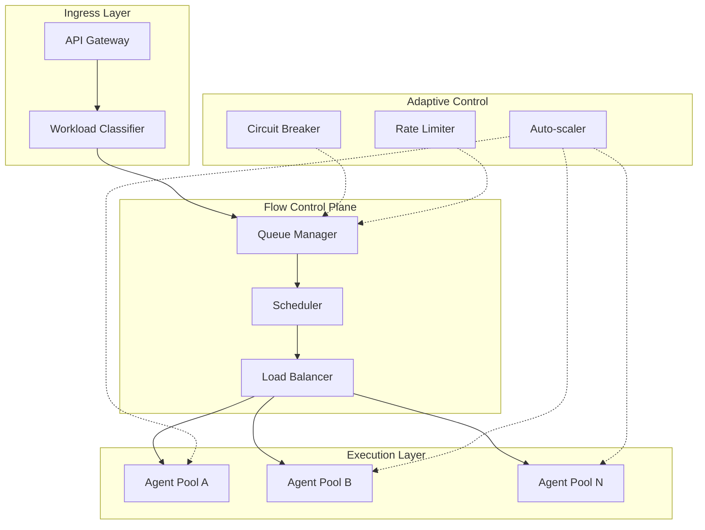

# Flow Control - 大规模并发与负载管理设计

## 概述

Flow Control 模块负责 CoRag 系统的大规模并发控制与负载管理，确保系统在高吞吐场景下的稳定性、弹性和资源效率。该模块与 Swarm Protocol 深度集成，实现智能体的动态调度与流量分配。

---

## 1. 设计目标

- **高吞吐支持**：单集群支持 100k+ 并发任务
- **弹性伸缩**：根据负载自动调整资源分配
- **公平调度**：多租户、多任务类型的公平资源分配
- **过载保护**：系统瓶颈下的主动降级与限流
- **可预测延迟**：关键任务的延迟保障（SLA）

---

## 2. 整体架构



---

## 3. 任务队列管理

### 3.1 多级队列设计

```go
// 队列优先级配置
type QueueConfig struct {
    // 优先级队列（高优先级任务优先处理）
    PriorityLevels []PriorityLevel
    
    // 每级队列的最大容量
    MaxSizePerLevel int64
    
    // 队列超时时间
    Timeout time.Duration
    
    // 公平调度权重
    FairWeight map[string]float64
}

type PriorityLevel struct {
    Level   int
    Name    string    // "critical", "high", "normal", "low"
    MaxWait time.Duration
}
```

### 3.2 队列类型

| 队列类型 | 用途 | 调度策略 |
|----------|------|----------|
| Priority Queue | 关键业务任务 | 优先级抢占 |
| Fair Queue | 多租户任务 | 轮询加权 |
| Delay Queue | 定时/批处理 | 延迟执行 |
| Backlog Queue | 积压任务 | 削峰填谷 |

---

## 4. 调度策略

### 4.1 调度器类型


#### 4.1.1 能力感知调度

```go
// 任务与节点能力匹配
func (s *Scheduler) matchTaskToNode(task *Task, nodes []*Node) *Node {
    // 1. 过滤满足能力要求的节点
    feasible := filterByCapability(nodes, task.RequiredCapabilities)
    
    // 2. 计算综合得分
    scores := make(map[string]float64)
    for _, n := range feasible {
        scores[n.ID] = s.calculateScore(n, task)
    }
    
    // 3. 选择最优节点
    return selectBest(scores)
}

func (s *Scheduler) calculateScore(node *Node, task *Task) float64 {
    // 加权得分计算
    score := 0.0
    score += s.config.LoadWeight * (1 - node.CurrentLoad)
    score += s.config.CapabilityWeight * node.CapabilityMatch
    score += s.config.LatencyWeight * (1 - node.AvgLatency/MaxLatency)
    score += s.config.CostWeight * (1 - node.CostRate/MaxCost)
    return score
}
```

#### 4.1.2 公平调度

```go
// 加权公平队列（WFQ）
type FairScheduler struct {
    // 每类任务的权重
    weights map[string]float64
    
    // 虚拟时间
    virtualTime float64
    
    // 每类的虚拟完成时间
    finishTimes map[string]float64
}

func (f *FairScheduler) Select() *Task {
    // 选择虚拟时间最小的队列
    queue := selectMinVirtualTimeQueue()
    return queue.Dequeue()
}
```

---

## 5. 负载均衡

### 5.1 负载指标

```go
type NodeMetrics struct {
    // 资源指标
    CPUUsage      float64
    MemoryUsage   float64
    DiskIO        float64
    NetworkIO     float64
    
    // 任务指标
    ActiveTasks   int
    QueuedTasks   int
    AvgLatency    time.Duration
    
    // 健康指标
    ErrorRate     float64
    TimeoutRate   float64
}
```

### 5.2 负载均衡算法

| 算法 | 适用场景 | 特点 |
|------|----------|------|
| Least Connections | 高并发短任务 | 选择连接数最少的节点 |
| Weighted Least Connections | 异构节点 | 权重 + 连接数 |
| Power of Two Choices | 大规模 | 随机选择2个，选最优 |
| Adaptive | 动态负载 | 基于实时指标 |

```go
// Power of Two Choices (P2C) 负载均衡
func (lb *LoadBalancer) SelectP2C(tasks []*Task) string {
    // 随机选择两个节点
    n1 := lb.nodes[rand.Intn(len(lb.nodes))]
    n2 := lb.nodes[rand.Intn(len(lb.nodes))]
    
    // 选择负载较小的
    if n1.Load() < n2.Load() {
        return n1.ID
    }
    return n2.ID
}
```

---

## 6. 过载保护

### 6.1 限流策略

```go
// Token Bucket 限流器
type TokenBucketLimiter struct {
    rate       float64       // 每秒生成 token 数
    capacity   int64         // 桶容量
    tokens     int64         // 当前 token 数
    lastUpdate time.Time     // 上次更新时间
    mu         sync.Mutex
}

// 滑动窗口限流器
type SlidingWindowLimiter struct {
    windowSize time.Duration
    maxReqs    int64
    requests   []time.Time   // 请求时间戳环形缓冲
}
```

### 6.2 熔断器

```go
// 熔断器状态
type CircuitState int

const (
    CircuitClosed CircuitState = iota  // 正常
    CircuitHalfOpen                    // 半开（探测）
    CircuitOpen                        // 熔断
)

// 熔断器配置
type CircuitBreakerConfig struct {
    FailureThreshold   int           // 失败次数阈值
    SuccessThreshold   int           // 成功次数阈值（半开转关闭）
    Timeout            time.Duration // 熔断超时
    HalfOpenMaxReqs    int           // 半开状态最大请求数
}
```

### 6.3 降级策略

| 级别 | 触发条件 | 降级动作 |
|------|----------|----------|
| L1 | CPU > 80% | 限制新任务接入 |
| L2 | CPU > 90% | 拒绝低优先级任务 |
| L3 | 响应延迟 > 5s | 启用快速失败 |
| L4 | 节点故障 | 任务迁移 |

---

## 7. 自动伸缩

### 7.1 伸缩策略

```yaml
Auto-scaling Rules:
  - name: "agent-pool-scale-out"
    metric: "cpu_usage"
    condition: "avg > 70%"
    action: "scale_out"
    step: 2
    cooldown: 60s
    
  - name: "agent-pool-scale-in"
    metric: "cpu_usage"
    condition: "avg < 30%"
    action: "scale_in"
    step: 1
    cooldown: 300s
    
  - name: "queue-length-scale"
    metric: "queue_length"
    condition: "max > 1000"
    action: "scale_out"
    step: 5
    cooldown: 30s
```

### 7.2 伸缩控制器

```go
type AutoScaler struct {
    // 目标指标
    targetMetrics map[string]float64
    
    // 伸缩规则
    rules []ScalingRule
    
    // 冷却时间
    cooldown map[string]time.Time
}

func (a *AutoScaler) Reconcile() {
    for _, rule := range a.rules {
        current := a.getMetricValue(rule.Metric)
        
        if a.shouldScaleOut(rule, current) {
            a.scaleOut(rule)
        } else if a.shouldScaleIn(rule, current) {
            a.scaleIn(rule)
        }
    }
}
```

---

## 8. 监控指标

### 8.1 核心指标

| 指标名称 | 类型 | 目标值 | 说明 |
|----------|------|--------|------|
| task_latency_p99 | Histogram | < 500ms | 任务延迟 P99 |
| queue_wait_time | Histogram | < 2s | 队列等待时间 |
| throughput | Counter | > 100k/s | 系统吞吐 |
| error_rate | Gauge | < 0.1% | 错误率 |
| cpu_utilization | Gauge | 60-80% | CPU 利用率 |
| active_agents | Gauge | 动态 | 活跃智能体数 |

### 8.2 告警规则

```yaml
Alerts:
  - name: "high_latency"
    expr: "task_latency_p99 > 1s"
    severity: "warning"
    
  - name: "queue_overflow"
    expr: "queue_length > max_capacity * 0.9"
    severity: "critical"
    
  - name: "node_failure"
    expr: "healthy_nodes < min_nodes"
    severity: "critical"
```

---

## 9. 未来演进

- **预测式伸缩**：基于 ML 的负载预测
- **多云流量调度**：跨云厂商的流量分配
- **成本优化**：spot instance + reserved 混合调度
- **边缘计算**：边缘节点的流量调度（2028+）
