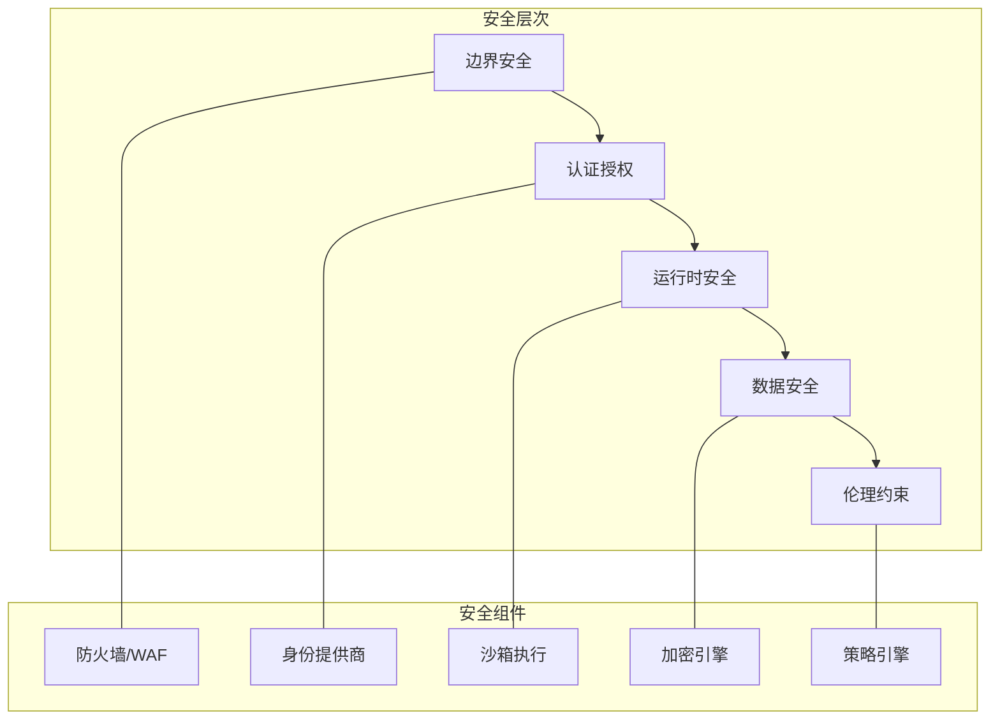

# Safety Constraints - 安全约束设计

## 概述

Safety Constraints 模块为 CoRag 系统提供全面的安全防护机制，确保智能体在 Swarm Intelligence 和 Embodied AI 运行时的行为安全可控。该设计涵盖数据安全、访问控制、运行时保护、伦理约束等多个层面，为 2030 年愿景中的大规模智能体系统提供安全保障。

---

## 1. 设计目标

- **行为安全**：确保智能体行为符合预定义安全策略
- **数据保护**：敏感数据的加密、访问控制和审计
- **运行时保护**：防止恶意代码、无限循环、资源耗尽
- **伦理合规**：AI 伦理规范的内容过滤和决策约束
- **可审计性**：完整的行为记录和追溯能力

---

## 2. 安全架构



---

## 3. 认证与授权

### 3.1 多层认证

```go
// 认证配置
type AuthConfig struct {
    // 认证级别
    RequireMFA bool
    
    // 认证方式
    Providers []AuthProvider
    
    // 会话配置
    SessionTTL time.Duration
    MaxSessions int
}

// 认证提供者
type AuthProvider struct {
    Type    ProviderType  // "oauth", "saml", "api-key", "jwt"
    Config  map[string]interface{}
}

type ProviderType int
const (
    OAuth ProviderType = iota
    SAML
    APIKey
    JWT
    Certificate
)
```

### 3.2 基于角色的访问控制（RBAC）

```go
// 角色定义
type Role struct {
    Name        string
    Permissions []Permission
    ParentRole  string  // 角色继承
    Constraints []Constraint
}

// 权限定义
type Permission struct {
    Resource   string  // "task:*", "agent:read", "tool:execute"
    Actions    []string  // "create", "read", "update", "delete", "execute"
    Conditions []Condition
}

// 角色层次
type RoleHierarchy struct {
    Admin     // 管理员 - 所有权限
        Operator  // 运维 - 大部分权限
            Agent     // 智能体 - 有限权限
                Guest     // 访客 - 只读
}
```

### 3.3 ABAC 扩展

```yaml
ABAC Policies:
  - name: "time-based-access"
    subject:
      role: "agent"
    resource:
      type: "sensitive-data"
    action: "read"
    condition:
      time_range: "09:00-18:00"
      location: "office-network"
      
  - name: "resource-limits"
    subject:
      role: "agent"
    resource:
      type: "compute"
    action: "execute"
    condition:
      cpu_limit: "4 cores"
      memory_limit: "8GB"
      duration_max: "300s"
```

---

## 4. 运行时安全

### 4.1 沙箱执行

```go
// 沙箱配置
type SandboxConfig struct {
    // 隔离级别
    IsolationLevel IsolationLevel
    
    // 资源限制
    MaxMemory      int64
    MaxCPU         int64
    MaxNetwork     int64
    MaxDiskIO      int64
    
    // 超时控制
    ExecutionTimeout time.Duration
    
    // 网络隔离
    NetworkPolicy  NetworkPolicy
}

type IsolationLevel int
const (
    ProcessIsolation IsolationLevel = iota  // 进程隔离
    ContainerIsolation                        // 容器隔离
    VMIsolation                               // 虚拟机隔离
)
```

### 4.2 代码安全

```go
// 代码审查规则
type CodeReviewRule struct {
    ID          string
    Pattern     string    // 正则表达式
    Severity    Severity  // "block", "warn", "log"
    Description string
    Remediation string
}

// 内置安全规则
var SecurityRules = []CodeReviewRule{
    {
        ID:          "SEC-001",
        Pattern:     `os\.Execute|exec\.Command`,
        Severity:    Block,
        Description: "禁止直接执行系统命令",
    },
    {
        ID:          "SEC-002",
        Pattern:     `eval\(|exec\(`,
        Severity:    Block,
        Description: "禁止动态代码执行",
    },
    {
        ID:          "SEC-003",
        Pattern:     `import.*crypto/subtle`,
        Severity:    Warn,
        Description: "检查加密实现是否正确",
    },
}
```

### 4.3 资源保护

```go
// 资源配额
type ResourceQuota struct {
    // 计算资源
    MaxCPU         int64
    MaxMemory      int64
    MaxGPU         int64
    
    // 存储资源
    MaxStorage     int64
    MaxTempStorage int64
    
    // 网络资源
    MaxNetworkCalls int
    MaxDataTransfer  int64
    
    // 并发限制
    MaxConcurrentTasks int
    MaxQueueSize       int
}

// 资源使用监控
type ResourceMonitor struct {
    Quotas      map[string]*ResourceQuota
    Usage       map[string]*ResourceUsage
    AlertThresholds map[string]float64
}
```

### 4.4 熔断与降级

```go
// 安全熔断器
type SafetyCircuitBreaker struct {
    // 触发条件
    MaxErrors       int
    ErrorWindow      time.Duration
    ErrorPercentThreshold float64
    
    // 熔断动作
    OnOpen           func(context.Context) error
    OnHalfOpen       func(context.Context) error
    OnClose          func(context.Context) error
    
    // 恢复配置
    RecoveryTimeout  time.Duration
    RecoveryRatio    float64
}
```

---

## 5. 数据安全

### 5.1 数据分类

```go
// 数据分类
type DataClassification int

const (
    Public     DataClassification = iota  // 公开数据
    Internal                               // 内部数据
    Confidential                           // 机密数据
    Restricted                             // 高度敏感
)

// 数据标签
type DataLabel struct {
    Classification DataClassification
    Jurisdiction  string    // "CN", "EU", "US"
    Retention     time.Duration
    PII           bool      // 个人身份信息
}
```

### 5.2 加密策略

```yaml
Encryption Rules:
  - data_class: "Public"
    at_rest: false
    in_transit: false
    
  - data_class: "Internal"
    at_rest: true
    algorithm: "AES-256-GCM"
    in_transit: true
    tls_version: "1.3"
    
  - data_class: "Confidential"
    at_rest: true
    algorithm: "AES-256-GCM"
    in_transit: true
    key_management: "hsm"
    
  - data_class: "Restricted"
    at_rest: true
    algorithm: "AES-256-GCM"
    in_transit: true
    key_management: "hsm"
    audit_log: true
    access_approval: true
```

### 5.3 密钥管理

```go
// 密钥管理器接口
type KeyManager interface {
    // 生成密钥
    GenerateKey(ctx context.Context, spec *KeySpec) (string, error)
    
    // 加密数据
    Encrypt(ctx context.Context, keyID string, plaintext []byte) ([]byte, error)
    
    // 解密数据
    Decrypt(ctx context.Context, keyID string, ciphertext []byte) ([]byte, error)
    
    // 密钥轮换
    RotateKey(ctx context.Context, keyID string) (string, error)
    
    // 销毁密钥
    DestroyKey(ctx context.Context, keyID string) error
}

// 密钥规范
type KeySpec struct {
    Algorithm string  // "AES-256-GCM", "RSA-4096"
    Purpose   string  // "encryption", "signing"
    Expires   time.Time
}
```

---

## 6. 伦理约束

### 6.1 内容过滤

```go
// 内容过滤器
type ContentFilter struct {
    // 敏感词过滤
    SensitiveWords *Trie
    
    // 有害内容检测
    HarmfulContentDetector *MLClassifier
    
    // 偏见检测
    BiasDetector *BiasDetector
    
    // 违规模式
    ViolationPatterns []*PatternRule
}

// 过滤规则
type FilterRule struct {
    Category    string    // "violence", "hate", "illegal", "privacy"
    Action      FilterAction  // "block", "warn", "audit"
    Threshold   float64
    Remediation string
}
```

### 6.2 决策约束

```go
// 决策约束引擎
type DecisionConstraintEngine struct {
    // 硬约束（不可违反）
    HardConstraints []Constraint
    
    // 软约束（优先遵守）
    SoftConstraints []Constraint
    
    // 约束冲突解决
    Resolver ConstraintResolver
}

// 预定义约束
var DefaultConstraints = []Constraint{
    {
        ID: "ETHIC-001",
        Description: "禁止生成有害内容",
        Type: Hard,
        Check: func(ctx context.Context, decision *Decision) error {
            if decision.IsHarmful() {
                return ErrConstraintViolation
            }
            return nil
        }
    },
    {
        ID: "ETHIC-002",
        Description: "尊重用户隐私",
        Type: Hard,
        Check: func(ctx context.Context, decision *Decision) error {
            if decision.ExposesPrivacy() {
                return ErrConstraintViolation
            }
            return nil
        }
    },
    {
        ID: "ETHIC-003",
        Description: "透明决策过程",
        Type: Soft,
        Check: func(ctx context.Context, decision *Decision) error {
            if !decision.IsExplainable() {
                return ErrConstraintWarning
            }
            return nil
        }
    },
}
```

### 6.3 审计追踪

```yaml
Audit Requirements:
  - event: "authentication"
    log_level: "info"
    retention: "1 year"
    
  - event: "authorization"
    log_level: "info"
    retention: "1 year"
    
  - event: "data_access"
    log_level: "info"
    retention: "3 years"
    pii: true
    
  - event: "model_decision"
    log_level: "debug"
    retention: "5 years"
    
  - event: "constraint_violation"
    log_level: "critical"
    retention: "7 years"
    alert: true
```

---

## 7. 异常处理

### 7.1 安全事件响应

```go
// 安全事件
type SecurityEvent struct {
    ID          string
    Type        EventType
    Severity    Severity
    Timestamp   time.Time
    Source      string
    Details     map[string]interface{}
    ActionTaken string
}

type EventType int
const (
    AuthenticationFailure EventType = iota
    AuthorizationFailure
    ConstraintViolation
    ResourceExhaustion
    MaliciousCode
    DataBreach
    AnomalyDetected
)

// 事件处理流程
type IncidentResponse struct {
    Detect    func(ctx context.Context, event *SecurityEvent)
    Analyze   func(ctx context.Context, event *SecurityEvent) *Analysis
    Contain   func(ctx context.Context, analysis *Analysis) error
    Recover   func(ctx context.Context, analysis *Analysis) error
    Postmortem func(ctx context.Context, event *SecurityEvent)
}
```

### 7.2 自动响应

```yaml
Auto-response Rules:
  - trigger: "authentication_failure > 5 in 1min"
    action: "block_ip"
    duration: "30min"
    
  - trigger: "constraint_violation"
    action: "log_and_notify"
    escalate: true
    
  - trigger: "resource_exhaustion"
    action: "throttle"
    limit: "50%"
    
  - trigger: "malicious_code_detected"
    action: "quarantine"
    notify: "security_team"
```

---

## 8. 合规性

### 8.1 支持的合规标准

| 标准 | 适用范围 | 关键控制点 |
|------|----------|------------|
| GDPR | 欧盟用户数据 | 数据删除权、同意管理 |
| CCPA | 加州用户数据 | 数据透明度、退出机制 |
| SOC 2 | 服务商审计 | 安全、可用、保密 |
| ISO 27001 | 信息安全 | 风险管理、安全控制 |
| 中国数据安全法 | 中国境内数据 | 数据分类分级保护 |

### 8.2 合规检查

```go
// 合规检查器
type ComplianceChecker struct {
    Standards []ComplianceStandard
}

func (c *ComplianceChecker) Check(ctx context.Context, operation *Operation) *ComplianceResult {
    results := make([]*CheckResult, 0)
    
    for _, standard := range c.Standards {
        result := standard.Check(operation)
        results = append(results, result)
    }
    
    return &ComplianceResult{
        Results: results,
        Pass:    allPass(results),
    }
}
```

---

## 9. 监控与告警

### 9.1 安全指标

| 指标 | 阈值 | 告警级别 |
|------|------|----------|
| 认证失败率 | > 10% | Warning |
| 未授权访问尝试 | > 5/min | Critical |
| 约束违反 | > 0 | Warning |
| 异常行为检测 | > 0 | Critical |
| 敏感数据访问 | 异常模式 | Warning |
| 资源使用异常 | > 90% | Warning |

### 9.2 安全仪表盘

```yaml
Dashboard Panels:
  - name: "Authentication Overview"
    metrics:
      - "auth_success_rate"
      - "auth_failure_count"
      - "mfa_usage"
      
  - name: "Authorization Matrix"
    metrics:
      - "permission_denied_count"
      - "role_changes"
      
  - name: "Threat Detection"
    metrics:
      - "anomaly_score"
      - "blocked_requests"
      - "malware_detected"
```

---

## 10. 未来演进

- **零信任架构**：持续验证，微隔离
- **AI 安全**：对抗样本检测，模型水印
- **隐私计算**：联邦学习，安全多方计算
- **合规自动化**：实时合规检查与报告
- **区块链审计**：不可篡改的行为记录（2028+）
