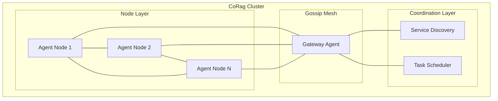

# Swarm Protocol - 跨节点智能体通信协议设计

## 概述

Swarm Protocol 是 CoRag 系统中实现多智能体跨节点协同的核心通信协议。该协议支持大规模智能体节点间的消息传递、状态同步、任务分发与结果聚合，为 2030 年愿景中的分布式群体智能提供可靠的网络通信基础。

---

## 1. 设计目标

- **去中心化拓扑**：支持 P2P 和混合架构，无单点故障
- **消息可靠性**：至少一次（At-Least-Once）语义，重要消息可升级为恰好一次
- **低延迟通信**：节点间单跳延迟 < 50ms（局域网），< 200ms（跨区域）
- **可扩展性**：支持 1000+ 节点同时在线，单集群支持 10w+ 智能体实例
- **故障容错**：网络分区、节点宕机情况下保证协议活性

---

## 2. 网络拓扑



### 节点类型

| 类型 | 职责 | 资源需求 |
|------|------|----------|
| Agent Node | 执行智能体任务，参与 gossip 扩散 | 中等 |
| Gateway Node | 入口代理，协议转换，限流 | 中等 |
| Coordinator Node | 任务分发，结果聚合，全局状态 | 较高 |

---

## 3. 消息格式

### 3.1 基础消息结构

```protobuf
message SwarmMessage {
    string id = 1;           // 全局唯一消息ID
    string source_node = 2;  // 来源节点ID
    string target_node = 3;  // 目标节点ID（空表示广播）
    MessageType type = 4;    // 消息类型
    bytes payload = 5;       // 序列化载荷
    uint64 timestamp = 6;    // 发送时间戳
    uint32 ttl = 7;         // 剩余跳数
    map<string, string> metadata = 8;  // 元数据
}

enum MessageType {
    HEARTBEAT = 0;          // 心跳
    TASK_DISPATCH = 1;     // 任务分发
    TASK_RESULT = 2;       // 任务结果
    STATE_SYNC = 3;         // 状态同步
    GOSSIP = 4;             // Gossip 扩散
    NEGOTIATION = 5;        // 资源协商
    EMERGENCY = 6;          // 紧急指令
}
```

### 3.2 载荷格式

```json
{
    "task_dispatch": {
        "task_id": "uuid",
        "agent_id": "agent-001",
        "capability": "retrieval",
        "input": {...},
        "deadline": 1699999999,
        "priority": "high"
    },
    "task_result": {
        "task_id": "uuid",
        "status": "success|failed|cancelled",
        "output": {...},
        "metrics": {
            "latency_ms": 150,
            "tokens": 1024
        }
    }
}
```

---

## 4. 通信模式

### 4.1 点对点通信

用于确定性任务分发和结果返回：

```go
// 发送方
func SendTask(ctx context.Context, target string, task Task) (*Result, error) {
    msg := SwarmMessage{
        Type:    TASK_DISPATCH,
        Payload: Serialize(task),
        TTL:     3,
    }
    
    // 可靠投递 + 超时控制
    resp, err := SendWithAck(ctx, target, msg, 30*time.Second)
    return resp.Result, err
}
```

### 4.2 Gossip 扩散

用于状态同步和知识共享：

```go
// Gossip 协议参数
const (
    Fanout = 3              // 每轮扩散目标数
    Interval = 1 * time.Second  // 扩散间隔
    MaxHops = 5             // 最大跳数
)
```

### 4.3 发布订阅

用于事件驱动场景：

```go
// 主题订阅
Subscribe("task:completed", func(event Event) {
    // 处理任务完成事件
})

// 主题发布
Publish("task:completed", TaskCompletedEvent{
    TaskID:    "uuid",
    AgentID:   "agent-001",
    Timestamp: time.Now(),
})
```

---

## 5. 服务发现

### 5.1 节点注册

```yaml
Node Registration:
  - node_id: "agent-node-001"
    capabilities:
      - retrieval
      - reasoning
      - tool_execution
    capacity: 10
    region: "cn-shanghai"
    endpoint: "grpc://10.0.0.1:8080"
    heartbeat_interval: 5s
```

### 5.2 健康检查

- **心跳频率**：每 5 秒一次
- **死亡判定**：连续 3 次心跳超时（15 秒）
- **恢复检测**：节点重新发送心跳后自动恢复

---

## 6. 安全机制

### 6.1 传输安全

- mTLS 双向认证
- 节点身份基于 PKI 证书
- 消息加密（TLS 1.3）

### 6.2 访问控制

```yaml
ACL Rules:
  - resource: "task:dispatch"
    subject: "role:agent"
    action: "allow"
    
  - resource: "state:sync"
    subject: "role:agent"
    action: "allow"
    
  - resource: "admin:*"
    subject: "role:coordinator"
    action: "allow"
```

---

## 7. 性能指标

| 指标 | 目标值 | 说明 |
|------|--------|------|
| 单跳延迟 | < 50ms | 局域网环境下 |
| 消息吞吐 | 100k msg/s | 单集群峰值 |
| 节点规模 | 1000+ | 单集群节点数 |
| 可用性 | 99.99% | 年度可用性 |
| 故障恢复 | < 30s | 节点故障检测与恢复 |

---

## 8. 未来演进

- **Kademlia DHT**：支持更高效的结构化 P2P 路由
- **QUIC 协议**：低延迟连接复用
- **WebRTC**：浏览器节点直接参与
- **链上治理**：去中心化协作决策（2028+）
