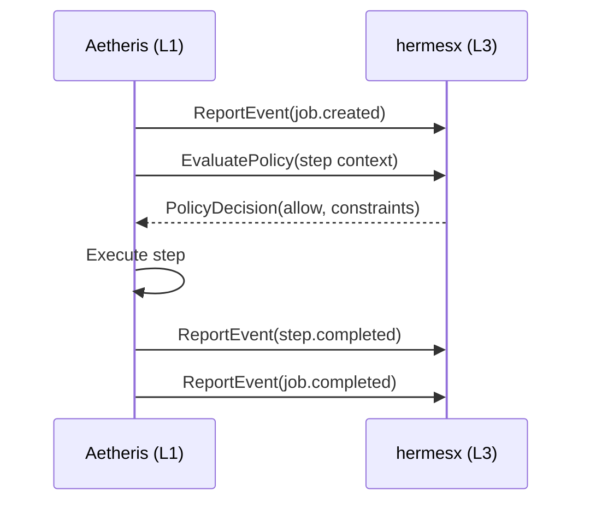
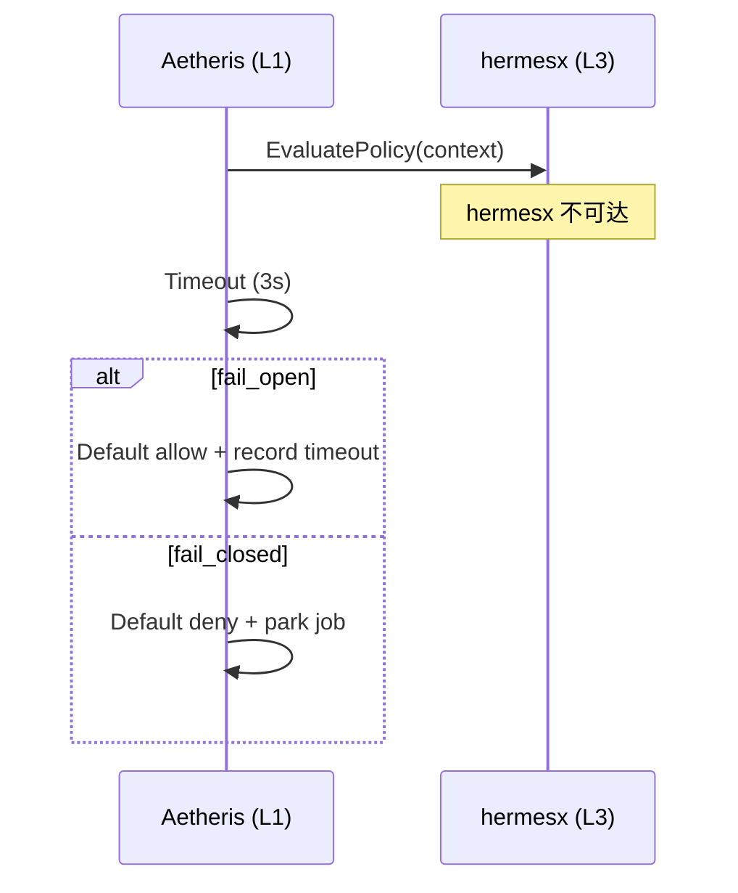

# Hermesx Integration Contract

> **Status**: draft
> **ADR**: [ADR-0002](../adr/ADR-0002-aetheris-four-layer-architecture.md)
> **Direction**: L1 (Aetheris) ↔ L3 (hermesx)
> **Date**: 2026-07-04

## 概述

本文档定义 Aetheris（L1 执行层）与 hermesx（L3 治理层）之间的接口契约。

采用 **单侧 Provider Interface** 模式（见 ADR-0002 方案 B）：先定义 Aetheris 侧的接口与事件模型，待 hermesx 团队参与后对齐细节。核心原则是 **evidence-first**：所有治理决策必须可追溯、可重放、可审计。

### 架构位置

```
L3: hermesx          — 治理层（策略、合规、审计、多租户治理）
L2: superagent-base  — 编排层（Agent 生命周期管理、工作流编排）
L1: Aetheris         — 执行层（持久化执行、crash recovery、event sourcing）
L0: Oris/openhuman   — 能力层（LLM、工具、数据源、外部服务）
```

### 设计约束

1. **治理上报不阻塞执行路径** — 事件上报采用异步方式，不可增加 Job 执行延迟
2. **策略评估有超时兜底** — 策略服务不可用时，明确 fail_open / fail_closed 行为
3. **审计证据链完整** — 所有治理交互记录到 event sourcing 链中
4. **多租户隔离** — 所有接口均携带 tenant_id，治理策略按租户隔离

---

## L1 → L3: 事件上报（GovernanceEvent Stream）

Aetheris 在 Job 生命周期关键节点向 hermesx 上报治理事件。

### 事件类型

| Event Type | 触发时机 | 说明 |
|------------|----------|------|
| `job.created` | Job 被创建 | 携带 job 元数据、tenant_id、goal |
| `job.completed` | Job 正常完成 | 携带最终状态、总步数、持续时间 |
| `job.failed` | Job 失败终止 | 携带错误信息、失败原因分类 |
| `step.started` | Step 开始执行 | 携带 step 类型、capability_id |
| `step.completed` | Step 正常完成 | 携带输出摘要（脱敏） |
| `step.failed` | Step 执行失败 | 携带错误分类、是否可重试 |
| `route.decision_recorded` | 路由决策已持久化 | 携带 decision_hash |
| `evidence.exported` | 证据包已导出 | 携带导出格式、签名算法 |
| `policy.violation_detected` | 策略违规被检测到 | 携带违规类型、严重级别 |

### 上报通道

| 通道 | 协议 | 延迟 | 适用场景 |
|------|------|------|----------|
| **主通道** | gRPC bidirectional stream | <50ms | 生产环境、高吞吐 |
| **备通道** | HTTP webhook (POST) | <500ms | 简单集成、调试 |

---

## L3 → L1: 策略下发（Policy Evaluation）

Aetheris 在执行敏感操作前向 hermesx 请求策略评估。**同步调用**，有严格超时约束。

### 决策枚举

| Decision | 含义 | Aetheris 行为 |
|----------|------|---------------|
| `allow` | 允许执行 | 继续执行，记录策略响应到 event chain |
| `deny` | 拒绝执行 | 中止 step，Job 进入 failed 状态 |
| `audit` | 允许但标记审计 | 继续执行，额外记录审计标记 |

### 超时策略

| Policy | 行为 | 适用场景 |
|--------|------|----------|
| `fail_open` | 超时后默认 allow | 非关键路径、开发环境 |
| `fail_closed` | 超时后默认 deny | 合规敏感、生产环境 |

---

## L3 → L1: 合规约束下发（ComplianceConstraints）

| 字段 | 类型 | 说明 |
|------|------|------|
| `data_residency` | string | 数据驻留区域 |
| `retention_days` | int | 审计日志保留天数 |
| `pii_masking` | object | PII 脱敏配置 |
| `audit_level` | string | `basic` / `detailed` / `forensic` |
| `allowed_tools` | []string | 工具白名单 |
| `denied_tools` | []string | 工具黑名单 |
| `max_job_duration_hours` | int | Job 最大执行时长 |
| `require_approval_for` | []string | 需要人工审批的操作类型 |

---

## L1 ↔ L3: 审计查询

| 方法 | 输入 | 输出 |
|------|------|------|
| `QueryAuditTrail` | job_id | 完整事件链 |
| `QueryAuditByTimeRange` | tenant_id, time_range | 事件列表 |
| `RequestEvidenceExport` | job_id | 签名证据包 |

### EvidenceExport 导出内容

1. 事件链（event sourcing 原始记录）
2. Checkpoint 快照
3. Tool Invocation 记录
4. Routing Decision 记录
5. Policy Evaluation 记录
6. 签名清单（SHA-256）

---

## 事件序列图

### 正常执行流程



### 策略超时降级



---

## Go 接口定义

接口定义位于 `internal/agent/governance/provider.go`：
- `GovernanceProvider` — Aetheris 期望 L3 实现的接口
- `ExecutionProvider` — Aetheris 暴露给 L2/L3 的接口

---

## 与现有组件的集成点

| 组件 | 交互方式 |
|------|----------|
| **JobStore** | 读取事件链（审计查询数据源） |
| **Scheduler** | 策略评估触发点（lease 获得后） |
| **Runner** | 策略评估触发点（step 执行前） |
| **RoutingAdvisor** | 事件关联（decision_hash） |
| **InvocationLedger** | 证据导出数据源 |

---

## 集成阶段

| 阶段 | 内容 | 状态 |
|------|------|------|
| Phase 1 | 接口定义 + ADR | ✅ 当前 |
| Phase 2 | Go interface 实现（stub + unit test） | ⏳ |
| Phase 3 | hermesx 团队 review | ⏳ |
| Phase 4 | Integration test | ⏳ |
| Phase 5 | Production promotion | ⏳ |

---

## 开放问题

| # | 问题 | Owner |
|---|------|-------|
| 1 | hermesx 是否支持 gRPC？ | hermesx team |
| 2 | 策略评估 SLA？默认超时 3s 是否合理？ | both |
| 3 | 合规约束更新频率？是否需要 push？ | hermesx team |
| 4 | 签名算法偏好？（SHA-256 + HMAC） | security |
| 5 | 多租户模型是否对齐？ | both |
| 6 | 是否需要 hermesx 主动下发暂停指令？ | hermesx team |
