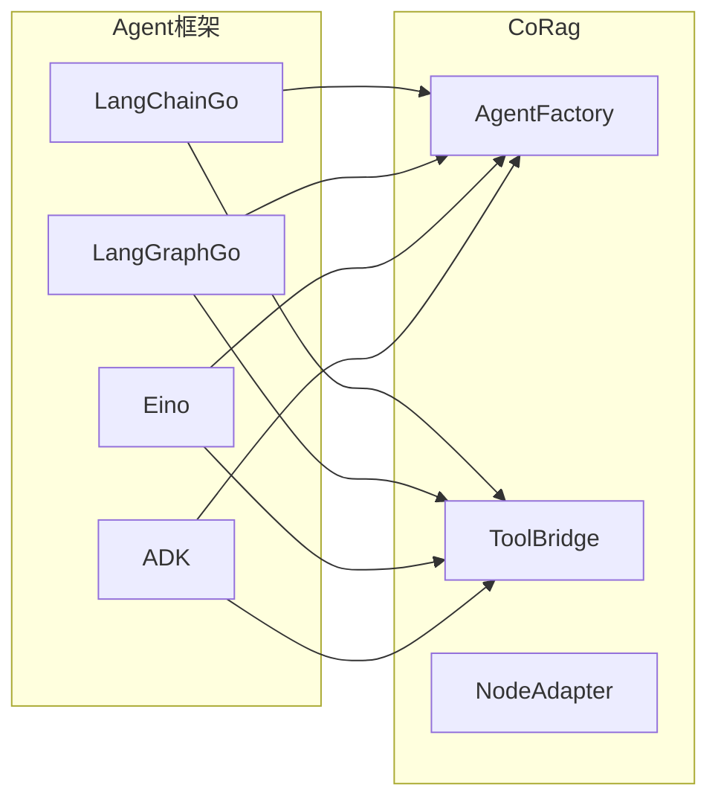

# CoRag vs Temporal：何时选择专用 Agent Runtime

> Temporal 是目前最成熟的通用工作流引擎，被称为「工作流领域的 Kubernetes」。但当你的核心场景是 AI Agent 时，专用 Runtime 能提供什么不同？为什么说「Temporal for Agents」不只是一个营销口号？

## 0. 先说结论

| 场景 | 推荐选择 |
|------|----------|
| 非 Agent 的业务流程（订单履约、审批流） | Temporal |
| 需要持久化、可恢复、有外部副作用的 AI Agent | CoRag |
| 需要完整推理链审计的合规场景 | CoRag |
| 需要多框架支持的 Agent 平台 | CoRag |
| 已有 Temporal 投入，迁移成本高 | 继续用 Temporal |

这不是「谁更好」的问题，而是「谁更适合」的问题。

## 1. Temporal 是什么？

Temporal 是由 Stripe 前工程师打造的分布式工作流引擎，核心解决的是**可靠业务工作流的执行问题**。

### 1.1 核心概念

```
┌─────────────────────────────────────────────────────────────┐
│                     Temporal 架构                            │
├─────────────────────────────────────────────────────────────┤
│                                                             │
│  Workflow    ──▶  业务逻辑代码（Node.js / Go / Java 等）    │
│                                                             │
│  Activity    ──▶  具体业务操作（数据库操作、外部 API 调用）   │
│                                                             │
│  Worker     ──▶  执行 Workflow 和 Activity 的进程           │
│                                                             │
│  Temporal Server ──▶  状态存储（PostgreSQL / Cassandra）     │
│                                                             │
└─────────────────────────────────────────────────────────────┘
```

### 1.2 Temporal 的优势

| 能力 | 说明 |
|------|------|
| **持久化执行** | Workflow 可以在任意时刻暂停、恢复，即使 Worker 崩溃 |
| **Activity 幂等性** | 通过 Idempotency Key 保证 Activity 不重复执行 |
| **历史记录** | 完整的执行历史，可用于调试和审计 |
| **分布式锁定** | 防止多 Worker 同时执行同一 Workflow |
| **重试策略** | 灵活的重试配置 |

### 1.3 Temporal 的典型用例

- **订单履约系统**：下单 → 库存确认 → 支付 → 发货 → 通知
- **数据处理流水线**：ETL、定时同步、批量处理
- **审批流程**：创建申请 → 主管审批 → HR 审批 → 入职办理
- **微服务编排**：协调多个微服务的调用

这些场景的共同特点是：**流程是确定的（确定的步骤、确定的调用顺序），失败时重试通常是可以接受的**。

## 2. AI Agent 的特殊需求

AI Agent 与传统业务工作流有本质区别：

### 2.1 执行路径是动态的

传统工作流：
```
Step 1 → Step 2 → Step 3 → Step 4（固定路径）
```

Agent 工作流：
```
Goal: "帮我分析苹果公司并生成报告"
  → Agent 调用 Search 工具
  → LLM 分析搜索结果
  → 如果信息不足，Agent 决定再调用一次 Search
  → LLM 决定调用 ReportGenerator
  → 如果用户不满意，Agent 重新生成
  → ...
```

**Agent 根据 LLM 的推理结果决定下一步做什么，无法在部署时确定执行顺序**。

### 2.2 Tool 调用不能随意重试

传统工作流的 Activity 重试：
```
调用支付 API 失败 → 重试 → 成功
```

Agent 的 Tool 调用：
```
调用 refund API 退款 $100
  → API 返回成功
  → [崩溃]
  
如果重试：用户被扣款 $200！
```

**有些操作「失败了就重试」是合理的，但 Tool 调用（尤其是支付、发邮件这类）重试可能是灾难性的**。

### 2.3 推理过程需要完整保留

传统工作流的审计：
```
「Step 3 在 14:30 执行，调用了 payment API」
```

Agent 的审计：
```
「Step 3 在 14:30 执行
   输入：用户说『帮我退掉这单』
   当时的 RAG 上下文：[文档1, 文档2]
   LLM 推理过程：用户要求退款，我先调用风控 API 检查风险...
   决策：批准退款（风险等级：低）
   工具调用：stripe.refund({amount: 100})
   外部副作用：$100 已退款」
```

**Agent 的决策过程本身就是证据链的一部分**，而这在传统工作流中是不需要的。

### 2.4 Human-in-the-Loop 是核心需求

Agent 场景中，用户经常需要：
- 「审批后再继续」
- 「修改目标后重新执行」
- 「在等待输入时暂停任务」
- 「中断 Agent 的执行，注入人工判断」

这在传统工作流中是「可选的附加功能」，在 Agent 场景中是**不可协商的基础需求**。

## 3. CoRag 的核心差异

### 3.1 设计定位：专为 Agent 而生

```
┌─────────────────────────────────────────────────────────────┐
│                    CoRag 定位                               │
├─────────────────────────────────────────────────────────────┤
│                                                             │
│   LangChainGo ──▶ 构建 Agent 逻辑                          │
│         │                                                   │
│         ▼                                                   │
│   LangGraphGo ──▶ 定义 Agent 行为                          │
│         │                                                   │
│         ▼                                                   │
│   CoRag ──▶ 运行 Agent（持久化、可恢复、可审计）            │
│                                                             │
└─────────────────────────────────────────────────────────────┘
```

CoRag 不试图替代 LangChain/LangGraph，而是为它们提供**生产级的执行运行时**。

### 3.2 多框架支持

这是 CoRag 区别于其他方案的关键特性之一：



CoRag 的 `AgentFactory` 可以接入不同框架构建的 Agent：

```go
// 接入 LangChainGo Agent
langChainAgent := langchaingo.NewAgent(...)
runtime.LoadAgent(ctx, langChainAgent)

// 接入 LangGraphGo Agent
langGraphAgent := langgraphgo.NewAgent(...)
runtime.LoadAgent(ctx, langGraphAgent)

// 接入 Eino Agent
einoAgent := eino.NewAgent(...)
runtime.LoadAgent(ctx, einoAgent)
```

### 3.3 原生事件溯源

CoRag 从一开始就把事件溯源作为核心设计：

```go
// CoRag 的事件类型（部分）
JobCreated        // Job 被创建
PlanGenerated     // Planner 产出任务图
NodeStarted       // 某节点开始执行
NodeFinished      // 某节点执行完成
ToolInvocationStarted   // 工具调用开始
ToolInvocationFinished  // 工具调用完成（含结果）
ReasoningSnapshot       // 推理快照（LLM 思考链）
CheckpointSaved         // 检查点已创建
RecoveryStarted         // 恢复开始
RecoveryCompleted       // 恢复完成
```

**Temporal 也有历史记录，但它是低层次的、执行导向的，不保留完整的推理上下文**。

### 3.4 Invocation Ledger：At-Most-Once 的原生支持

```go
// Temporal 的幂等性（需要手动配置）
activities := &Activities{
    PaymentID: "pay_123", // 手动传入 Idempotency Key
}
await workflow.ExecuteActivity(ctx, activities.Charge, paymentID)

// CoRag 的 At-Most-Once（内置）
result, err := runner.CallTool(ctx, &CallToolRequest{
    Tool:   "stripe.refund",
    Input:  map[string]any{"amount": 100},
    // 无需手动传 Idempotency Key
    // Ledger 自动处理幂等性
})
```

### 3.5 恢复粒度：Step 级别

| 系统 | 恢复粒度 | 说明 |
|------|----------|------|
| Kubernetes | Pod 级别 | 整个 Pod 重启 |
| Temporal | Activity 级别 | 整个 Activity 重试 |
| **CoRag** | **Step 级别** | 单个 Step 重试 |

**更细的恢复粒度意味着更少的重复工作**。

## 4. 功能对比

| 能力 | Temporal | CoRag |
|------|----------|-------|
| **执行模型** | 通用工作流 | Agent 专用 |
| **Tool/LLM 调用** | Activity（需额外配置幂等） | 内置 At-Most-Once |
| **Human-in-the-Loop** | Signal（有限） | 内置 Wait/Signal/Parked |
| **事件溯源** | 执行历史 | 完整推理链 |
| **Checkpoint** | Workflow 快照（需手动实现） | 自动 Step 级别 |
| **多框架支持** | 无 | LangChainGo/LangGraphGo/Eino/ADK |
| **恢复粒度** | Activity | Step |
| **证据链** | 有限 | 完整（RAG + LLM + Tool） |
| **部署方式** | 自托管 / Temporal Cloud | 自托管 |
| **开源** | Apache 2.0 | Apache 2.0 |

## 5. 场景对比

### 5.1 适合用 Temporal 的场景

**场景：电商订单履约**

```
OrderPlaced → PaymentCharged → InventoryReserved → ShippingScheduled → CustomerNotified
```

特点：
- 流程是固定的
- 每个步骤可以重试
- 不需要 LLM 推理
- 主要是数据一致性需求

**Temporal 的优势**：
- 成熟的生态系统
- 丰富的 SDK 支持
- 大量生产案例
- Temporal Cloud 托管服务

### 5.2 适合用 CoRag 的场景

**场景：AI 投资研究 Agent**

```
用户目标：「分析苹果公司的竞争优势并生成投资报告」

Agent 执行：
1. 调用 Search 工具查询苹果公司背景
2. 调用 RAG 获取财务数据
3. 调用 LLM 分析竞争优势
4. [等待用户确认报告结构]
5. 调用 ReportGenerator 生成报告
6. 用户审批：「数据来源不够详细」
7. Agent 补充查询 → 重新生成报告
8. ...
```

特点：
- 动态执行路径
- Tool 调用带副作用（不能重复执行）
- 需要完整审计（RAG 上下文、LLM 推理过程）
- Human-in-the-Loop 是核心需求

**CoRag 的优势**：
- 内置 At-Most-Once
- 完整的推理链保留
- 原生 Human-in-the-Loop
- 多框架 Agent 支持

### 5.3 混合场景：Agent 编排工作流

一个更复杂的场景：**用工作流引擎编排多个 Agent**。

```
┌─────────────────────────────────────────────────────────────┐
│              Temporal Workflow 编排多个 Agent                │
├─────────────────────────────────────────────────────────────┤
│                                                             │
│  Workflow: 客户服务自动化                                   │
│                                                             │
│  Step 1: Agent_A（LangChainGo）分析客户问题                 │
│     ↓                                                       │
│  Step 2: Agent_B（LangGraphGo）查询知识库                   │
│     ↓                                                       │
│  Step 3: Agent_C（Eino）生成回复                           │
│     ↓                                                       │
│  Step 4: [Human Approval] 人工审核回复                      │
│     ↓                                                       │
│  Step 5: Agent_D 发送邮件给客户                             │
│                                                             │
└─────────────────────────────────────────────────────────────┘
```

在这个场景中：
- **工作流层面**：用 Temporal 做整体编排
- **Agent 层面**：每个 Agent 用 CoRag 运行

两者可以互补，而不是非此即彼。

## 6. 迁移成本

### 6.1 从自建状态机迁移到 CoRag

**自建状态机的典型问题**：

```go
// 自建状态机（不推荐的方式）
type Job struct {
    ID        string
    Status    string  // "pending", "running", "completed"
    Step      int
    // ...
}

// 定时任务轮询
for {
    jobs, _ := db.GetJobsByStatus("running")
    for _, job := range jobs {
        // 问题：崩溃后不知道执行到哪了
        // 问题：Tool 可能重复执行
        // 问题：没有完整的审计日志
        process(job)
    }
    time.Sleep(10 * time.Second)
}
```

**迁移到 CoRag**：

```go
// CoRag 方式
job, err := runtime.CreateJob(ctx, &CreateJobRequest{
    AgentConfig: agentConfig,
    UserGoal:    "处理退款申请 #12345",
})
// 后续的持久化、恢复、幂等都由 CoRag 处理
```

### 6.2 从 Temporal 迁移

如果你已经在用 Temporal，有几个信号说明 Agent Runtime 可能是更好的选择：

| 信号 | 说明 |
|------|------|
| Workflow 里大量 Activity 需要手动配置幂等 | Activity 语义与 Tool 调用不匹配 |
| 需要在 Workflow 里嵌入 LLM 调用和 RAG | 不是传统业务工作流 |
| 审计要求「完整的推理链」 | Temporal 历史不够用 |
| Human-in-the-Loop 需求复杂 | Signal 机制不够用 |

迁移成本评估：
- **低**：新项目直接用 CoRag
- **中**：独立的服务用 CoRag，逐步迁移
- **高**：现有 Temporal 投入大，迁移需谨慎

## 7. 选型决策树

```
你的场景是什么？
│
├─ 非 Agent 业务工作流
│   └─ Temporal 是好选择
│
├─ AI Agent（需要持久化、可恢复）
│   │
│   ├─ 已有 Temporal 投入？
│   │   ├─ 是：考虑 CoRag 作为补充
│   │   └─ 否：直接用 CoRag
│   │
│   └─ 需要多框架支持？
│       ├─ 是：CoRag
│       └─ 否：也可以考虑 Temporal + 定制
│
└─ 需要完整推理链审计？
    └─ CoRag（Temporal 历史不够用）
```

## 8. 小结

**Temporal 和 CoRag 不是竞争关系，而是分工关系：**

| 系统 | 核心定位 | 最佳拍档 |
|------|----------|----------|
| **Temporal** | 通用工作流引擎 | 非 Agent 的业务流程 |
| **CoRag** | Agent 执行运行时 | 需要可信执行的 AI Agent |

**什么时候选择 CoRag？**

当你的核心场景是：
- 需要持久化、可恢复的 AI Agent
- Tool 调用带外部副作用（不能重复执行）
- 需要完整的推理链审计
- 需要多框架 Agent 支持
- Human-in-the-Loop 是核心需求

当这些需求成为你的主要挑战时，CoRag 能提供开箱即用的能力，而无需在通用工作流引擎上做大量定制开发。

**Temporal for Agents** 不只是一个比喻——它意味着用做工作流引擎的思路和严谨度，来解决 Agent 执行的问题。这才是 CoRag 真正的价值所在。

## 延伸阅读

- [为什么 AI Agent 需要自己的 Runtime](./why-agents-need-runtime.md)
- [事件溯源在 AI Agent 执行中的应用](./event-sourcing-in-corag.md)
- [Aetheris 入门 - 5 分钟快速开始](./01-quick-start.md)
- [At-Most-Once 执行保证：Invocation Ledger 原理](./06-at-most-once-ledger.md)
