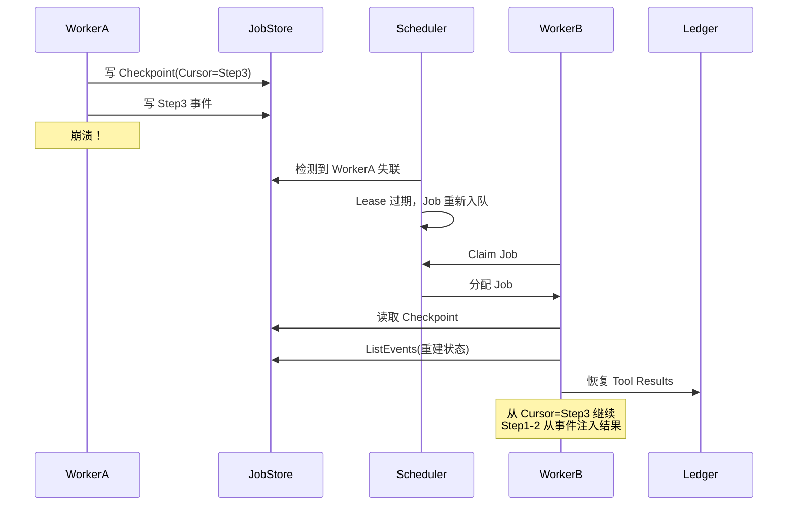

# 事件溯源在 AI Agent 执行中的应用

> 传统架构用状态快照记录「当前是什么样」，事件溯源用事件流记录「发生了什么」。对于 AI Agent 来说，事件流不仅是日志，更是重建执行状态、保证 At-Most-Once、实现完整审计的基石。

## 0. 从一个面试问题开始

如果你在面试中被问到：「Agent 执行到一半崩溃了，如何恢复？」

常见的答案是「写入数据库，定时任务轮询」。但这个答案只解决了一半问题。

更深入的追问是：
- 「执行到哪一步了？」
- 「第 3 步的 Tool 调用结果是什么？」
- 「LLM 在第 5 步的输入输出是什么？」
- 「如何保证 Replay 时不会重复调用 Tool？」

这些问题靠「状态快照」回答不了，但靠「事件溯源」可以。

## 1. 什么是事件溯源？

### 1.1 传统架构 vs 事件溯源

**传统架构（状态快照）**：

```
当前状态：订单已支付，已发货

数据库记录：Order { status: "shipped" }
```

**事件溯源架构**：

```
事件流：
1. OrderCreated { order_id: 123, items: [...] }
2. PaymentReceived { order_id: 123, amount: 100 }
3. ShipmentInitiated { order_id: 123, tracking: "SF123" }

当前状态：通过重放事件流得到
```

核心区别：**事件溯源存储的是「发生了什么」，而不是「当前是什么样」**。

### 1.2 为什么 Agent 需要事件溯源？

对于 AI Agent，事件溯源天然适合：

1. **完整历史** — 每一步执行都被记录，可追溯、可审计
2. **可恢复** — 崩溃后重放事件流即可恢复状态
3. **可回放** — 支持 Replay 调试，重新运行历史执行
4. **可证明** — 事件链本身就是执行证明

## 2. CoRag 的事件流设计

### 2.1 事件类型一览

CoRag 定义了丰富的事件类型，涵盖 Job 生命周期、执行过程、LLM 调用、Tool 调用、人工介入等各个方面：

```go
// 任务生命周期事件
JobCreated        // Job 被创建
JobQueued        // Job 进入队列
JobLeased        // Job 被 Worker 认领
JobRunning       // Job 开始执行
JobParked        // Job 暂停（等待）
JobResumed       // Job 恢复执行
JobCompleted     // Job 成功结束
JobFailed        // Job 执行失败
JobCancelled     // Job 被取消

// 执行步骤事件
StepStarted      // Step 开始执行
StepFinished     // Step 执行完成
StepFailed       // Step 执行失败
StepRetried      // Step 重试
CheckpointSaved  // 检查点已保存

// LLM 调用事件
CommandEmitted   // LLM 请求已发送
CommandCommitted // LLM 响应已提交

// Tool 调用事件
ToolCalled              // Tool 被调用
ToolReturned            // Tool 返回结果
ToolInvocationStarted   // 工具调用开始
ToolInvocationFinished  // 工具调用完成

// 人工介入事件
AgentMessage       // 信箱消息
ApprovalRequested  // 审批请求
ApprovalCompleted  // 审批完成
HumanApprovalGiven // 人类审批

// 审计事件
ReasoningSnapshot   // 推理快照
DecisionSnapshot    // 决策快照
StateCheckpointed   // 状态检查点
RecoveryStarted     // 恢复开始
RecoveryCompleted   // 恢复完成
```

### 2.2 事件结构

每条事件都是一个不可变的「事实」：

```go
// JobEvent 单条不可变事件；Job 的真实形态是事件流
type JobEvent struct {
    ID        string    // 单条事件唯一 ID，用于排序/去重
    JobID     string    // 所属任务流 ID
    Type      EventType // 事件类型
    Payload   []byte    // JSON，由各 EventType 语义定义
    CreatedAt time.Time
    
    // 防篡改：哈希链
    PrevHash string // 上一个事件的 hash（SHA256）
    Hash     string // 当前事件 hash
}
```

### 2.3 哈希链：防篡改

每个事件都包含前一个事件的哈希，形成一条不可篡改的链：

```go
// 事件哈希计算
func (e *JobEvent) ComputeHash() string {
    data := e.JobID + string(e.Type) + string(e.Payload) + 
            e.CreatedAt.Format(time.RFC3339) + e.PrevHash
    return SHA256(data)
}
```

这保证了：
- 任何历史事件的篡改都会被检测到
- 事件顺序不可被重排
- 完整的执行证明链可用于合规审计

## 3. At-Most-Once 执行保证

### 3.1 问题回顾

```
退款场景：
1. Agent 调用支付 API 退款 $100
2. 支付 API 返回成功
3. Agent 准备写日志... 
4. [崩溃]

重启后：
- 如果全部重来：用户被扣款 $200！
- 如果不重来：不知道退款是否真的成功了
```

### 3.2 Tool Ledger 的双重角色

CoRag 的 Tool Ledger 不仅是「结果缓存」，更是**执行许可系统**：

```go
// Ledger 的裁决结果
type LedgerResult int

const (
    AllowExecute           LedgerResult = iota  // 尚无记录，允许执行
    ReturnRecordedResult                         // 已有记录，返回已记录结果
)

// 关键：只有返回 AllowExecute 时才会真正调用 Tool
func (ledger *InvocationLedger) Acquire(ctx context.Context, key string) (LedgerResult, error) {
    entry, err := ledger.store.Get(key)
    if err != nil {
        return AllowExecute, nil // 无记录，允许执行
    }
    if entry.Status == "committed" {
        return ReturnRecordedResult, nil // 已提交，返回缓存结果
    }
    // pending 状态：上次调用正在进行中，需要等待或拒绝
    return ReturnRecordedResult, ErrConcurrentInvocation
}
```

### 3.3 两阶段提交协议

为了处理「调用成功但写入失败」的边缘情况，CoRag 使用**两阶段提交**：

```go
func (r *Runner) callToolWithTwoPC(ctx context.Context, tool Tool, input Input) (Output, error) {
    key := GenerateIdempotencyKey(tool, input)
    
    // Phase 1: 预提交
    // 1. 尝试获取分布式锁
    lock := redis.Lock("tool:" + key)
    if !lock.Acquire(ctx, 10*time.Second) {
        return nil, ErrConcurrentExecution
    }
    defer lock.Release()
    
    // 2. 检查 Ledger
    cached, err := ledger.Get(key)
    if err == nil && cached != nil && cached.Status == "committed" {
        return cached.Output, nil // 已执行过
    }
    
    // 3. 调用工具
    output, err := tool.Execute(ctx, input)
    if err != nil {
        return nil, err // 工具调用失败，直接返回
    }
    
    // 4. 预写入 Ledger（状态：pending）
    ledger.Put(&LedgerEntry{
        Key:     key,
        Status:  "pending",
        Output:  output,
    })
    
    // 5. 确认提交（状态：committed）
    // 如果这一步之前崩溃：外部系统已有记录，可通过外部验证恢复
    ledger.UpdateStatus(key, "committed")
    
    return output, nil
}
```

### 3.4 外部验证：最后一道防线

当 Tool 执行成功但 Ledger 写入失败时，CoRag 通过**外部验证**确认状态：

```go
// 恢复时的验证逻辑
func (r *Runner) verifyAndRecover(ctx context.Context, effect *Effect) (any, error) {
    switch effect.ToolName {
    case "stripe.refund":
        // 查询 Stripe：该 refund_id 是否已存在？
        refund, err := stripe.GetRefund(effect.ExternalID)
        if err == nil && refund.Status == "succeeded" {
            return &RefundResult{
                ID:     refund.ID,
                Amount: refund.Amount,
                Status: "succeeded",
            }, nil
        }
        
    case "email.send":
        // 查询邮件服务：该 message_id 是否已发送？
        status, err := email.GetStatus(effect.ExternalID)
        if err == nil && status == "sent" {
            return &EmailResult{Status: "sent"}, nil
        }
    }
    
    return nil, ErrEffectVerificationFailed
}
```

## 4. Checkpoint 恢复

### 4.1 Checkpoint 的本质

事件流记录了「发生了什么」，但重放整个事件流效率很低。**Checkpoint 是定期保存的「状态快照」**：

```
时间线：
──────────────────────────────────────────────────────────────▶
│ Event 1 │ Event 2 │ Event 3 │ Event 4 │ Event 5 │ Event 6 │
│         │         │         │ Checkp. │         │ Checkp. │
                                              ▲           ▲
                                            保存状态     保存状态
```

### 4.2 Checkpoint 内容

```go
type Checkpoint struct {
    JobID         string                 // 任务标识
    Cursor        string                 // 恢复点：下一个待执行的节点 ID
    SessionID     string                 // 关联的 Session ID
    StepIndex     int                    // Checkpoint 时的 Step 索引
    SnapshotSize  int                    // 快照大小
    CreatedAt     time.Time              // 创建时间
}
```

### 4.3 完整的恢复流程



### 4.4 恢复时的关键判断

```go
func (r *Runner) resumeFromCheckpoint(ctx context.Context, job *Job) error {
    checkpoint := job.Checkpoint
    
    // 1. 恢复执行状态
    r.state = checkpoint.State
    
    // 2. 恢复工具结果缓存
    for key, result := range checkpoint.ToolResults {
        toolLedger.Put(key, result)
    }
    
    // 3. 确定从哪个步骤继续
    currentStepID := checkpoint.Cursor
    
    // 4. 查找下一个要执行的步骤
    nextStep := r.findNextStep(currentStepID)
    
    // 5. 执行（Tool 调用会走 Ledger，不会重复）
    return r.executeStep(nextStep)
}
```

## 5. 完整执行历史 / 审计追踪

### 5.1 事件流示例

一个典型的退款处理流程会产生以下事件流：

```
[Event #1] JobCreated
  { goal: "处理退款申请 #12345", agent_type: "refund" }

[Event #2] PlanGenerated
  { steps: ["analyze", "verify_risk", "execute_refund", "send_email"] }

[Event #3] StepStarted
  { step_id: "step_analyze", node_type: "llm", name: "analyze_request" }

[Event #4] CommandEmitted
  { prompt: "分析退款原因...", model: "gpt-4" }

[Event #5] CommandCommitted
  { response: "批准退款，原因合理", model: "gpt-4" }

[Event #6] StepFinished
  { step_id: "step_analyze", output: { decision: "approve" } }

[Event #7] CheckpointSaved
  { cursor: "step_verify_risk" }

[Event #8] StepStarted
  { step_id: "step_execute_refund", node_type: "tool", name: "call_refund_api" }

[Event #9] LedgerAcquired
  { tool: "stripe.refund", idempotency_key: "job:123:step:3:..." }

[Event #10] ToolInvocationFinished
  { tool: "stripe.refund", output: { refund_id: "re_123" } }

[Event #11] LedgerCommitted
  { tool: "stripe.refund", status: "committed" }

[Event #12] StepFinished
  { step_id: "step_execute_refund", output: { status: "success" } }

[Event #13] CheckpointSaved
  { cursor: "step_send_email" }

[Event #14] JobParked
  { wait_type: "human", reason: "等待财务审批" }

[Event #15] ApprovalCompleted
  { decision: "approved", approver: "张三" }

[Event #16] JobResumed
  { resumed_by: "approval" }

[Event #17] JobCompleted
  { final_state: { refund_status: "completed" } }
```

### 5.2 证据图：决策的完整推理链

对于合规场景，CoRag 提供了**证据图（Evidence Graph）**：

```go
type Evidence struct {
    // RAG 证据
    RAGDocs []RAGDoc `json:"rag_docs"`
    
    // LLM 证据
    LLM *LLMEvidence `json:"llm"`
    
    // 工具证据
    ToolCalls []ToolCall `json:"tool_calls"`
    
    // 人工输入
    HumanInput *HumanInput `json:"human_input"`
    
    // 推理链
    ReasoningChain []string `json:"reasoning_chain"`
}

type RAGDoc struct {
    DocID   string  `json:"doc_id"`
    Content string  `json:"content"`
    Score   float64 `json:"score"`
    Source  string  `json:"source"`
}

type LLMEvidence struct {
    Model     string `json:"model"`
    Prompt    string `json:"prompt"`
    Response  string `json:"response"`
    Tokens    int    `json:"tokens"`
    LatencyMs int    `json:"latency_ms"`
}
```

### 5.3 Timeline API

```bash
# 获取 Job 的完整时间线
curl http://localhost:8080/api/jobs/{job_id}/timeline

# 响应示例
{
  "job_id": "job_abc123",
  "total_duration": "45.2s",
  "events": [
    {
      "time": "14:30:00",
      "type": "job_created",
      "description": "任务创建"
    },
    {
      "time": "14:30:01", 
      "type": "step_started",
      "step": "analyze_application",
      "description": "开始分析申请"
    },
    {
      "time": "14:30:05",
      "type": "command_emitted",
      "step": "analyze_application", 
      "model": "gpt-4",
      "description": "调用 LLM 分析"
    },
    ...
  ]
}
```

## 6. Replay：安全回放

### 6.1 什么是 Replay？

Replay 是 CoRag 的调试功能：**重新运行历史执行**。

关键点：**Replay 时不会真的调用外部 API**。

```go
func (r *Runner) Replay(jobID string) error {
    events := jobstore.ListEvents(jobID)
    
    for _, event := range events {
        switch event.Type {
        case "ToolInvocationStarted":
            // 检查 Tool Ledger
            entry, _ := ledger.Get(event.IdempotencyKey)
            if entry != nil {
                // 使用缓存结果，不调用外部
                r.injectResult(entry.Output)
                fmt.Printf("[Replay] Tool %s: using cached result\n", event.ToolName)
                continue
            }
            
            // Ledger 没有记录：尝试外部验证
            effect, _ := effectStore.Get(event.EffectID)
            if effect.ExternalID != "" {
                output, err := r.verifyAndRecover(effect)
                if err == nil {
                    r.injectResult(output)
                    continue
                }
            }
            
            return ErrReplayFailed
            
        case "CommandEmitted":
            // LLM 可以重新调用（幂等）
            // 或者也使用缓存
            r.replayLLM(event)
        }
    }
    
    return nil
}
```

### 6.2 Replay 命令行

```bash
# 回放 Job 执行
aetheris replay job_abc123

# 带详细输出
aetheris replay job_abc123 --verbose

# 从指定步骤开始
aetheris replay job_abc123 --from-step step_3
```

## 7. 与传统方案的对比

| 维度 | 数据库事务 | 幂等 API | Replay + Ledger |
|------|------------|----------|------------------|
| 外部 API | ❌ | ⚠️ 部分支持 | ✅ 统一抽象 |
| 崩溃恢复 | ❌ | ⚠️ 需要手动 | ✅ 自动 |
| Replay | ❌ | ❌ | ✅ 安全重放 |
| 审计 | ❌ | ❌ | ✅ 完整记录 |
| 推理链 | ❌ | ❌ | ✅ 内置 |

## 8. 小结

事件溯源是 CoRag 可靠执行的基石：

1. **完整的事件流** — 记录每一步执行，支持审计和回放
2. **防篡改哈希链** — 保证事件顺序和完整性
3. **Tool Ledger + 两阶段提交** — 保证 At-Most-Once
4. **Checkpoint** — 加速恢复，避免全量重放
5. **证据图** — 保留完整的决策推理链

有了事件溯源，Agent 的执行不再是「黑盒」—— 每一刻发生了什么、为什么发生，都可以追溯和重现。

---

*下篇预告：CoRag vs Temporal 对比——何时选择专用 Agent Runtime*
