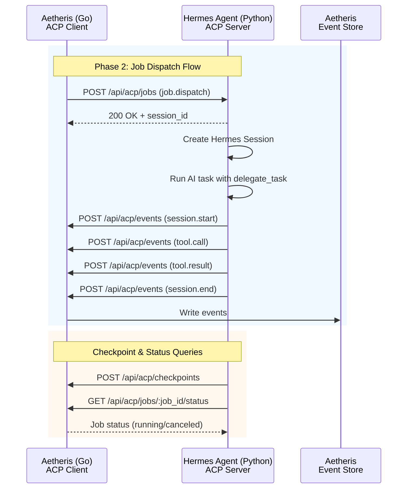

# ACP Protocol: Hermes-Aetheris Integration

## Overview

Phase 2 establishes Hermes Agent as an **ACP Server** that receives Job Dispatch messages from Aetheris and writes execution results back to the Aetheris Event Store via HTTP callbacks.



## ACP Message Types

### 1. `job.dispatch` (Aetheris → Hermes)

Sent by Aetheris to dispatch a new AI coding task to Hermes.

```json
{
  "type": "job.dispatch",
  "job_id": "run_xxx",
  "workflow_id": "wf_xxx",
  "step_id": "step_xxx",
  "instruction": "Review PR #123 for repo owner/repo",
  "tools": ["terminal", "file", "search_files", "delegate_task", "browser"],
  "context": {
    "github_pr_url": "https://github.com/owner/repo/pull/123",
    "github_token": "ghp_xxx"
  },
  "callback_url": "http://localhost:8080/api/acp/events"
}
```

| Field | Type | Required | Description |
|-------|------|----------|-------------|
| `type` | string | Yes | Must be `"job.dispatch"` |
| `job_id` | string | Yes | Unique run ID from Aetheris |
| `workflow_id` | string | No | Workflow that spawned this job |
| `step_id` | string | No | Step within the workflow |
| `instruction` | string | Yes | Task instruction for Hermes |
| `tools` | string[] | No | Allowed tool names (empty = all) |
| `context` | object | No | Additional context (tokens, URLs, etc.) |
| `callback_url` | string | Yes | Aetheris callback endpoint for events |

### 2. `session.start` (Hermes → Aetheris)

Sent when Hermes starts processing a job.

```json
{
  "type": "session.start",
  "job_id": "run_xxx",
  "session_id": "hermes_session_abc",
  "timestamp": "2026-04-16T10:30:00Z"
}
```

### 3. `session.end` (Hermes → Aetheris)

Sent when Hermes completes or fails a job.

```json
{
  "type": "session.end",
  "job_id": "run_xxx",
  "session_id": "hermes_session_abc",
  "status": "completed",
  "final_response": "PR review complete. Found 3 issues.",
  "timestamp": "2026-04-16T10:35:00Z"
}
```

| Field | Type | Description |
|-------|------|-------------|
| `status` | string | `completed`, `failed`, or `canceled` |

### 4. `tool.call` (Hermes → Aetheris)

Sent when Hermes makes a tool call during job execution.

```json
{
  "type": "tool.call",
  "job_id": "run_xxx",
  "session_id": "hermes_session_abc",
  "call_id": "call_001",
  "tool_name": "delegate_task",
  "arguments": {
    "goal": "Review PR #123 changes",
    "agent_type": "coding"
  },
  "timestamp": "2026-04-16T10:31:00Z"
}
```

### 5. `tool.result` (Hermes → Aetheris)

Sent with the result of a tool call.

```json
{
  "type": "tool.result",
  "job_id": "run_xxx",
  "session_id": "hermes_session_abc",
  "call_id": "call_001",
  "tool_name": "delegate_task",
  "result": "Task completed. Summary: ...",
  "error": null,
  "timestamp": "2026-04-16T10:31:05Z"
}
```

### 6. `checkpoint.save` (Hermes → Aetheris)

Sent to persist session checkpoint for potential resumption.

```json
{
  "type": "checkpoint.save",
  "job_id": "run_xxx",
  "session_id": "hermes_session_abc",
  "checkpoint": {
    "id": "ckpt_001",
    "cursor": "msg_42",
    "history_len": 42,
    "snapshot": "base64_encoded_state"
  },
  "timestamp": "2026-04-16T10:33:00Z"
}
```

### 7. `ping` / `pong` (Heartbeat)

Used to keep connection alive and verify both sides are responsive.

```json
// ping (either side)
{"type": "ping", "timestamp": "2026-04-16T10:30:00Z"}

// pong (response)
{"type": "pong", "timestamp": "2026-04-16T10:30:00Z"}
```

## HTTP REST API Endpoints

### Aetheris Endpoints (Callbacks from Hermes)

#### `POST /api/acp/events`

Receives tool call and session events from Hermes.

**Request:**
```json
{
  "type": "tool.call|tool.result|session.start|session.end",
  "job_id": "run_xxx",
  "session_id": "hermes_session_abc",
  "call_id": "call_001",
  "tool_name": "delegate_task",
  "arguments": {},
  "result": "...",
  "error": null,
  "timestamp": "2026-04-16T10:31:00Z"
}
```

**Response:** `200 OK`
```json
{"status": "ok"}
```

#### `POST /api/acp/checkpoints`

Receives checkpoint data from Hermes for durable storage.

**Request:**
```json
{
  "job_id": "run_xxx",
  "session_id": "hermes_session_abc",
  "checkpoint": {
    "id": "ckpt_001",
    "cursor": "msg_42",
    "history": [...],
    "snapshot_size": 12345
  },
  "timestamp": "2026-04-16T10:33:00Z"
}
```

**Response:** `200 OK`
```json
{"status": "ok", "checkpoint_id": "ckpt_001"}
```

#### `GET /api/acp/jobs/:job_id/status`

Hermes queries job status (e.g., to check if canceled).

**Response:** `200 OK`
```json
{
  "job_id": "run_xxx",
  "status": "running",
  "is_canceled": false
}
```

If canceled:
```json
{
  "job_id": "run_xxx",
  "status": "canceled",
  "is_canceled": true
}
```

### Hermes ACP Server Endpoints

#### `POST /api/acp/jobs`

Aetheris dispatches a new job to Hermes.

**Request:** Same as `job.dispatch` message type above.

**Response:** `200 OK`
```json
{
  "status": "accepted",
  "session_id": "hermes_session_abc",
  "message": "Job dispatched successfully"
}
```

**Error Response:** `400 Bad Request`
```json
{
  "error": "invalid_request",
  "message": "Missing required field: instruction"
}
```

## Session Lifecycle

### Correlation: Hermes `session_id` ↔ Aetheris `job_id`

```
Aetheris job_id (run_xxx)     Hermes session_id (hermes_session_abc)
        |                              |
        |--- job.dispatch ------------>| Creates mapping
        |                              |
        |<-- session.start (job_id) ---| Passive correlation via job_id field
        |<-- tool.call (job_id) --------|
        |<-- tool.result (job_id) ------|
        |<-- session.end (job_id) ------|
```

### Session Creation Flow

1. Aetheris sends `job.dispatch` to Hermes ACP Server
2. Hermes creates a new session via `SessionManager.create_session()`
3. Hermes returns `session_id` in the HTTP response
4. Hermes sends `session.start` event to `callback_url` with `job_id` and `session_id`
5. Hermes runs the AI task using `delegate_task` tool

### Session Correlation

- Hermes stores the `job_id` in the session's `SessionState` context
- All subsequent events (`tool.call`, `tool.result`, `session.end`) include both `job_id` and `session_id`
- Aetheris uses `job_id` as the primary key for event storage

## Handshake and Heartbeat

### Connection Establishment

1. Aetheris connects to Hermes ACP Server via HTTP POST to `/api/acp/jobs`
2. Hermes validates the request and creates a session
3. Hermes acknowledges with `200 OK` + `session_id`

### Heartbeat

- Both sides send `ping` every **30 seconds** if no messages exchanged
- Recipient must respond with `pong` within **5 seconds**
- After **3 missed pongs**, the connection is considered dead

## Error Handling and Retry Strategy

### Hermes → Aetheris Callback Retries

When Hermes fails to send events to Aetheris callback URL:

| Retry | Delay | Backoff |
|-------|-------|---------|
| 1 | 1 second | linear |
| 2 | 2 seconds | linear |
| 3 | 4 seconds | exponential |

After 3 failed retries, the event is logged and dropped (fire-and-forget with best-effort delivery).

### Aetheris → Hermes Job Dispatch Retries

When Aetheris fails to receive acknowledgment for job dispatch:

| Retry | Delay | Backoff |
|-------|-------|---------|
| 1 | 2 seconds | linear |
| 2 | 4 seconds | linear |
| 3 | 8 seconds | exponential |

After 3 failed retries, the job is marked as `failed` with error `dispatch_failed`.

### Error Codes

| Code | Meaning | Action |
|------|---------|--------|
| `invalid_request` | Malformed JSON or missing required fields | Do not retry |
| `session_not_found` | Unknown session_id | Do not retry |
| `job_not_found` | Unknown job_id | Do not retry |
| `callback_failed` | Aetheris callback endpoint unreachable | Retry with backoff |
| `internal_error` | Unexpected server error | Retry with backoff |
| `dispatch_failed` | Could not create Hermes session | Retry with backoff |

## Hermes ACP Server TCP Server Design

The Hermes ACP Server listens on TCP port (default 9090) for HTTP connections from Aetheris.

### Server Implementation

- Uses Python `aiohttp` or built-in `http.server` with asyncio
- Runs as `hermes acp-server --port 9090`
- Stateless request handling (no WebSocket persistence needed for job dispatch)

### Request Format

All requests are JSON over HTTP POST/GET as described above.

## Tool Filtering

When `job.dispatch.tools` is specified, Hermes filters its available tools to only those in the allowed list.

If `tools` is empty or omitted, Hermes uses its default toolset for ACP sessions (`hermes-acp`).

## Security Considerations

1. **Callback URL validation**: Hermes should validate callback URLs to prevent SSRF
2. **Token handling**: GitHub tokens and other secrets in `context` should not be logged
3. **Rate limiting**: Implement per-job rate limiting to prevent abuse
4. **Authentication**: Future versions may add HMAC-based request signing

## Implementation Notes

### Hermes Side (Python)

- `hermes_job_handler.py` - Handles incoming job.dispatch messages
- `callback_client.py` - HTTP client for sending events to Aetheris

### Aetheris Side (Go)

- `internal/runtime/hermes/acp_client.go` - Hermes ACP Go client
- `internal/runtime/hermes/job_dispatch.go` - Message type definitions
- `internal/api/acp_handler.go` - HTTP handlers for Hermes callbacks
