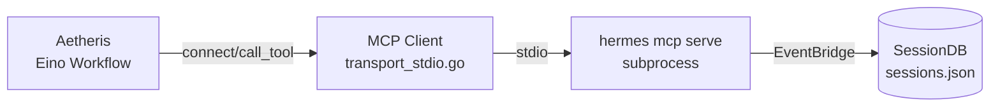
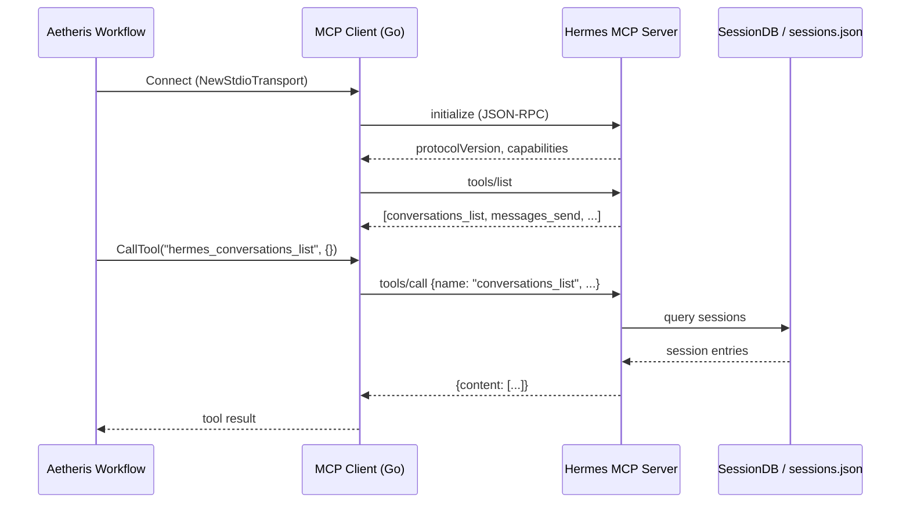

# MCP Bridge: Aetheris → Hermes MCP Server

## Overview

This document describes the integration between Aetheris (CoRag) MCP Client and Hermes Agent MCP Server via stdio transport.



## Architecture



## Hermes MCP Tool Schema

| Function Name | MCP Tool Name | Description | Parameters |
|---------------|---------------|-------------|------------|
| `conversations_list` | `hermes_conversations_list` | List active messaging conversations across connected platforms | `platform?: string`, `limit?: int (default 50)`, `search?: string` |
| `conversation_get` | `hermes_conversation_get` | Get detailed info about one conversation by session key | `session_key: string` |
| `messages_read` | `hermes_messages_read` | Read recent messages from a conversation | `session_key: string`, `limit?: int (default 50)` |
| `attachments_fetch` | `hermes_attachments_fetch` | List non-text attachments for a message | `session_key: string`, `message_id: string` |
| `events_poll` | `hermes_events_poll` | Poll for new conversation events since a cursor position | `after_cursor?: int (default 0)`, `session_key?: string`, `limit?: int (default 20)` |
| `events_wait` | `hermes_events_wait` | Wait for the next conversation event (long-poll) | `after_cursor?: int`, `session_key?: string`, `timeout_ms?: int (default 30000)` |
| `messages_send` | `hermes_messages_send` | Send a message to a platform conversation | `target: string` (format: "platform:chat_id"), `message: string` |
| `channels_list` | `hermes_channels_list` | List available messaging channels and targets | `platform?: string` |
| `permissions_list_open` | `hermes_permissions_list_open` | List pending approval requests | (none) |
| `permissions_respond` | `hermes_permissions_respond` | Respond to a pending approval request | `id: string`, `decision: string` ("allow-once", "allow-always", "deny") |

### Tool Details

#### conversations_list
```json
{
  "platform": "telegram",    // optional filter
  "limit": 50,               // max conversations (default 50)
  "search": "john"           // optional text filter
}
```
Returns:
```json
{
  "count": 2,
  "conversations": [
    {
      "session_key": "telegram:6308981865",
      "session_id": "sess_xxx",
      "platform": "telegram",
      "chat_type": "direct",
      "display_name": "John Doe",
      "chat_name": "john_doe",
      "user_name": "@johndoe",
      "updated_at": "2026-04-15T10:30:00Z"
    }
  ]
}
```

#### messages_send
```json
{
  "target": "telegram:6308981865",  // "platform:chat_id" format
  "message": "Hello from Hermes MCP!"
}
```

## Recommended Tool Sets for Aetheris Eino Workflow

### Terminal-Related Tools
These tools enable agent delegation and code execution:

| Tool | Purpose | Key Parameters |
|------|---------|----------------|
| `hermes_conversations_list` | Search/filter sessions for context | `platform`, `limit`, `search` |
| `hermes_messages_read` | Read conversation history | `session_key`, `limit` |

### Message-Related Tools
For messaging and notification workflows:

| Tool | Purpose | Key Parameters |
|------|---------|----------------|
| `hermes_conversations_list` | List active conversations | `platform`, `limit`, `search` |
| `hermes_messages_send` | Send message to platform | `target`, `message` |
| `hermes_channels_list` | List available send targets | `platform` |

## Transport Configuration

### Stdio Mode (Default)
```bash
hermes mcp serve
```
- Spawns `hermes mcp serve` as subprocess
- Communicates via stdin/stdout JSON-RPC
- Blocking synchronous communication

### SSE Mode (HTTP)
```bash
hermes mcp serve --sse
```
- Starts HTTP server at `http://localhost:3000/sse`
- Uses Streamable HTTP transport
- Supports non-blocking communication
- Better for web-based MCP clients

**SSE Configuration:**
```json
{
  "mcpServers": {
    "hermes": {
      "url": "http://localhost:3000/sse"
    }
  }
}
```

## Error Handling

| Error Code | Meaning | Action |
|------------|---------|--------|
| `-32602` | Invalid params | Check parameter types and required fields |
| `-32603` | Internal error | Server-side issue, retry later |
| Connection refused | Server not running | Verify `hermes mcp serve` is active |

## Quick Reference: Go Client Usage

```go
// Create transport
transport, err := mcp.NewStdioTransport(ctx, mcp.StdioConfig{
    Command: "hermes",
    Args:    []string{"mcp", "serve"},
})

// Create and initialize client
client := mcp.NewClient(mcp.ClientConfig{
    Name:    "hermes",
    Transport: transport,
})
if err := client.Initialize(ctx); err != nil {
    return err
}

// List available tools
tools := client.Tools()
for _, t := range tools {
    fmt.Printf("Tool: %s - %s\n", t.Name, t.Description)
}

// Call a tool
result, err := client.CallTool(ctx, "conversations_list", map[string]any{
    "limit": 10,
})
if err != nil {
    return err
}

// Close
client.Close()
```

## Limitations

1. **SessionDB required**: Event polling (`events_poll`, `events_wait`) requires SessionDB access
2. **No file attachments**: `attachments_fetch` only returns metadata, not actual file content
3. **Platform-specific**: Some features depend on platform capabilities (e.g., threading)
