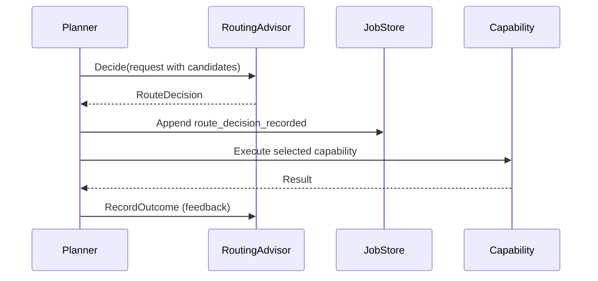
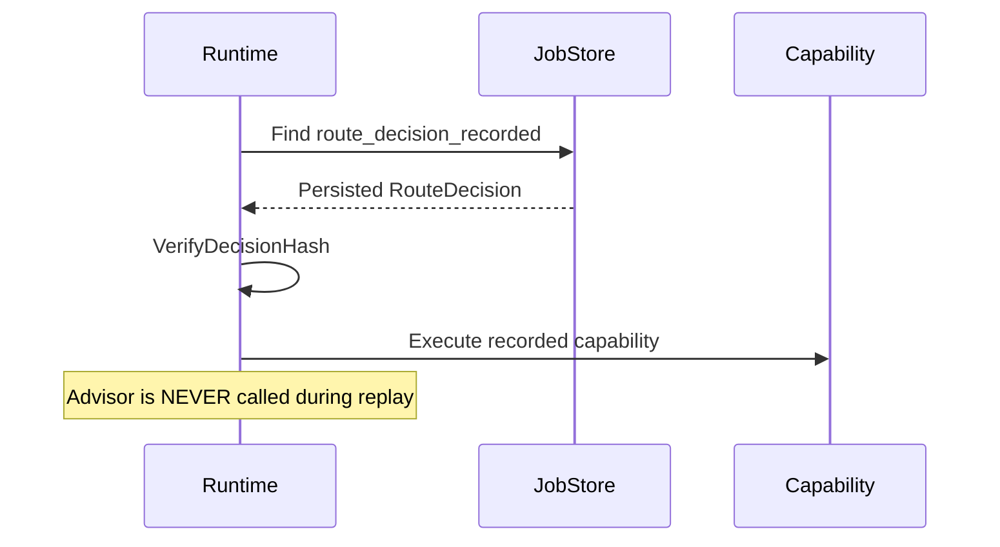

# RoutingAdvisor — Evidence-First Capability Routing

> **Status**: draft
> **Since**: v2.5.x
> **Design**: [Architecture](../artifacts/2026-05-26-routing-advisor-contract/arch-design.md) | [API Contract](../artifacts/2026-05-26-routing-advisor-contract/api-contract.md) | [Test Plan](../artifacts/2026-05-26-routing-advisor-contract/test-plan.md)

## What is RoutingAdvisor?

RoutingAdvisor is Aetheris's mechanism for **evidence-first capability routing**. It lets an external or local advisor recommend which tool, agent, model, adapter, or workflow path should execute a planned step — and ensures that recommendation becomes **durable, replayable evidence**.

This is different from Aetheris's built-in model router (`pkg/routing`), which selects LLM models by tier/cost/latency. RoutingAdvisor operates at a higher level: it selects **capabilities**.

```
Model Router:    "Use GPT-4o-mini for this step"
RoutingAdvisor:  "Use the web_search tool, then the conversation agent"
```

## Why It Matters

Without RoutingAdvisor, routing decisions are implicit — baked into code or config. With RoutingAdvisor:

- **Auditability**: Every routing decision is recorded as evidence in the job event chain
- **Replay safety**: Replayed jobs reuse recorded decisions, never re-calling the advisor
- **Crash recovery**: If a worker crashes between routing and execution, the persisted decision survives
- **Compliance**: Routing decisions are part of the evidence graph and forensics read model

## Core Design Principle

> **If a route decision cannot be recorded as durable evidence, it cannot influence execution.**

This is the fundamental invariant. A recovered or replayed job must never make a fresh outbound routing call — that would change the execution path and break replay determinism.

## How It Works

### Original Execution



### Replay



## Key Invariants

| # | Invariant | Why |
|---|-----------|-----|
| 1 | Advisor called exactly once per decision point | No retry/fan-out to multiple advisors |
| 2 | Evidence persisted before capability executes | Crash between routing and execution is recoverable |
| 3 | Replay never calls the advisor | Guarantees deterministic replay regardless of advisor availability |
| 4 | Hash verification mandatory on replay | Detects storage corruption and tampering |
| 5 | Missing evidence = hard failure on replay | Re-running advisor would produce different decision, breaking audit trail |

## Interface

```go
type RoutingAdvisor interface {
    Decide(ctx context.Context, req RouteDecisionRequest) (RouteDecision, error)
    RecordOutcome(ctx context.Context, outcome RouteOutcome) error
}
```

The interface is intentionally small. It does not own tool execution, job scheduling, retries, ledger acquisition, or evidence export.

## Failure Policies

| Policy | Behavior |
|--------|----------|
| `fail_open` | Use local deterministic fallback when advisor fails |
| `fail_closed` | Fail the job before executing an unadvised route |
| `cached_decision` | Reuse a previously recorded decision with matching decision key |

Default for external adapters: `fail_open` only when the local fallback is deterministic and evidence-recorded. Otherwise `fail_closed`.

## Configuration

```yaml
routing_advisor:
  enabled: false           # Default: disabled
  provider: "wisepick"     # Advisor provider name
  endpoint: "http://localhost:8787"
  timeout: "2s"
  fallback_policy: "fail_open"
  record_outcome: true     # Send outcome feedback to advisor
```

Rules:
- Default is disabled; enabling requires explicit config
- External endpoints are never called during replay
- Config must support tenant-scoped disablement before production promotion

## Event Model

A single experimental event type:

```
route_decision_recorded
```

This event is replay-relevant and must be included in:
- Evidence exports
- Hash chain validation
- Forensics read model

## Integration Points

| Component | Interaction |
|-----------|-------------|
| **Planner** | Provides candidate capabilities and constraints |
| **Job Event Store** | Persists route decision before capability execution |
| **Tool Bridge** | Receives only the selected target |
| **Replay** | Reads recorded decision, bypasses advisor |
| **Evidence Export** | Includes routing evidence in job event chain |
| **Monitoring** | Counts decisions, fallback policy, advisor errors |

## WisePick Integration

WisePick can be the first external adapter:

```
WisePick response → adapter normalization → Aetheris RouteDecision → persisted event
```

The adapter must not require changes to Aetheris replay semantics.

## Deterministic Hash Rules

`decision_hash` is computed over canonical JSON (excluding `decision_hash` itself):

1. Sort candidates by `capability_id` alphabetically
2. Sort `reason_codes` within each candidate alphabetically
3. Marshal using `encoding/json` (no custom encoder)
4. Timestamps as RFC3339 with nanosecond precision
5. Nil `metadata` → `null`; empty `reason_codes` → `[]`

Changing any rule = breaking change = schema version bump required.

## Error Codes

| Code | Meaning |
|------|---------|
| `routing_advisor_unavailable` | Advisor could not be reached |
| `routing_advisor_invalid_response` | Adapter could not normalize response |
| `routing_decision_hash_mismatch` | Recorded evidence hash is invalid |
| `routing_decision_missing` | Replay needs recorded decision but none exists |
| `routing_candidate_not_allowed` | Advisor selected capability outside allowed set |

## Current Status

- [x] Architecture design complete
- [x] API contract defined (Go interface + JSON schemas)
- [x] Test plan with 9-step recovery validation suite
- [x] Replay invariants documented
- [x] Deterministic serialization rules specified
- [ ] Implementation (experimental)
- [ ] HTTP/CLI surface
- [ ] Production promotion (requires tests, config, ops evidence)

## Non-Goals

- Do not use advisor output to mutate a job after replay starts
- Do not hide candidate scores or reason codes
- Do not make WisePick a required runtime dependency
- Do not promote beyond experimental without tests, config, API/CLI docs, release drill, and ops evidence
