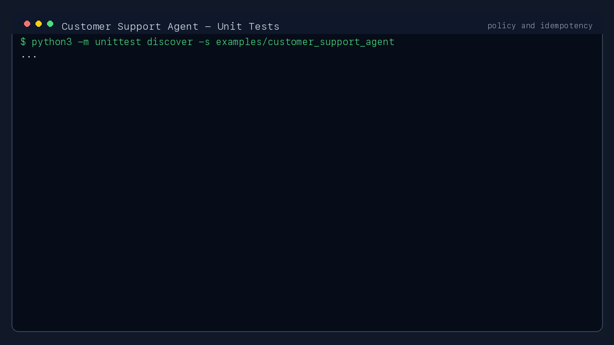
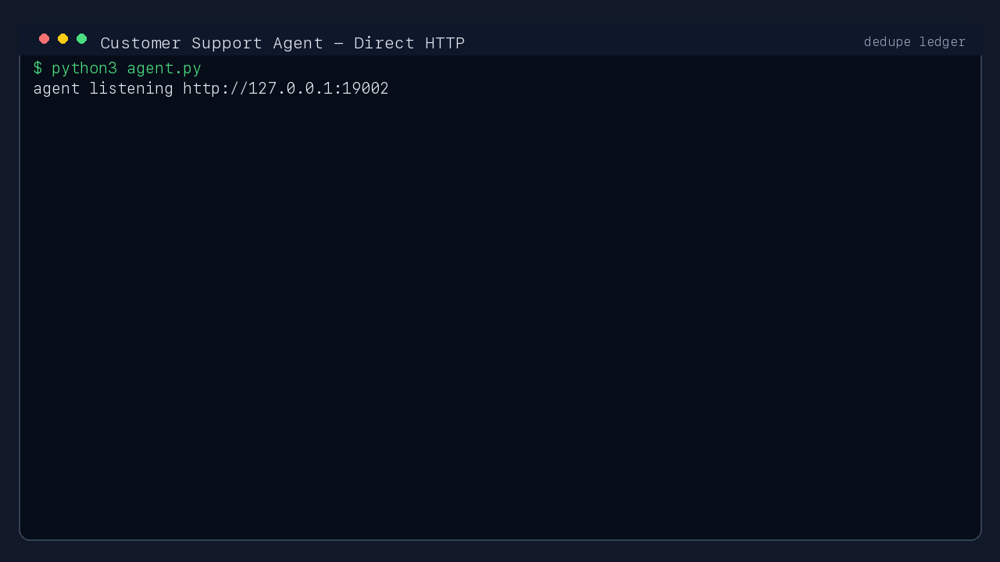
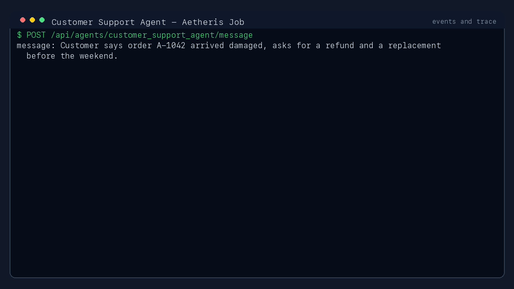

# Aetheris Examples

This directory contains runnable examples for Aetheris integration patterns.

## Real Agent With GIF Test Results

The newest complete example is [customer_support_agent](customer_support_agent/):
a realistic `external_http` customer support agent with order lookup, policy
evaluation, ticket creation, and an idempotency ledger.

### Test GIFs

| Test | Result |
| --- | --- |
| Policy and idempotency unit tests | `PASS` |
| Direct HTTP idempotency | Same `Idempotency-Key` reuses the same support ticket |
| Aetheris job, events, and trace | Job completed with recorded event chain and trace |







Run it from the repository root:

```bash
python3 -m unittest discover -s examples/customer_support_agent
python3 examples/customer_support_agent/demo.py
python3 examples/customer_support_agent/render_gifs.py
```

See [customer_support_agent/README.md](customer_support_agent/README.md) for
the full contract, evidence files, and reliability boundary notes.
